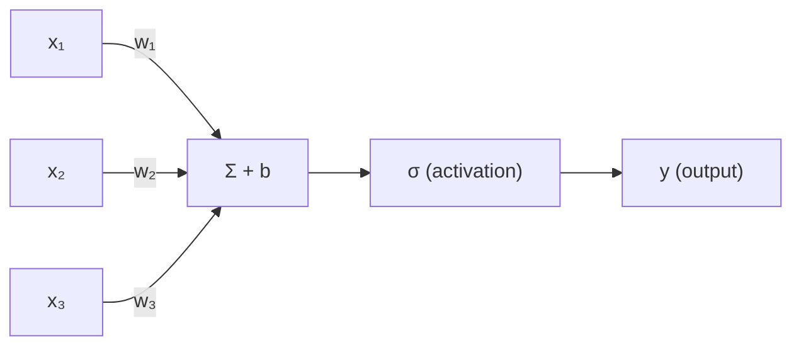
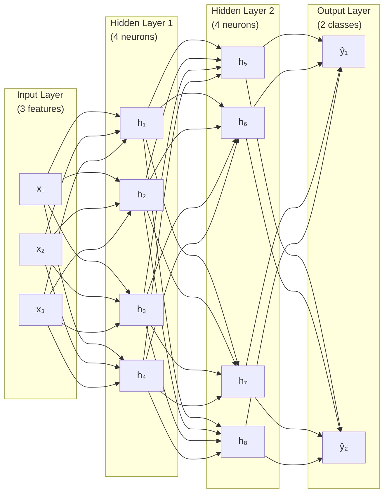
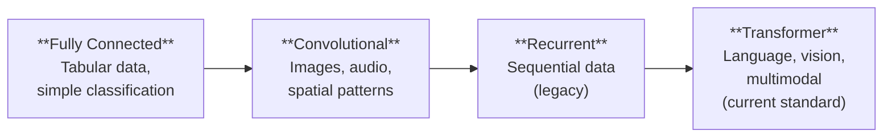

# What Is a Neural Network?

*Last reviewed: April 2026*

A neural network is a mathematical function that learns patterns from data. It takes an input (text, an image, numbers), transforms it through layers of simple mathematical operations, and produces an output (a classification, a prediction, generated text). The "learning" happens by adjusting the numerical parameters of those operations until the function's outputs match the desired results.

This chapter builds the mental model from the ground up.

## The Building Block: The Neuron

A single neuron computes a **weighted sum** of its inputs, adds a **bias**, and applies a **non-linear activation function**:

$$y = \sigma\left(\sum_{i=1}^{n} w_i x_i + b\right) = \sigma(\mathbf{w} \cdot \mathbf{x} + b)$$

Where:
- $x_1, x_2, \ldots, x_n$ — input values
- $w_1, w_2, \ldots, w_n$ — weights (learned parameters)
- $b$ — bias (learned parameter)
- $\sigma$ — activation function (introduces non-linearity)
- $y$ — output

The weights determine **how much each input matters**. The bias shifts the decision boundary. The activation function allows the neuron to model non-linear relationships.

Without the activation function, any combination of neurons would collapse to a single linear transformation — no matter how many layers you stack. Non-linearity is what gives networks the ability to model complex patterns.

## Layers

Neurons are organized into **layers**:

- **Input layer**: Receives the raw data. One neuron per input feature.
- **Hidden layers**: Intermediate transformations. "Hidden" because their values are not directly observed as inputs or outputs.
- **Output layer**: Produces the final result. For classification: one neuron per class. For regression: one neuron outputting a continuous value.

Each connection between neurons has a **weight**. A network with 3 inputs, two hidden layers of 4 neurons each, and 2 outputs has:
- Layer 1: 3 × 4 = 12 weights + 4 biases
- Layer 2: 4 × 4 = 16 weights + 4 biases
- Output: 4 × 2 = 8 weights + 2 biases
- Total: **46 learnable parameters**

GPT-3 has 175 **billion** parameters. The principle is the same — just vastly more neurons and layers.

## "Deep" Learning

A network with **two or more hidden layers** is called a "deep" neural network. "Deep learning" simply means using deep networks. Modern language models have dozens to hundreds of layers:

| Model | Hidden Layers | Total Parameters |
|-------|:------------:|:---------------:|
| Simple classifier | 2-3 | ~1,000 |
| Image recognition (ResNet-50) | 50 | ~25 million |
| BERT-base | 12 | ~110 million |
| GPT-2 | 48 | ~1.5 billion |
| GPT-3 | 96 | ~175 billion |
| Llama 3 405B | 126 | ~405 billion |

More layers allow the network to learn increasingly abstract representations. Early layers learn simple patterns (edges in images, character combinations in text); later layers compose these into complex concepts (objects, syntax, meaning).

## Types of Neural Networks

### Fully Connected (Dense)

Every neuron connects to every neuron in the next layer. The type described above. Simple but parameter-intensive.

### Convolutional (CNN)

Specialized for grid-structured data (images, audio). Neurons connect only to local regions, sharing weights across positions. This exploits spatial structure — the same edge detector works everywhere in an image.

### Recurrent (RNN / LSTM / GRU)

Designed for sequential data. Each step's output feeds back as input to the next step, creating a "memory" that carries information across the sequence. Dominant for language tasks before transformers, now largely superseded.

### Transformer

The architecture used by modern language models. Based on the attention mechanism (Chapter 5) rather than recurrence or convolution. Processes all positions in parallel. This is the architecture explored in depth throughout this book.

## The Universal Approximation Theorem

A fundamental theoretical result: a neural network with a single hidden layer of sufficient width can approximate **any continuous function** to arbitrary accuracy. This means neural networks are theoretically capable of learning any input-output mapping.

In practice, this doesn't mean any network will learn the right function — it means the **architecture** is not the bottleneck. The challenges are:
- Having enough **data** to learn from
- Having enough **compute** to train effectively
- Finding the right **training procedure** to converge to a good solution

## What Neural Networks Are NOT

- **Not brains**: Despite the name "neural network," these are mathematical functions, not biological systems. The analogy is loose at best.
- **Not databases**: They don't store facts as retrievable records. Knowledge is distributed across billions of parameters in ways that are not directly interpretable.
- **Not rule-based systems**: They learn patterns from data rather than following programmed rules. This makes them flexible but unpredictable.
- **Not conscious or "understanding"**: They manipulate symbols statistically. Whether this constitutes "understanding" is a philosophical debate, not a technical one.

> **Governance Relevance**
>
> The foundational understanding matters for governance:
>
> 1. **Parameters = complexity = opacity**: The more parameters a model has, the harder it is to understand why it produces specific outputs. This is the root cause of the explainability challenge (Chapter 24).
> 2. **Learning from data = inheriting data problems**: If the training data contains biases, errors, or harmful content, the model learns those patterns (Chapter 27). Data quality directly determines model quality.
> 3. **Not rule-based = not auditable in traditional ways**: You cannot inspect a neural network's "rules" because it doesn't have explicit rules. This is why EU AI Act Article 13 focuses on enabling interpretation of outputs rather than requiring transparent internal logic.
