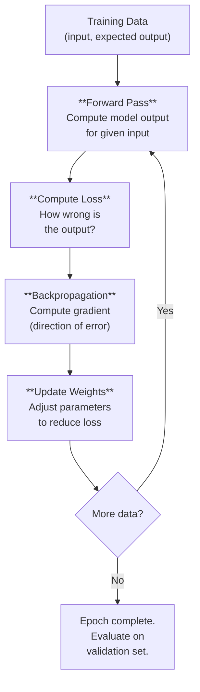
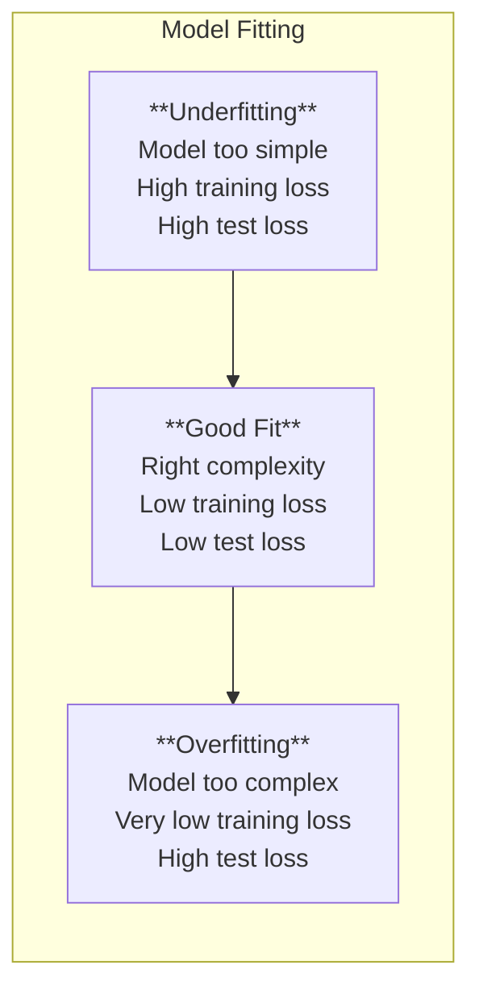

# How Models Learn: Training Basics

*Last reviewed: April 2026*

Training a neural network means finding the values for millions (or billions) of parameters that make the network produce correct outputs. This chapter explains the core training loop: forward pass, loss computation, backpropagation, and gradient descent.

## The Training Loop

This loop repeats millions or billions of times during training. Each iteration processes a batch of examples, computes errors, and makes small adjustments to every parameter.

## Step 1: Forward Pass

Pass input data through the network, layer by layer, to compute an output:

$$\hat{y} = f(x; \theta)$$

Where $x$ is the input, $\theta$ represents all parameters (weights + biases), and $\hat{y}$ is the model's prediction.

For a language model, the input is a sequence of tokens, and the output is a probability distribution over the vocabulary for the next token.

## Step 2: Compute Loss

The **loss function** measures how far the model's prediction $\hat{y}$ is from the correct answer $y$:

**Cross-entropy loss** (standard for classification and language modelling):

$$\mathcal{L} = -\sum_{i} y_i \log(\hat{y}_i)$$

For next-token prediction: the loss is low when the model assigns high probability to the correct next token, and high when it assigns low probability.

**Mean squared error** (for regression):

$$\mathcal{L} = \frac{1}{n}\sum_{i}(y_i - \hat{y}_i)^2$$

The loss is a single number summarizing how wrong the model is. Training seeks to minimize this number.

## Step 3: Backpropagation

The key question: **which parameters should change, and by how much, to reduce the loss?**

Backpropagation answers this by computing the **gradient** of the loss with respect to every parameter using the **chain rule** of calculus:

$$\frac{\partial \mathcal{L}}{\partial w_i} = \frac{\partial \mathcal{L}}{\partial \hat{y}} \cdot \frac{\partial \hat{y}}{\partial h_n} \cdot \frac{\partial h_n}{\partial h_{n-1}} \cdots \frac{\partial h_1}{\partial w_i}$$

The gradient tells us: "if I increase this weight slightly, does the loss go up or down, and by how much?"

Backpropagation flows **backward** through the network — from the loss, through the output layer, through each hidden layer, to the input — computing gradients at every step.

## Step 4: Gradient Descent

Update each parameter in the direction that reduces the loss:

$$w_i \leftarrow w_i - \eta \cdot \frac{\partial \mathcal{L}}{\partial w_i}$$

Where $\eta$ is the **learning rate** — the size of the step. A core hyperparameter:
- **Too large**: Overshoots the minimum, training becomes unstable
- **Too small**: Converges very slowly, may get stuck in poor solutions
- **Just right**: Steady convergence toward a good solution

### Optimizers

Modern training uses sophisticated variants of gradient descent:

| Optimizer | Key Innovation |
|-----------|---------------|
| **SGD** (Stochastic Gradient Descent) | Compute gradients on random subsets (mini-batches) of data |
| **SGD + Momentum** | Accumulate a running average of gradients — smooths updates, escapes shallow local minima |
| **Adam** | Adapt the learning rate per-parameter based on first and second moments of gradients |
| **AdamW** | Adam + decoupled weight decay (regularization). **Standard for transformer training** |

AdamW is the default optimizer for virtually all modern language model training.

## Batching

Processing one example at a time is inefficient — modern GPUs excel at parallel matrix operations. **Mini-batch training** processes multiple examples simultaneously:

- Compute forward pass for all examples in the batch (parallel)
- Average the loss across the batch
- Compute gradients for the averaged loss
- Update weights once per batch

**Batch size** affects training dynamics:
- **Larger batches**: More stable gradients (averaged over more examples), better GPU utilization, but requires more memory
- **Smaller batches**: More noisy gradients (which can help escape local minima), less memory, but potentially slower convergence

Typical batch sizes for language model training: 256–4096 examples (or measured in total tokens per batch: 1–4 million tokens).

## Overfitting and Generalization

The goal of training is not to minimize loss on the training data — it's to minimize loss on **unseen data**. The gap between training performance and test performance is the **generalization gap**.

**Underfitting**: The model is too simple to capture the patterns in the data. Both training and test performance are poor.

**Overfitting**: The model memorizes the training data — including its noise and idiosyncrasies. Training performance is excellent but test performance degrades. The model has learned to recite the training data rather than learn generalizable patterns.

### Preventing Overfitting

| Technique | How It Works |
|-----------|-------------|
| **Dropout** | Randomly set a fraction of neuron outputs to zero during training. Forces the network to not rely on any single neuron. |
| **Weight decay** (L2 regularization) | Add a penalty proportional to weight magnitude. Keeps weights small, preventing the model from fitting noise. |
| **Early stopping** | Monitor validation loss during training. Stop when validation loss starts increasing even if training loss is still decreasing. |
| **Data augmentation** | Create variant training examples (rotated images, paraphrased text). Increases effective training set size. |
| **More data** | The most reliable defense against overfitting. Larger datasets make it harder to memorize. |

Note: Modern large language models are trained for **one epoch or less** on their training data — they see each example at most once. In this regime, classical overfitting (memorizing training data through repeated exposure) is less of a concern, but memorization of frequently repeated content can still occur.

## Training, Validation, and Test Sets

Data is split into three sets:

| Set | Purpose | When Used |
|-----|---------|-----------|
| **Training** | Learn parameters | During training (every batch) |
| **Validation** | Tune hyperparameters, early stopping | Periodically during training |
| **Test** | Final performance evaluation | Once, after training is complete |

The test set must never influence any training decisions — otherwise, the reported performance is optimistic. This is why benchmark contamination (training data overlapping with benchmark test sets) is a serious evaluation concern.

## What Training "Learns"

Training does not explicitly program knowledge into the model. It adjusts parameters so that the model's statistical patterns match the statistical patterns in the data. What emerges:

- **Linguistic knowledge**: Grammar, syntax, morphology
- **World knowledge**: Facts, relationships, common sense
- **Reasoning patterns**: Logical steps, mathematical operations, code patterns
- **Biases**: Stereotypes, prejudices, and cultural assumptions present in the data
- **Style patterns**: Formal/informal writing, domain jargon, conversational patterns

All of these are encoded as numerical patterns in parameters — not as explicit, retrievable rules or facts.

> **Governance Relevance**
>
> Training fundamentals directly inform governance:
>
> 1. **Training data determines behavior**: The model is, in a very literal sense, a compressed representation of its training data. EU AI Act Article 10 requires data governance precisely because data quality determines model quality.
> 2. **Hyperparameter choices affect outcomes**: Learning rate, batch size, training duration — these all affect what the model learns. They should be documented as part of technical documentation (Annex IV).
> 3. **Overfitting to benchmarks**: If models are tuned to maximize specific benchmark scores, their real-world performance may be lower. NIST AI RMF MEASURE 2.3 requires evaluation under deployment conditions, not just benchmarks.
> 4. **Data split integrity**: If test data leaked into training, all performance claims are suspect. This is the "data contamination" problem that undermines benchmark credibility (Chapter 25).
