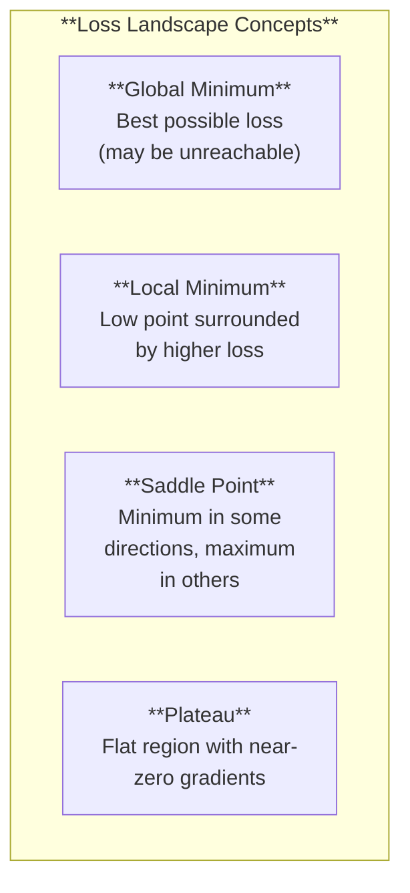
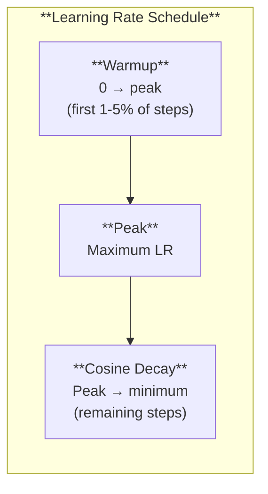

# Loss Functions and Optimisation

*Last reviewed: April 2026*

The loss function defines what "correct" means. The optimizer defines how to get there. Together, they determine what the model learns. This chapter covers the important loss functions and optimization concepts.

## Loss Functions

### Cross-Entropy Loss (Log Loss)

The standard for classification tasks and language modelling:

$$\mathcal{L}_{\text{CE}} = -\sum_{i=1}^{C} y_i \log(\hat{y}_i)$$

Where $C$ is the number of classes, $y$ is the true distribution (one-hot for classification), and $\hat{y}$ is the model's predicted probability distribution.

For **language modelling** (next-token prediction with vocabulary size $V$):

$$\mathcal{L} = -\log P(t_{\text{correct}})$$

The loss is simply the negative log-probability of the correct token. If the model assigns probability 0.9 to the correct token: $-\log(0.9) = 0.105$ (low loss). If it assigns 0.01: $-\log(0.01) = 4.605$ (high loss).

**Perplexity** is the exponentiated average cross-entropy loss:

$$\text{PPL} = e^{\mathcal{L}} = 2^{H}$$

Where $H$ is the cross-entropy in bits. Perplexity of 10 means the model is "as confused as if it were choosing between 10 equally likely tokens." Lower is better.

### Binary Cross-Entropy

For two-class problems:

$$\mathcal{L}_{\text{BCE}} = -[y \log(\hat{y}) + (1-y) \log(1-\hat{y})]$$

Used for binary classification, toxicity detection, and each output in multi-label classification.

### Mean Squared Error (MSE)

$$\mathcal{L}_{\text{MSE}} = \frac{1}{n}\sum_{i=1}^{n}(y_i - \hat{y}_i)^2$$

Standard for regression tasks. Penalizes large errors more heavily due to the squaring. Used in reward model training and some fine-tuning objectives.

### Contrastive Loss

Used for learning embeddings (representations where similar items are close and dissimilar items are far):

$$\mathcal{L}_{\text{contrastive}} = -\log\frac{e^{\text{sim}(a, b^+)/\tau}}{\sum_j e^{\text{sim}(a, b_j)/\tau}}$$

Where $b^+$ is the positive (matching) example, $b_j$ includes both positive and negative examples, and $\tau$ is a temperature parameter. This is the InfoNCE loss used to train embedding models (CLIP, E5, sentence transformers).

## The Loss Landscape

The loss function defines a surface over the parameter space. Training navigates this surface, seeking low points:

In practice, models with billions of parameters have enormously high-dimensional loss landscapes. Research suggests that in high dimensions:
- True local minima are rare — most apparent minima are actually saddle points
- "Good" local minima tend to generalize well (flat minima hypothesis)
- The landscape is more benign than low-dimensional intuition suggests

## Optimization Algorithm Details

### Stochastic Gradient Descent (SGD)

$$\theta_{t+1} = \theta_t - \eta \nabla_\theta \mathcal{L}(\theta_t)$$

Compute gradients on a random mini-batch, move in the opposite direction. Simple but noisy — the randomness helps escape shallow local minima but makes convergence unstable.

### Momentum

$$v_{t+1} = \beta v_t + \nabla_\theta \mathcal{L}(\theta_t)$$
$$\theta_{t+1} = \theta_t - \eta v_{t+1}$$

Accumulate a running average of past gradients ($v$). This creates "momentum" — the optimizer continues moving in consistent directions and damps oscillations. $\beta$ is typically 0.9.

### Adam (Adaptive Moment Estimation)

Adam maintains two running averages per parameter:
- **First moment** $m$: Running average of gradients (like momentum)
- **Second moment** $v$: Running average of squared gradients (gradient magnitude)

$$m_t = \beta_1 m_{t-1} + (1-\beta_1) g_t$$
$$v_t = \beta_2 v_{t-1} + (1-\beta_2) g_t^2$$

The parameter update is scaled inversely proportional to $\sqrt{v_t}$ — parameters with historically large gradients get smaller updates, and parameters with small gradients get larger updates. This per-parameter adaptive learning rate is why Adam works well across diverse parameter types.

**Standard hyperparameters**: $\beta_1 = 0.9$, $\beta_2 = 0.999$, $\epsilon = 10^{-8}$

### AdamW

AdamW decouples weight decay from the adaptive gradient computation. In standard Adam, weight decay interacts with the adaptive learning rate in unintended ways. AdamW applies weight decay directly to the parameters:

$$\theta_{t+1} = (1 - \lambda)\theta_t - \eta \frac{\hat{m}_t}{\sqrt{\hat{v}_t} + \epsilon}$$

Where $\lambda$ is the weight decay coefficient (typically $0.01$ to $0.1$).

**AdamW is the standard optimizer for transformer training.**

## Learning Rate Scheduling

The learning rate is not constant during training. Modern LLM training uses:

**Warmup**: Start with a very small learning rate and linearly increase to the peak value over the first few thousand steps. This prevents instability at the start of training when model parameters are randomly initialized.

**Cosine decay**: After warmup, decrease the learning rate following a cosine curve:

$$\eta_t = \eta_{\min} + \frac{1}{2}(\eta_{\max} - \eta_{\min})\left(1 + \cos\left(\frac{t}{T}\pi\right)\right)$$

This schedule has become standard because it provides a smooth, gradual reduction that allows increasingly fine-grained optimization as training progresses.

## Gradient Problems

### Vanishing Gradients

In deep networks, gradients can shrink exponentially as they flow backward through layers. By the time gradients reach early layers, they may be negligibly small — meaning early layers barely learn.

**Cause**: Activation functions that squash values (sigmoid, tanh) produce derivatives less than 1. Multiplying many such derivatives together yields near-zero.

**Solutions**: ReLU activation (gradient is 1 for positive values), residual connections (gradient flows through skip connection unchanged), careful initialization.

### Exploding Gradients

The opposite: gradients grow exponentially, causing massive weight updates and training instability.

**Solutions**: Gradient clipping (cap the gradient magnitude at a threshold), proper initialization, layer normalisation.

### Gradient Clipping

Standard practice in LLM training:

$$\text{If } \|\nabla\| > \tau, \text{ then } \nabla \leftarrow \frac{\tau}{\|\nabla\|} \nabla$$

Where $\tau$ is the clipping threshold (typically 1.0). This preserves the gradient direction but limits its magnitude, preventing catastrophic weight updates.

## Mixed Precision Training

Modern LLM training uses multiple numerical precisions:

| Precision | Bits | Range | Use |
|-----------|:----:|-------|-----|
| FP32 | 32 | ±3.4 × 10³⁸ | Master weights, loss computation |
| FP16 | 16 | ±65,504 | Forward/backward pass, gradient computation |
| BF16 | 16 | ±3.4 × 10³⁸ | Same as FP16 but with FP32's range, less precision |

**Why**: FP16/BF16 use half the memory and compute approximately 2× faster on modern GPUs compared to FP32. Mass-scale training in FP32 would double the cost.

**BF16** (Brain Float 16, developed by Google) has become the preferred training precision for LLMs because it maintains the same range as FP32 (avoiding overflow) while still providing the speed benefits of 16-bit.

> **Governance Relevance**
>
> Loss functions and optimization are engineering details, but they inform governance:
>
> 1. **Training methodology documentation**: EU AI Act Annex IV requires "design specifications" and "development methods." The optimizer, learning rate schedule, loss function, and training hyperparameters are all part of this documentation.
> 2. **Reproducibility**: Without exact training configuration (optimizer, learning rate, schedule, batch size, random seed), results cannot be reproduced. NIST AI RMF MEASURE 2.1 requires documentation of the tools and methods used in evaluation.
> 3. **Compute cost**: Mixed precision training and optimizer choice affect the total compute required. This is relevant to GPAI systemic risk classification (compute-based threshold) and environmental impact documentation (Annex XI).
