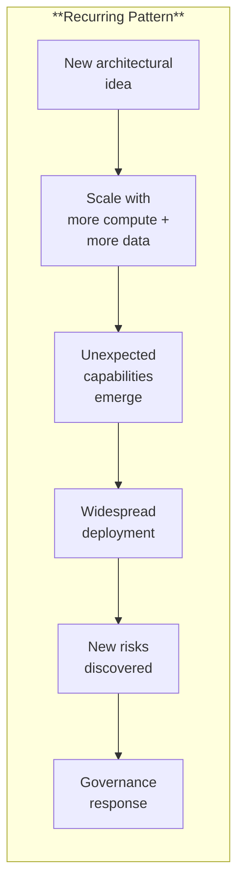

# From Perceptrons to Transformers: A Brief History

*Last reviewed: April 2026*

Understanding where we came from illuminates where we are. This chapter traces the key developments from the first artificial neuron to the transformer architecture, providing context for the technical concepts covered in the rest of this book.

## Timeline

```mermaid
flowchart TD
    P["**1958: Perceptron**<br/>Rosenblatt<br/>Single-layer linear classifier"]
    P --> W1["**1969: AI Winter I**<br/>Minsky & Papert show<br/>perceptron limitations"]
    W1 --> BP["**1986: Backpropagation**<br/>Rumelhart, Hinton, Williams<br/>Training deep networks<br/>becomes feasible"]
    BP --> CNN["**1998: LeNet-5 (CNN)**<br/>LeCun<br/>Convolutional networks<br/>for handwriting"]
    CNN --> W2["**2000s: AI Winter II**<br/>Limited data, limited<br/>compute, SVMs dominate"]
    W2 --> DL["**2012: AlexNet**<br/>Krizhevsky, Sutskever, Hinton<br/>Deep learning on GPUs<br/>wins ImageNet by huge margin"]
    DL --> SEQ["**2014: Seq2Seq + Attention**<br/>Bahdanau et al.<br/>Attention mechanism<br/>for machine translation"]
    SEQ --> TRANS["**2017: Transformer**<br/>Vaswani et al.<br/>'Attention Is All You Need'"]
    TRANS --> BERT["**2018: BERT**<br/>Google<br/>Bidirectional encoder"]
    BERT --> GPT2["**2019: GPT-2**<br/>OpenAI<br/>'Too dangerous to release'"]
    GPT2 --> GPT3["**2020: GPT-3**<br/>175B params<br/>In-context learning emerges"]
    GPT3 --> CHAT["**2022: ChatGPT**<br/>RLHF applied to GPT-3.5<br/>Public adoption explodes"]
    CHAT --> GPT4["**2023-2024: GPT-4, Claude 3,<br/>Gemini, Llama 3**<br/>Frontier models at scale"]
```

## The Perceptron Era (1958-1969)

Frank Rosenblatt's **perceptron** (1958) was the first artificial neuron that could learn from data. It computed a weighted sum of inputs and output 1 or 0 based on whether the sum exceeded a threshold. It could learn to classify linearly separable patterns — but nothing more.

Minsky and Papert's book *Perceptrons* (1969) proved mathematically that single-layer perceptrons **cannot learn XOR** — a function as simple as "one or the other, but not both." This result, combined with a broader critique of neural network limitations, contributed to the first AI winter. Funding dried up and neural network research stalled for over a decade.

**The lesson**: A single demonstration of fundamental limitation can halt an entire research direction. The perceptron was not wrong — it was limited. Multi-layer networks could solve XOR, but the tools to train them didn't exist yet.

## Backpropagation and Multi-Layer Networks (1986)

Rumelhart, Hinton, and Williams popularised **backpropagation** — the algorithm that made it practical to train multi-layer networks by efficiently computing gradients for every weight using the chain rule. Suddenly, deep networks could learn non-linear functions.

The technique existed earlier (Linnainmaa, 1970; Werbos, 1974), but the 1986 paper demonstrated its practical effectiveness and sparked renewed interest.

**Impact**: Multi-layer networks with backpropagation could (in principle) learn any function. But computing power was insufficient for large-scale applications. Networks remained small by modern standards.

## Convolutional Networks and Early Applications (1989-2000s)

Yann LeCun's **LeNet-5** (1989, refined through the 1990s) applied convolutional neural networks to handwritten digit recognition. CNNs exploited spatial structure in images: local connectivity, weight sharing, and pooling operations. LeNet-5 was deployed commercially for reading checks.

But for most of the 2000s, traditional machine learning methods — **Support Vector Machines** (SVMs), random forests, gradient-boosted trees — outperformed neural networks on most practical tasks. Neural networks were seen as computationally expensive and finicky. This was the second quiet period for deep learning.

## The Deep Learning Revolution (2012)

**AlexNet** (Krizhevsky, Sutskever, Hinton, 2012) won the ImageNet image classification competition by a massive margin, using a deep CNN trained on **GPUs**. This single result demonstrated that:
- Deep networks dramatically outperform traditional methods on complex tasks
- GPUs enable the compute needed for deep learning at scale
- More data + more compute + deeper networks = better performance

The dam broke. Within two years, deep learning dominated computer vision, speech recognition, and began transforming natural language processing.

## Sequence Models: RNNs and LSTMs (2013-2016)

For sequential data (text, speech, time series), **Recurrent Neural Networks** (RNNs) maintained a hidden state that carried information across time steps. But standard RNNs struggled with long sequences — gradients vanished over long distances.

**Long Short-Term Memory** (LSTM, Hochreiter & Schmidhuber, 1997, widely adopted in the 2010s) solved this with a gating mechanism that controlled information flow. LSTMs became the standard for machine translation, text generation, and speech recognition.

**Limitation**: RNNs and LSTMs process sequences **one token at a time**, creating a fundamental speed bottleneck. Each step depends on the previous step — no parallelization. And despite LSTMs, capturing very long-range dependencies remained difficult.

## Attention Is All You Need (2017)

The **transformer** (Vaswani et al., 2017) eliminated recurrence entirely. Instead of processing tokens sequentially, it used **self-attention** to let every token interact with every other token in parallel.

Key innovations:
- **Self-attention**: Direct interaction between all token pairs ($O(n^2)$ but parallelizable)
- **Positional encoding**: Inject position information since attention is position-agnostic
- **Multi-head attention**: Multiple parallel attention operations capturing different relationship types
- **Encoder-decoder structure**: Encoder processes input, decoder generates output

The result: dramatically faster training (full parallelism on GPUs), better long-range dependency modelling, and performance improvements across all NLP tasks.

This paper is the foundation of everything in Parts II and III of this book.

## The Pre-Training Revolution (2018-2020)

### BERT (2018)

Google's **BERT** (Bidirectional Encoder Representations from Transformers) showed that pre-training a large transformer encoder on massive text data, then fine-tuning on specific tasks, produced state-of-the-art results across all major NLP benchmarks simultaneously.

The insight: a single pre-trained model can serve as a foundation for many different tasks. This created the **transfer learning** paradigm that dominates modern AI.

### GPT-2 (2019)

OpenAI's **GPT-2** (1.5B parameters) was a decoder-only transformer trained on web text. It demonstrated surprisingly coherent text generation and early signs of few-shot capability. OpenAI initially withheld the full model, citing concerns about misuse — marking one of the first high-profile decisions about responsible AI release.

### GPT-3 (2020)

**GPT-3** (175B parameters) was a scaling milestone. At this size, **in-context learning** emerged: the model could perform tasks it was never explicitly trained for simply by seeing a few examples in the prompt. No fine-tuning needed.

This was the moment that demonstrated the scaling hypothesis — more parameters and more data produce qualitatively new capabilities, not just incrementally better performance.

## The Alignment Era (2022-Present)

### ChatGPT and RLHF (2022)

OpenAI applied **Reinforcement Learning from Human Feedback** (RLHF) to GPT-3.5, creating ChatGPT. The technical contribution was modest (RLHF was known), but the impact was transformative: for the first time, the general public could interact with a large language model through a natural conversation interface.

ChatGPT reached 100 million users in two months — faster than any technology product in history. This explosion in public awareness triggered:
- Massive investment in AI development
- Urgent regulatory responses (EU AI Act accelerated, executive orders, national AI strategies)
- The governance and safety field expanding from academic niche to operational necessity

### The Frontier (2023-2025)

The current era is characterized by:
- **Scale**: GPT-4, Claude 3 Opus, Gemini Ultra, Llama 3 405B — models with hundreds of billions (or trillions, for MoE) of parameters
- **Open weight releases**: Meta's Llama series, Mistral, and others release model weights publicly, democratizing access
- **Multimodality**: Models that process and generate text, images, audio, and video
- **Alignment and safety**: RLHF, DPO, Constitutional AI, red-teaming as standard practice
- **Regulation**: EU AI Act signed into law (2024), NIST AI RMF widely adopted, ISO 42001 published

## Patterns in the History

This pattern — innovation → scale → surprising capabilities → deployment → risk discovery → governance — has repeated with increasing speed. The gap between "surprising new capability" and "regulatory response" has compressed from decades (perceptrons to AI winter) to months (ChatGPT to EU AI Act acceleration).

> **Governance Relevance**
>
> History provides context for governance decisions:
>
> 1. **Capabilities outpace governance**: Every major AI capability (neural networks, deep learning, transformers, LLMs) was deployed and scaled before governance frameworks existed. The EU AI Act is the first comprehensive attempt to govern AI proactively rather than reactively.
> 2. **The scaling hypothesis is empirically strong**: More compute and more data have consistently produced more capable models. This supports compute-based governance frameworks (the 10²⁵ FLOPs threshold) — even if the exact threshold needs updating.
> 3. **Open vs. closed is not new**: The debate about responsible AI release (GPT-2 withheld, Llama released open-weight) echoes earlier technology debates. There is no settled answer — both approaches have valid governance arguments.
> 4. **The alignment gap is closing but not closed**: From no alignment (GPT-2) to RLHF (ChatGPT) to Constitutional AI (Claude) — alignment techniques are improving rapidly. But the gap between "aligned enough for deployment" and "fully aligned" remains significant.
