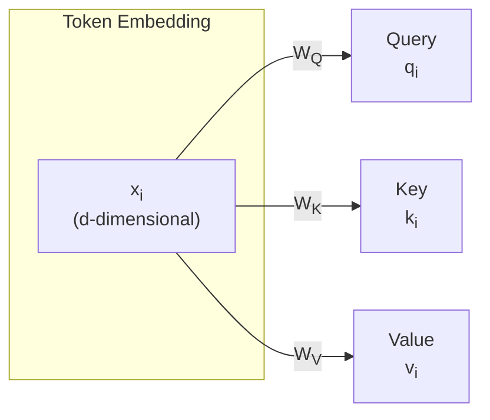
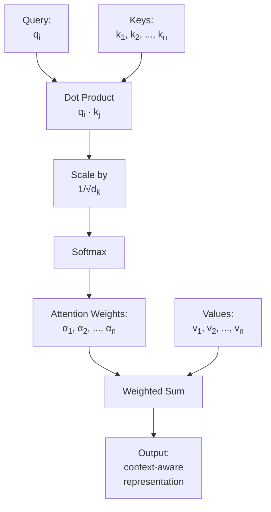
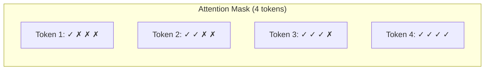

# The Attention Mechanism

*Last reviewed: April 2026*

Attention is the core innovation that makes transformers work. Introduced in "Attention Is All You Need" (Vaswani et al., 2017), the mechanism allows every token in a sequence to directly interact with every other token — eliminating the sequential processing bottleneck that limited earlier architectures like RNNs and LSTMs.

This chapter explains attention from first principles, building from the intuition to the exact computation.

## The Core Intuition

Consider the sentence: *"The cat sat on the mat because it was tired."*

What does "it" refer to? A human reader knows "it" refers to "the cat" — not "the mat." To make this connection, we need a mechanism that lets the word "it" look back at all previous words and determine which ones are most relevant to its meaning in this context.

That is what attention does. Every token computes a relevance score for every other token, then uses those scores to create a context-aware representation of itself.

## Queries, Keys, and Values

Attention operates on three vectors derived from each token's representation:

- **Query (Q)**: "What am I looking for?" — represents what information this token needs
- **Key (K)**: "What do I contain?" — represents what information this token has to offer
- **Value (V)**: "What information do I actually carry?" — the content that gets passed forward

Each projection is a learned linear transformation (matrix multiplication). The weight matrices $W_Q$, $W_K$, $W_V$ are the parameters that training optimises.

## The Attention Computation

For a single query token attending to all key-value pairs:

$$\text{Attention}(Q, K, V) = \text{softmax}\left(\frac{QK^T}{\sqrt{d_k}}\right)V$$

Step by step:

1. **Compute similarity scores**: Multiply each query by every key (dot product). This produces a score indicating how relevant each key is to the query.
2. **Scale**: Divide by $\sqrt{d_k}$ (the square root of the key dimension). Without scaling, dot products grow large as dimensionality increases, pushing softmax into regions where gradients vanish.
3. **Normalise**: Apply softmax to convert raw scores into a probability distribution (all positive, sum to 1). Each score is now an "attention weight."
4. **Aggregate**: Multiply each value vector by its attention weight and sum. The result is a weighted combination of all value vectors, dominated by the most relevant ones.

## A Concrete Example

Consider three tokens: ["The", "cat", "sat"]. Suppose after projection, the dot products between the query for "sat" and the keys for each token are:

| Key token | Raw score | After softmax |
|-----------|-----------|---------------|
| "The" | 1.2 | 0.15 |
| "cat" | 3.8 | 0.72 |
| "sat" | 1.5 | 0.13 |

The output for "sat" would be: 0.15 × v_The + 0.72 × v_cat + 0.13 × v_sat

The token "sat" now carries a representation that is heavily influenced by "cat" — encoding the relationship between the action and its subject. This is how attention builds contextual understanding.

## Self-Attention vs. Cross-Attention

**Self-attention**: Q, K, and V all come from the same sequence. Every token attends to every other token in the same input. This is what GPT-family models use.

**Cross-attention**: Q comes from one sequence (e.g., a decoder generating a translation), while K and V come from another sequence (e.g., the encoder processing the source language). Used in encoder-decoder models like the original transformer for machine translation.

## Masked Attention

In autoregressive models (GPT family), a token at position $i$ should only attend to positions $\leq i$ — it cannot look at future tokens that haven't been generated yet. This is enforced by **masking**: setting the attention scores for future positions to $-\infty$ before softmax, which drives their attention weights to zero.

✓ = can attend, ✗ = masked (set to −∞). This creates a causal or "autoregressive" attention pattern — each token can only see the past, not the future.

## Computational Complexity

Standard self-attention has **quadratic complexity** in sequence length: $O(n^2 \cdot d)$ where $n$ is the number of tokens and $d$ is the model dimension. This means:

- Doubling the sequence length quadruples the attention computation
- A 128K context window requires 16,384× more attention computation than a 1K window

This quadratic scaling is the primary bottleneck for long-context models and has motivated extensive research into efficient attention variants (covered in Chapter 11).

## Why Attention Works So Well

1. **Direct connections**: Unlike RNNs where information must flow sequentially through every intermediate position, attention creates direct connections between any two tokens regardless of distance.

2. **Parallelisable**: All attention scores can be computed simultaneously (matrix multiplication), unlike RNNs which process tokens one by one. This makes transformers dramatically faster to train on modern GPU hardware.

3. **Interpretable (partially)**: Attention weights provide some insight into which tokens the model considers relevant — though this interpretability has limits (see Chapter 24: Explainability).

4. **Composable**: Stacking attention layers creates increasingly abstract representations. Early layers capture syntactic relationships; later layers capture semantic and reasoning patterns.

> **Governance Relevance**
>
> Attention mechanisms are central to explainability discussions. When a provider claims their model is "interpretable because you can inspect the attention weights," understand the limitation: attention weights show which tokens were attended to, but do not explain *what* was learned from that attention or *why* a particular output was produced. Attention maps are a useful debugging tool, not a complete explanation.
