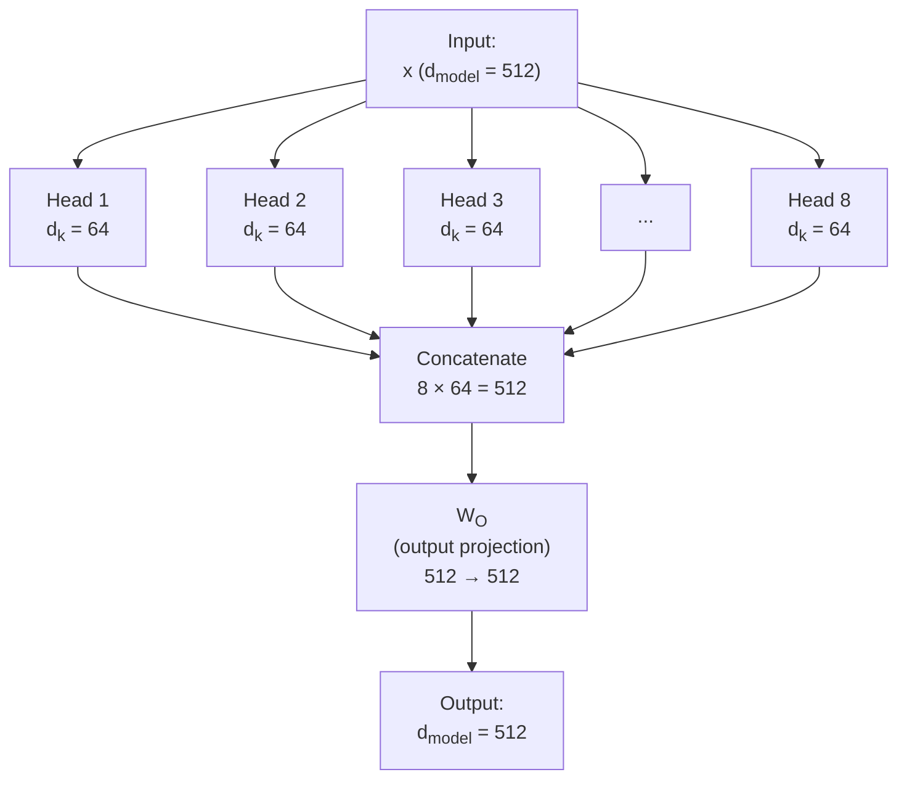
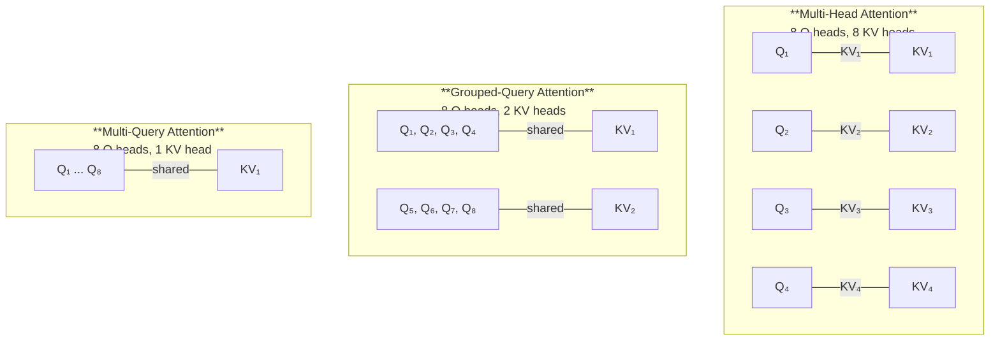

# Multi-Head Attention

*Last reviewed: April 2026*

A single attention operation can only capture one type of relationship at a time. Multi-head attention runs **multiple attention operations in parallel**, each learning to focus on different aspects of the input — syntactic relationships, semantic similarity, positional patterns, coreference, and more.

## Why Multiple Heads?

Consider the sentence: *"The bank approved the loan because the applicant's credit score was excellent."*

Different types of relationships matter simultaneously:
- **Syntactic**: "approved" relates to "bank" (subject-verb)
- **Semantic**: "loan" relates to "credit score" (topical connection)
- **Coreference**: "the applicant's" implicitly refers to someone mentioned or implied
- **Causal**: "because" links the approval to the credit score

A single attention head must compress all of these relationships into one set of attention weights. Multiple heads let the model maintain separate "channels" for different relationship types.

## The Multi-Head Mechanism

Each head operates on a **reduced dimension**:

$$d_k = d_v = \frac{d_{\text{model}}}{h}$$

Where $h$ is the number of heads. For the original transformer ($d_{\text{model}} = 512$, $h = 8$), each head works in 64 dimensions. This means multi-head attention has approximately the **same total compute cost** as single-head attention at the full dimension — you're dividing the work, not multiplying it.

### The Computation

$$\text{MultiHead}(Q, K, V) = \text{Concat}(\text{head}_1, \ldots, \text{head}_h) W^O$$

Where each head is:

$$\text{head}_i = \text{Attention}(QW_i^Q, KW_i^K, VW_i^V)$$

Each head has its own learned projection matrices ($W_i^Q$, $W_i^K$, $W_i^V$), which means each head learns to project the input into a different subspace where different types of relationships become apparent.

## What Different Heads Learn

Research (Clark et al., 2019; Voita et al., 2019) has shown that attention heads tend to specialise:

| Head Type | What It Learns | Layer Tendency |
|-----------|---------------|----------------|
| **Positional heads** | Attend to adjacent tokens (previous token, next token) | Early layers |
| **Syntactic heads** | Track grammatical structure (subject-verb, modifier-noun) | Early-to-middle layers |
| **Coreference heads** | Link pronouns to their referents | Middle layers |
| **Rare word heads** | Give high attention to unusual or informative tokens | Middle layers |
| **Delimiter heads** | Attend to punctuation and special tokens | Various layers |
| **Semantic heads** | Attend to semantically related tokens across long distances | Later layers |

Not every head is equally important. Some heads can be **pruned** (removed) with minimal impact on model performance, suggesting redundancy. Others are critical — removing them causes significant degradation.

## Scaling Head Counts

| Model | Parameters | Layers | Heads per Layer | d_model | d_k per Head |
|-------|-----------|--------|-----------------|---------|-------------|
| Transformer (original) | 65M | 6 | 8 | 512 | 64 |
| BERT-base | 110M | 12 | 12 | 768 | 64 |
| GPT-2 | 1.5B | 48 | 25 | 1600 | 64 |
| GPT-3 | 175B | 96 | 96 | 12288 | 128 |
| Llama 2 70B | 70B | 80 | 64 | 8192 | 128 |

The per-head dimension ($d_k$) tends to stay in the 64-128 range even as models scale. What increases is the number of heads and the total model dimension.

## Grouped-Query Attention (GQA)

Standard multi-head attention requires storing separate K and V projections for every head, which becomes expensive during inference (especially for long sequences where the KV cache grows large).

**Grouped-Query Attention** (Ainslie et al., 2023) reduces this cost by sharing K and V projections across groups of query heads:

- **MHA**: Each query head has its own KV pair. Maximum expressiveness, maximum memory cost.
- **GQA**: Groups of query heads share a KV pair. Used in Llama 2 70B and Llama 3 models. Good balance of quality and efficiency.
- **MQA (Multi-Query)**: All query heads share a single KV pair. Maximum efficiency, some quality loss.

GQA reduces the KV cache memory by a factor equal to the grouping ratio, which directly impacts maximum context length and inference throughput.

## KV Cache

During autoregressive generation, the model generates one token at a time. Without caching, generating token $n$ would require recomputing the K and V vectors for all $n-1$ previous tokens — an $O(n^2)$ cost per token.

The **KV cache** stores the K and V vectors from all previous tokens, so each new token only needs to compute its own Q, K, V and then attend to the cached K and V vectors. This reduces per-token generation from $O(n^2)$ to $O(n)$.

The trade-off: the KV cache grows linearly with sequence length and is proportional to the number of KV heads. For a model like GPT-3 with 96 layers and 96 heads generating a 128K context, the KV cache alone requires tens of gigabytes of GPU memory.

> **Governance Relevance**
>
> Multi-head attention is relevant to explainability claims. When providers show "attention visualisations," they are typically showing the weights from individual attention heads. Since different heads specialise in different relationships, a single head's attention pattern tells only a partial story. Comprehensive attention analysis requires examining patterns across many heads and layers — which is rarely done in practice. This limits the depth of attention-based explanations.
