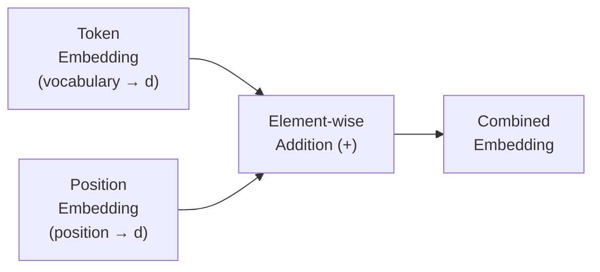
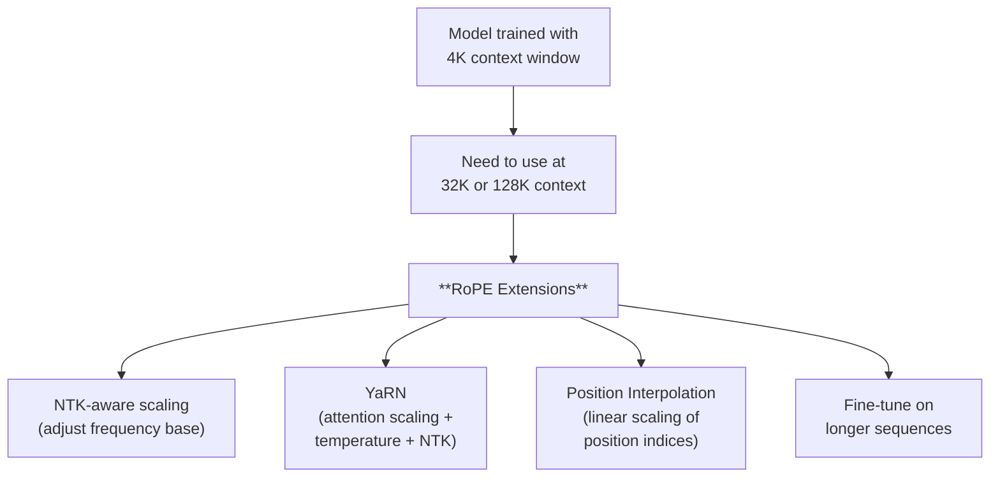

# Positional Encoding

*Last reviewed: April 2026*

Attention is **position-agnostic** — the attention score between two tokens depends only on their content (Q and K vectors), not on where they appear in the sequence. Without positional information, the sentences "dog bites man" and "man bites dog" would produce identical representations.

Positional encoding injects position information into the model so it can distinguish token order while preserving the parallelism advantage of attention over recurrent architectures.

## The Problem

Consider self-attention computing $\text{softmax}(QK^T/\sqrt{d_k})V$. This is a **set operation** — it produces the same result regardless of how the input tokens are ordered. Shuffling the input sequence would change nothing about the attention computation itself.

Language is fundamentally ordered. Meaning depends on word order. Therefore, we must explicitly encode position.

## Approach 1: Sinusoidal Positional Encoding (Original Transformer)

The original "Attention Is All You Need" paper encodes position using fixed sinusoidal functions:

$$PE_{(pos, 2i)} = \sin\left(\frac{pos}{10000^{2i/d_{\text{model}}}}\right)$$

$$PE_{(pos, 2i+1)} = \cos\left(\frac{pos}{10000^{2i/d_{\text{model}}}}\right)$$

Where $pos$ is the token position and $i$ is the dimension index. Each dimension of the positional encoding uses a sinusoid of a different frequency, creating a unique pattern for each position.

**Why sinusoids?** The authors hypothesised that sinusoidal encodings would allow the model to learn to attend to relative positions, because for any fixed offset $k$, the encoding at position $pos + k$ can be expressed as a linear function of the encoding at position $pos$. This means relative position information is theoretically recoverable.

**Properties:**
- Deterministic — no learnable parameters
- Can theoretically extrapolate to sequence lengths not seen during training (though in practice, performance degrades)
- Added to token embeddings at the input layer

## Approach 2: Learned Absolute Positional Embeddings (GPT, BERT)

Instead of fixed sinusoids, learn a separate embedding vector for each position:

A lookup table maps each position index (0, 1, 2, ..., max_length) to a $d$-dimensional vector. These vectors are learned during training alongside all other parameters.

**Properties:**
- Learnable — can capture complex positional patterns
- Cannot extrapolate beyond the maximum position seen during training
- GPT-2: 1024 positions, BERT: 512 positions, GPT-3: 2048 positions

**Limitation:** The model is strictly limited to the context window size set during training. Inputs longer than max_length cannot be processed without modification.

## Approach 3: Rotary Position Embeddings — RoPE (Modern Standard)

RoPE (Su et al., 2021) has become the dominant approach in modern language models (Llama, Mistral, Qwen, Gemma). Instead of adding positional information to the input embeddings, RoPE **rotates** the query and key vectors based on their position.

### The Intuition

Think of each pair of dimensions in the Q and K vectors as a 2D plane. RoPE rotates vectors in this plane by an angle proportional to the token's position. When computing the dot product $q_i \cdot k_j$ (the attention score), the rotation encodes the **relative distance** $i - j$ between the two tokens.

$$f(q, m) = q \cdot e^{im\theta}$$

Where $m$ is the position and $\theta$ is a frequency parameter that varies across dimension pairs. Different dimension pairs rotate at different frequencies — fast-rotating dimensions capture short-range relationships; slow-rotating dimensions capture long-range ones.

### Why RoPE Dominates

| Property | Sinusoidal | Learned Absolute | RoPE |
|----------|:---------:|:----------------:|:----:|
| Captures relative position | Theoretically | No | Yes (by design) |
| Learnable | No | Yes | Frequency base is a hyperparameter |
| Extrapolation beyond training length | Limited | No | With extensions (NTK-aware, YaRN) |
| Where applied | Input embeddings | Input embeddings | Q and K at every layer |
| Compute overhead | Negligible | Negligible | Small (rotation at each layer) |
| Modern adoption | Rare | Rare | Standard |

RoPE's key advantage: attention scores depend directly on **relative position** ($i - j$), not absolute positions ($i$ and $j$ separately). This means the model naturally learns distance-based patterns: "the token 3 positions back is often the subject" rather than "the token at position 7 is important."

## Approach 4: ALiBi — Attention with Linear Biases

ALiBi (Press et al., 2022) takes a simpler approach: instead of modifying embeddings or rotations, it adds a **linear penalty** to attention scores based on distance:

$$\text{score}_{ij} = q_i \cdot k_j - m \cdot |i - j|$$

Where $m$ is a head-specific slope. Different heads use different slopes (geometrically spaced), so some heads are sensitive to nearby tokens while others attend more broadly.

**Properties:**
- No learned positional parameters
- Strong extrapolation to longer sequences
- Simple to implement
- Used in BLOOM and some MPT models

## Context Length Extension

A major practical challenge: how do you use a model at longer context lengths than it was trained on? The positional encoding determines the answer:

**Position Interpolation (PI)**: Instead of using position index 32768 for the 32769th token (which would be out of training distribution), interpolate: scale all positions by the ratio of original to target length. Position 32768 becomes position 4096 × (32768/32768) = 4096 — now within the trained range.

**NTK-aware scaling**: Adjusts the frequency base of RoPE so that high-frequency (short-range) dimensions maintain their resolution while low-frequency (long-range) dimensions are stretched to accommodate longer sequences.

**YaRN (Yet another RoPE extensioN)**: Combines NTK-aware scaling with attention temperature adjustment, achieving strong extrapolation with minimal fine-tuning.

These techniques have enabled models trained on 4K contexts to be successfully extended to 128K+ contexts — a critical practical capability.

## Impact on Model Behavior

The choice of positional encoding affects more than just maximum context length:

- **Recency bias**: Most positional encoding schemes create some degree of recency bias — tokens closer to the current position tend to get higher attention. This is why models sometimes "forget" information in the middle of long contexts (the "lost in the middle" phenomenon).

- **Position-dependent performance**: Models may perform differently on the same information depending on where it appears in the context window. This has governance implications for RAG systems where document ordering in the prompt can affect output quality.

- **Training-inference mismatch**: If context length extensions are applied without sufficient fine-tuning, the model may exhibit degraded performance at lengths it wasn't trained for, even if it technically processes the input.

> **Governance Relevance**
>
> Positional encoding choices directly affect a model's context window claims. When a model card states "128K context window," verify:
> - Was it **trained** at 128K, or was a 4K model **extended** to 128K using PI/YaRN/NTK?
> - If extended, has performance been evaluated at the target context length? The "lost in the middle" effect means information retrieval accuracy often drops significantly at long contexts.
> - Context window claims should be accompanied by performance metrics at various context lengths, not just the maximum.
