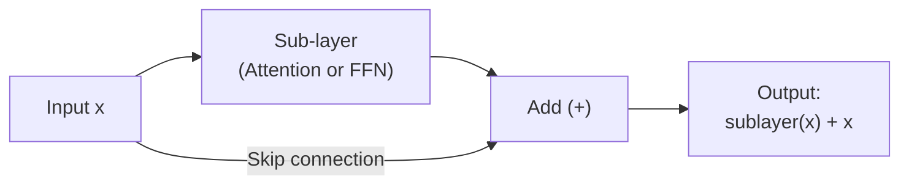
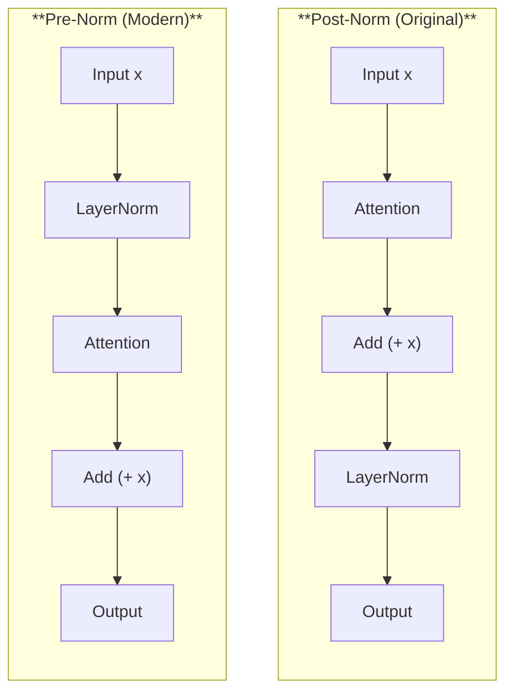
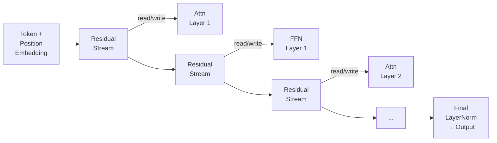

# Layer Normalisation and Residual Connections

*Last reviewed: April 2026*

Transformers are deep networks — GPT-3 has 96 layers, Llama 2 70B has 80 layers. Training networks this deep is only possible because of two architectural components that stabilise the learning process: **layer normalisation** (LayerNorm) and **residual connections** (skip connections).

These components are not glamorous, but they are essential. Without them, transformer training collapses.

## Residual Connections

### The Problem They Solve

In a deep network, each layer transforms its input. After many layers, the original input signal can be lost — gradients during backpropagation must flow through every layer, and at each layer they can shrink (vanishing gradients) or explode (exploding gradients).

### The Solution

A residual connection adds the input of a sub-layer directly to its output:

$$\text{output} = \text{sublayer}(x) + x$$

The gradient of the addition operation is 1 — gradients flow through the skip connection unchanged. This means even in a 96-layer network, gradients from the final layer have a direct additive path back to the first layer. The network can never do *worse* than the identity function for any sub-layer, because the skip connection preserves the input.

### In the Transformer Block

Each transformer block has **two** residual connections:

$$x_1 = \text{Attention}(x) + x$$
$$x_2 = \text{FFN}(x_1) + x_1$$

Every sub-layer (attention and feed-forward) is wrapped in a residual connection. This means information flows through two parallel paths at each stage: the "residual stream" (unchanged identity) and the "transformation" (what the sub-layer computes). The sub-layer only needs to learn the **residual** — the difference between the desired output and the input — hence the name.

## Layer Normalisation

### The Problem It Solves

Even with residual connections, activation magnitudes can drift across layers. If the values flowing through the network grow or shrink systematically, optimisation becomes unstable — learning rate that works for one layer may be too large or too small for another.

### The Computation

Layer normalisation normalises activations across the **feature dimension** (not the batch dimension, which is what batch normalisation does):

$$\text{LayerNorm}(x) = \gamma \cdot \frac{x - \mu}{\sqrt{\sigma^2 + \epsilon}} + \beta$$

Where:
- $\mu$ = mean of $x$ across the feature dimension
- $\sigma^2$ = variance of $x$ across the feature dimension
- $\gamma$ and $\beta$ = learned scale and shift parameters
- $\epsilon$ = small constant for numerical stability (typically $10^{-5}$)

The learned parameters $\gamma$ and $\beta$ allow the network to undo the normalisation if that's optimal — LayerNorm constrains the default behavior but doesn't permanently lock it.

## Pre-Norm vs. Post-Norm

The original transformer used **post-norm** — LayerNorm is applied after the residual addition:

$$x_1 = \text{LayerNorm}(\text{Attention}(x) + x)$$

Modern transformers (GPT-2 onward, Llama, Mistral) use **pre-norm** — LayerNorm is applied before the sub-layer:

$$x_1 = \text{Attention}(\text{LayerNorm}(x)) + x$$

### Why Pre-Norm Won

| Property | Post-Norm | Pre-Norm |
|----------|:---------:|:--------:|
| Training stability | Requires careful warmup | More stable from the start |
| Gradient flow | Normalisation on the residual path | Clean residual path (no normalisation blocking gradients) |
| Performance at scale | Slightly better if training is stable | Comparable, much easier to train |
| Modern adoption | Rare | Standard |

Pre-norm places the normalisation inside the sub-layer branch, leaving the residual stream (the skip connection path) completely unobstructed. This means gradients can flow from the last layer to the first without passing through any normalisation layers — significantly improving training stability for very deep networks.

## RMSNorm: A Simpler Alternative

RMSNorm (Zhang & Sennrich, 2019) simplifies LayerNorm by removing the mean-centering step:

$$\text{RMSNorm}(x) = \gamma \cdot \frac{x}{\sqrt{\frac{1}{d}\sum_{i=1}^{d} x_i^2 + \epsilon}}$$

It normalises by the root-mean-square of the activations, without subtracting the mean first. This is computationally cheaper (one fewer reduction operation) and has been shown to perform comparably.

**Adoption**: Llama, Llama 2, Llama 3, Mistral, and Gemma all use RMSNorm instead of standard LayerNorm. It has become the default for modern LLM architectures.

## The Residual Stream View

A useful mental model (popularised by the mechanistic interpretability community) is to view the transformer as a **residual stream** — a river of information that flows through all layers, with attention and FFN sub-layers reading from and writing to it:

In this view:
- The **residual stream** carries the evolving representation through all layers
- Each **attention layer** reads from the stream (via Q, K, V projections) and writes back (via the output projection + residual addition)
- Each **FFN layer** reads from the stream (via its input) and writes back (via its output + residual addition)
- The final representation is the **sum** of the initial embedding and all sub-layer contributions

This view explains why transformers are surprisingly robust to layer removal — removing one layer removes one read/write operation but doesn't destroy the stream itself. It also explains why features from early layers persist to the output: they propagate through the residual stream unchanged unless explicitly overwritten.

> **Governance Relevance**
>
> LayerNorm and residual connections are not directly governance-relevant, but understanding them helps when evaluating model architecture claims. If a provider claims architectural innovations for training stability or efficiency, understanding these fundamentals lets you assess whether the claimed improvements are meaningful or incremental.
