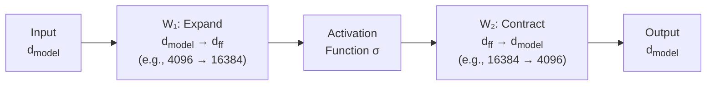
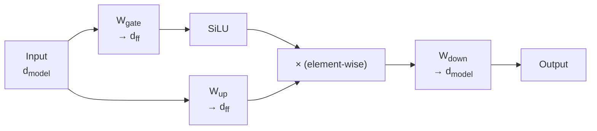
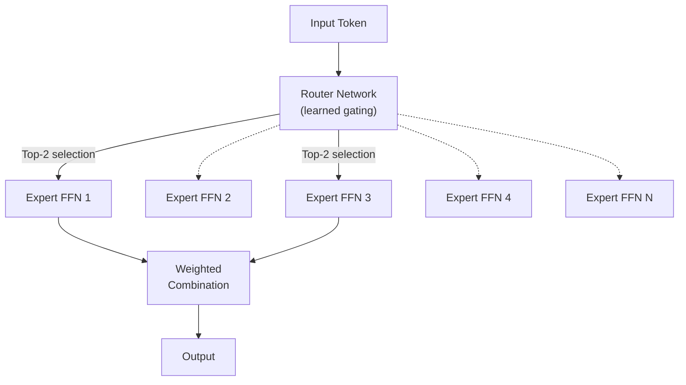

# Feed-Forward Networks in Transformers

*Last reviewed: April 2026*

Every transformer block contains two sub-layers: an attention layer (which models relationships between tokens) and a **feed-forward network** (FFN) layer (which processes each token independently). The FFN is sometimes overlooked in favor of attention, but it contains the majority of a transformer's parameters and plays a critical role in storing learned knowledge.

## Architecture

The standard FFN in each transformer block is a simple two-layer network applied to each token position independently (no interaction between tokens):

$$\text{FFN}(x) = W_2 \cdot \sigma(W_1 x + b_1) + b_2$$

Where:
- $W_1 \in \mathbb{R}^{d_{\text{ff}} \times d_{\text{model}}}$ — projects from model dimension to a larger intermediate dimension
- $W_2 \in \mathbb{R}^{d_{\text{model}} \times d_{\text{ff}}}$ — projects back to model dimension
- $\sigma$ — activation function
- $d_{\text{ff}}$ — intermediate (hidden) dimension, typically $4 \times d_{\text{model}}$

## The Expand-Contract Pattern

The FFN first **expands** the representation to a higher dimension, applies a non-linearity, then **contracts** back. This expansion ratio is typically 4:1 in the original transformer design. The intermediate dimension $d_{\text{ff}}$ is where the network has its highest representational capacity.

Why expand? The non-linear activation in the intermediate space allows the network to compute more complex per-token transformations than a single linear layer could achieve. The expansion gives the network more "room" to represent different features before compressing back.

## Parameter Cost

The FFN accounts for a disproportionate share of total parameters:

| Component | Parameters per Layer |
|-----------|---------------------|
| Self-attention (Q, K, V, O projections) | $4 \times d_{\text{model}}^2$ |
| FFN (W₁ and W₂) | $2 \times d_{\text{model}} \times d_{\text{ff}}$ = $8 \times d_{\text{model}}^2$ (if ratio is 4x) |

With a 4:1 expansion ratio, **the FFN has twice the parameters of the attention layer**. For a model like GPT-3 ($d_{\text{model}} = 12288$, $d_{\text{ff}} = 49152$, 96 layers), the FFN parameters across all layers total approximately 115 billion out of 175 billion total — about **two-thirds** of the model.

## Activation Functions

### ReLU (Original Transformer)

$$\text{ReLU}(x) = \max(0, x)$$

Simple and effective. Zeroes out negative values. The original transformer used ReLU in the FFN.

### GELU (GPT-2, BERT)

$$\text{GELU}(x) = x \cdot \Phi(x)$$

Where $\Phi(x)$ is the cumulative distribution function of the standard normal distribution. Approximated as:

$$\text{GELU}(x) \approx 0.5x \left(1 + \tanh\left[\sqrt{2/\pi}(x + 0.044715x^3)\right]\right)$$

GELU is a "smooth" version of ReLU — instead of a hard cutoff at zero, it gradually attenuates values near zero. This smoother gradient flow is believed to help training stability.

### SiLU / Swish (Llama, Mistral)

$$\text{SiLU}(x) = x \cdot \sigma(x) = \frac{x}{1 + e^{-x}}$$

SiLU (Sigmoid Linear Unit, also called Swish) is used in Llama, Llama 2, Llama 3, and Mistral models. Like GELU, it is smooth and allows small negative values to pass through, but with a different curve shape.

## Gated FFN (SwiGLU)

Modern LLMs (Llama, Mistral, Gemma, PaLM) use a **gated** variant of the FFN called **SwiGLU** (Shazeer, 2020):

$$\text{SwiGLU}(x) = \text{SiLU}(xW_{\text{gate}}) \odot (xW_{\text{up}})$$

$$\text{FFN}_{\text{SwiGLU}}(x) = \text{SwiGLU}(x) \cdot W_{\text{down}}$$

Instead of one up-projection, there are two: a **gate** projection and an **up** projection. The gate projection controls how much of the up projection passes through, using element-wise multiplication ($\odot$).

SwiGLU adds a third weight matrix (3 instead of 2), increasing parameters by ~50%. To compensate, models using SwiGLU typically reduce $d_{\text{ff}}$ from 4x to $\frac{8}{3} \times d_{\text{model}}$ (approximately 2.67x), keeping total parameters roughly constant while improving performance.

## The FFN as a Knowledge Store

Research in mechanistic interpretability has proposed that FFN layers function as a form of **key-value memory** (Geva et al., 2021):

- The first linear transformation ($W_1$) acts as a **pattern detector** — each row of $W_1$ is a "key" that activates in response to specific input patterns
- The activation function determines which patterns are active (non-zero)
- The second linear transformation ($W_2$) maps activated patterns to **output updates** — each column of $W_2$ is a "value" that gets added to the residual stream when its corresponding key activates

In this view, each FFN neuron in the intermediate layer represents a learned association: "when I see this pattern (key), add this information (value) to the representation." The billions of parameters in FFN layers across all transformer blocks collectively store the model's "knowledge" — factual associations, linguistic patterns, and reasoning heuristics.

This has been experimentally validated: researchers have identified individual FFN neurons that activate for specific factual associations (e.g., "Eiffel Tower → Paris") and shown that editing these neurons can update the model's knowledge without retraining.

## Mixture of Experts (MoE) FFN

The FFN is also the component targeted by **Mixture of Experts** architectures. Instead of one large FFN per layer, MoE replaces it with multiple smaller "expert" FFNs and a learned **router** that selects which experts to activate for each token:

- **Total parameters**: Very large (all experts combined)
- **Active parameters per token**: Small (only top-k experts activate, typically k=2)
- **Benefit**: Much larger model capacity without proportionally higher compute cost

Mixtral 8x7B (Mistral, 2024) has 8 experts per layer, activates 2, for ~47B total parameters but only ~13B active per token. This design is becoming increasingly common.

> **Governance Relevance**
>
> The FFN's role as a knowledge store has direct implications for model editing and knowledge control. Research on "model editing" — surgically modifying specific facts stored in the model — targets FFN weights. This creates both opportunities (correcting known errors without full retraining) and risks (malicious modification of model knowledge). When assessing model integrity and supply chain security (EU AI Act Art. 15(9)), the FFN layers are where knowledge-level attacks would target.
>
> For MoE models, the "parameter count" in model cards requires nuance: a model may have 47B total parameters but only 13B active per forward pass. Governance documentation should report both numbers, as total parameters affect storage/security requirements while active parameters affect inference cost and performance characteristics.
