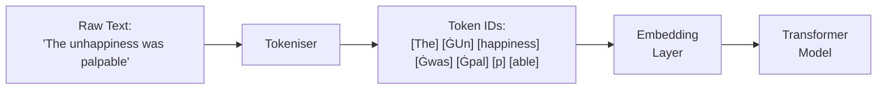

# Tokenisation

*Last reviewed: April 2026*

Before a language model can process text, that text must be converted into numbers — specifically, a sequence of integer **token IDs** drawn from a fixed vocabulary. The tokeniser is the first and last component in the text processing pipeline: it converts text to tokens before the model, and tokens back to text after the model.

Tokenisation is not a trivial engineering detail. It fundamentally affects what the model can learn, how it handles different languages, and where certain types of failures originate.

## Why Not Characters or Words?

### Character-level

Split text into individual characters: "Hello" → ["H", "e", "l", "l", "o"]

- **Pro**: Tiny vocabulary (~256 for UTF-8 bytes), handles any text
- **Con**: Sequences become very long (an average English word is 5 characters), greatly increasing attention's $O(n^2)$ cost. The model must learn spelling, word boundaries, and morphology from scratch.

### Word-level

Split on whitespace/punctuation: "The cat sat" → ["The", "cat", "sat"]

- **Pro**: Semantically meaningful units
- **Con**: Vocabulary becomes enormous (hundreds of thousands of words), out-of-vocabulary words cannot be represented, morphological variants (run/running/ran) get no shared representation.

### Subword Tokenisation: The Middle Ground

Modern LLMs use **subword** tokenisation: common words remain whole, while rare words are split into smaller pieces. This balances vocabulary size (typically 32K–100K tokens) with sequence length.

"unhappiness" might tokenise as: ["un", "happiness"] or ["un", "happ", "iness"]

(Ġ represents a leading space — many tokenisers encode spaces as part of the token.)

## Byte Pair Encoding (BPE)

BPE (Sennrich et al., 2016) is the most widely used tokenisation algorithm, used by GPT-2, GPT-3, GPT-4, Llama, and Mistral.

### How BPE Training Works

1. **Start** with a base vocabulary of individual characters (or bytes)
2. **Count** the frequency of every adjacent pair of tokens in the training corpus
3. **Merge** the most frequent pair into a new single token
4. **Repeat** steps 2-3 until the vocabulary reaches the desired size

### Example

Starting text: "aab aab aab ab"

Starting vocabulary: {a, b, ' ', 'a', 'b'}

| Step | Most Frequent Pair | New Token | Vocabulary Size |
|------|-------------------|-----------|----------------|
| 1 | (a, a) → | aa | +1 |
| 2 | (aa, b) → | aab | +1 |
| 3 | (aab, ' ') → | "aab " | +1 |

The algorithm greedily merges the most common pairs, naturally creating tokens for common words and subwords while keeping rare sequences as smaller pieces.

### BPE Tokenisation (Inference)

Given a trained vocabulary, tokenise new text by applying the learned merges in order of training priority:

1. Split input into individual characters
2. Apply merges in the order they were learned during training
3. Stop when no more merges can be applied

### Byte-Level BPE (GPT-2+)

Instead of starting from Unicode characters, start from raw **bytes** (0–255). This guarantees every possible input can be tokenised — no out-of-vocabulary tokens, ever. UTF-8 characters that span multiple bytes get split into byte tokens before merges are applied.

GPT-2 introduced byte-level BPE, and it has been the standard since.

## SentencePiece

SentencePiece (Kudo & Richardson, 2018) treats the input as a raw byte stream, not pre-tokenised words. It works directly on Unicode text without requiring language-specific pre-processing (whitespace splitting, punctuation handling), making it more language-agnostic.

Llama, Llama 2, and Gemma use SentencePiece with a BPE or Unigram algorithm internally.

**Key difference from standard BPE**: SentencePiece treats spaces as regular characters (often represented as ▁) rather than word boundaries. This means it can learn tokens that span word boundaries if that's statistically efficient.

## The Vocabulary

| Model | Vocabulary Size | Algorithm |
|-------|:--------------:|-----------|
| GPT-2 | 50,257 | Byte-level BPE |
| GPT-3 | 50,257 | Byte-level BPE |
| GPT-4 | ~100,000 | Byte-level BPE (tiktoken) |
| Llama 2 | 32,000 | SentencePiece BPE |
| Llama 3 | 128,256 | Byte-level BPE (tiktoken) |
| Mistral | 32,000 | SentencePiece BPE |
| Gemma | 256,000 | SentencePiece |

Vocabulary size is a key design choice:
- **Larger vocabulary** → shorter token sequences (fewer tokens per text), faster inference, but larger embedding tables (more parameters) and potentially worse handling of rare tokens
- **Smaller vocabulary** → longer sequences (more tokens per text), higher compute per text, but more compositional — rare words can always be built from common pieces

## Tokenisation Problems

### The Multilingual Tax

Most LLM tokenisers are trained primarily on English text. This means English words tend to be single tokens, while words in other languages may be split into many tokens:

| Language | Text | Approximate Tokens |
|----------|------|--------------------|
| English | "artificial intelligence" | 2 tokens |
| Japanese | "人工知能" (artificial intelligence) | 4-6 tokens |
| Hindi | "कृत्रिम बुद्धिमत्ता" | 8-12 tokens |
| Thai | "ปัญญาประดิษฐ์" | 10-15 tokens |

This has concrete consequences:
- **Higher cost**: Non-English users consume more tokens per equivalent meaning, paying more for API access
- **Shorter effective context**: The same context window holds less information in non-English languages
- **Potential quality degradation**: More tokens per concept means longer sequences and potentially degraded attention over them

### Numbers and Arithmetic

Tokenisers split numbers inconsistently: "123456" might become ["123", "456"] or ["1", "234", "56"] depending on the specific tokeniser. This means the model sees numbers as arbitrary subword pieces, not as numerical values. It partly explains why language models struggle with arithmetic — they have no consistent representation of numerical magnitude.

### Trailing Whitespace and Special Characters

Tokenisation of whitespace, newlines, and special characters varies between models and can affect behavior in surprising ways. A prompt ending in a space may tokenise differently than one without the trailing space, potentially changing model output.

### The Glitch Token Problem

Some tokens in the vocabulary may appear extremely rarely or never in the training data. These "glitch tokens" have poorly trained embeddings and can cause unexpected model behavior when they appear in input text. Examples have included tokens that cause the model to repeat text, generate nonsense, or ignore instructions.

## Special Tokens

Every tokeniser includes tokens with special meanings that are not part of the natural text:

| Token | Purpose |
|-------|---------|
| `<|endoftext|>` or `</s>` | End of sequence — signals the model to stop generating |
| `<|startoftext|>` or `<s>` | Start of sequence |
| `[PAD]` | Padding for batch processing — fills shorter sequences to match the longest |
| `[CLS]` | Classification token (BERT) — used for sequence-level tasks |
| `[SEP]` | Separator between segments (BERT) |
| `<|im_start|>`, `<|im_end|>` | Chat turn delimiters (ChatML format) |
| `<|system|>`, `<|user|>`, `<|assistant|>` | Role markers for chat models |

These special tokens structure the conversation format and tell the model which parts of the input serve which roles. The chat template (how special tokens frame system prompts, user messages, and assistant responses) varies by model and is critical for correct behavior.

> **Governance Relevance**
>
> Tokenisation has direct governance implications:
>
> 1. **Multilingual fairness**: If a model's tokeniser imposes a 3-5x token cost on non-English languages, deployers should assess whether this creates unfair cost or quality disparities. EU AI Act Article 10(2)(f) requires bias examination — tokeniser-induced language bias qualifies.
> 2. **Cost transparency**: Token-based pricing means the same information in different languages has different costs. This should be disclosed to deployers and users.
> 3. **Prompt injection via special tokens**: Attackers can craft inputs containing special token sequences (or their byte representations) to manipulate model behavior. Input sanitisation should account for special token injection.
> 4. **Reproducibility**: The same text tokenised with different tokeniser versions may produce different token sequences. Model cards should specify the exact tokeniser version.
