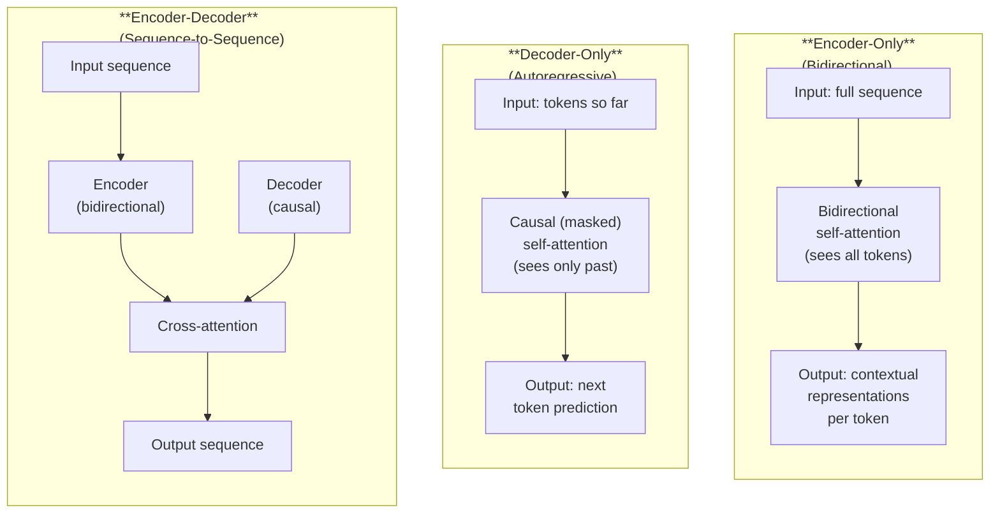
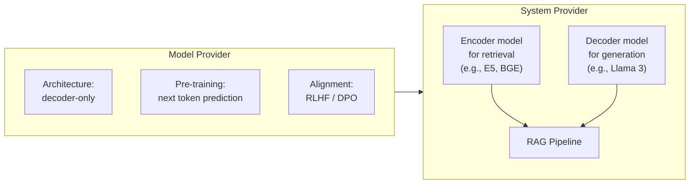

# Encoder, Decoder, and Encoder-Decoder Architectures

*Last reviewed: April 2026*

The transformer was originally designed as an **encoder-decoder** model for machine translation. Since then, the architecture has split into three distinct families — each optimised for different tasks. Understanding these variants is essential for evaluating model cards and technical documentation, where architecture type determines what the model can and cannot do.

## The Three Architecture Families

## Encoder-Only Models

### How They Work

The encoder processes the **entire input at once**, with **bidirectional** self-attention — every token can attend to every other token, both left and right. This produces a rich, contextual representation for each token in the sequence.

$$\text{Representation}_i = f(\text{token}_1, \text{token}_2, \ldots, \text{token}_n)$$

Every token's representation is informed by the full sequence context.

### Key Models

| Model | Parameters | Year | Key Innovation |
|-------|-----------|------|---------------|
| **BERT** | 110M / 340M | 2018 | Masked language modelling (MLM) — predict randomly masked tokens |
| **RoBERTa** | 125M / 355M | 2019 | Better training of BERT (more data, longer training, dynamic masking) |
| **DeBERTa** | 100M–1.5B | 2020 | Disentangled attention (separate content and position attention) |

### What They're Good At

- **Classification**: Sentiment analysis, toxicity detection, topic categorisation
- **Token-level tasks**: Named entity recognition, part-of-speech tagging
- **Sentence similarity**: Semantic search, duplicate detection
- **Feature extraction**: Generating embeddings for downstream use

### What They Can't Do

Encoder-only models do **not** generate text. They produce representations, not sequences. You cannot ask BERT to write a paragraph — that requires a decoder.

### Training Objective: Masked Language Modelling (MLM)

Randomly mask 15% of input tokens. The model must predict the original token from the surrounding context. This forces the encoder to build rich bidirectional representations.

Example:
- Input: "The [MASK] sat on the mat"
- Training target: predict "cat" for the masked position

## Decoder-Only Models

### How They Work

The decoder generates tokens **one at a time, left to right**. At each step, it can only attend to tokens at or before the current position — **causal** (masked) self-attention. The model predicts the probability distribution over the vocabulary for the next token.

$$P(\text{token}_{t+1} | \text{token}_1, \text{token}_2, \ldots, \text{token}_t)$$

### Key Models

| Model | Parameters | Year | Key Innovation |
|-------|-----------|------|---------------|
| **GPT-2** | 1.5B | 2019 | Demonstrated few-shot capabilities at scale |
| **GPT-3** | 175B | 2020 | In-context learning emerges at scale |
| **GPT-4** | Undisclosed | 2023 | Multimodal (text + image input) |
| **Llama 2** | 7B–70B | 2023 | Open-weight, competitive performance |
| **Llama 3** | 8B–405B | 2024 | Larger vocabulary, improved training recipe |
| **Mistral** | 7B | 2023 | Sliding window attention, GQA |
| **Mixtral** | 8×7B (MoE) | 2024 | Mixture of Experts architecture |
| **Claude 3** | Undisclosed | 2024 | 200K context, strong safety alignment |

### What They're Good At

- **Text generation**: Continuation, creative writing, code generation
- **Instruction following**: Chat, Q&A, task completion
- **In-context learning**: Few-shot and zero-shot task adaptation via prompts
- **Reasoning**: Chain-of-thought, step-by-step problem solving (at scale)

### Training Objective: Next Token Prediction

Predict the next token given all previous tokens. Simple, scalable, and remarkably effective:

- Input: "The cat sat on"
- Training target: predict "the" (or the correct next token from the training data)

This objective scales elegantly — more data and more parameters consistently improve performance, with emergent capabilities appearing at sufficient scale.

## Encoder-Decoder Models

### How They Work

Combines both components:
1. The **encoder** processes the full input with bidirectional attention, producing contextual representations
2. The **decoder** generates output tokens autoregressively, using **cross-attention** to attend to the encoder's representations

Cross-attention allows each decoder token to attend to all encoder positions — "looking at the input" while generating the output.

### Key Models

| Model | Parameters | Year | Key Innovation |
|-------|-----------|------|---------------|
| **T5** | 60M–11B | 2019 | "Text-to-text transfer" — frames all tasks as text generation |
| **BART** | 140M–400M | 2020 | Denoising autoencoder pre-training |
| **Flan-T5** | 80M–11B | 2022 | Instruction-tuned T5 |
| **UL2** | 20B | 2022 | Unified pre-training across multiple objectives |

### What They're Good At

- **Translation**: Mapping one sequence to another (the original transformer use case)
- **Summarisation**: Compressing long input to short output
- **Question answering**: Given a context document, generate an answer
- **Structured output**: Generating formatted or constrained output from input

### Training Objective: Denoising / Span Corruption

T5 corrupts input text by replacing random spans with sentinel tokens, then trains the model to reconstruct the original spans in the decoder output.

- Input: "The ⟨X⟩ sat on the ⟨Y⟩"
- Target: "⟨X⟩ cat ⟨Y⟩ mat"

## Comparing the Three

| Property | Encoder-Only | Decoder-Only | Encoder-Decoder |
|----------|:------------:|:------------:|:---------------:|
| Attention direction | Bidirectional | Causal (left-to-right) | Bi (encoder) + Causal (decoder) |
| Generates text | No | Yes | Yes |
| Strong at classification | Yes | With prompting | Yes |
| Strong at generation | No | Yes | Yes |
| Parameter efficiency | High (for classification) | Lower (large models needed) | Medium |
| Dominant use case (2024+) | Embeddings, classifiers | Chat, general purpose | Translation, summarisation |
| Scale trend | Mostly < 1B params | 7B to 400B+ | Mostly < 20B params |

## Why Decoder-Only Won

The AI field has converged on decoder-only architectures for general-purpose LLMs. Several factors drove this:

1. **Simplicity**: One architecture, one training objective (next token prediction), one inference mode. Easier to scale.

2. **Emergent capabilities**: In-context learning, chain-of-thought reasoning, and instruction following all emerged in large decoder-only models. These capabilities were not reliably observed in encoder-only or encoder-decoder models at the time.

3. **Scalability**: The next-token prediction objective parallelises perfectly during training. Every token in the training sequence provides a training signal.

4. **Unified interface**: A decoder-only model can do classification (by generating a class label), translation (by generating the translation), summarisation (by generating a summary), and any other task — all through the same prompting interface. No task-specific heads needed.

Encoder-only models remain important for **embedding** and **classification** tasks where bidirectional context is essential and text generation is not needed. Encoder-decoder models remain strong for **structured sequence-to-sequence** tasks. But for general-purpose AI systems — the models that appear in governance assessments — decoder-only is the standard.

## Architecture and the Supply Chain

Understanding architecture type matters when reading model cards and assessing AI systems:

Many deployed systems combine architectures: an **encoder** model generates embeddings for document retrieval, which are fed as context to a **decoder** model that generates the response. The system card should document both components and their respective model cards.

> **Governance Relevance**
>
> When reviewing technical documentation:
>
> 1. **Identify the architecture type**: This determines what the model can do and what evaluation methods are applicable. Classification metrics (accuracy, F1) apply to encoder models. Generation metrics (perplexity, BLEU, human evaluation) apply to decoder and encoder-decoder models.
> 2. **Check for multi-model systems**: Many deployed AI systems combine models of different architectures. Each model in the pipeline needs documentation — a system card for one component does not cover the others.
> 3. **Training objective informs capabilities**: Next-token prediction (decoder) creates different capabilities and failure modes than masked language modelling (encoder). Understanding the training objective helps predict where the model will succeed and fail.
