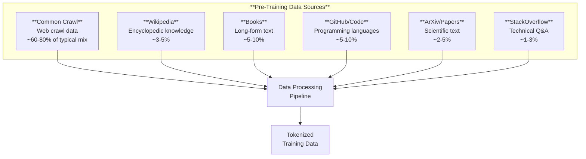
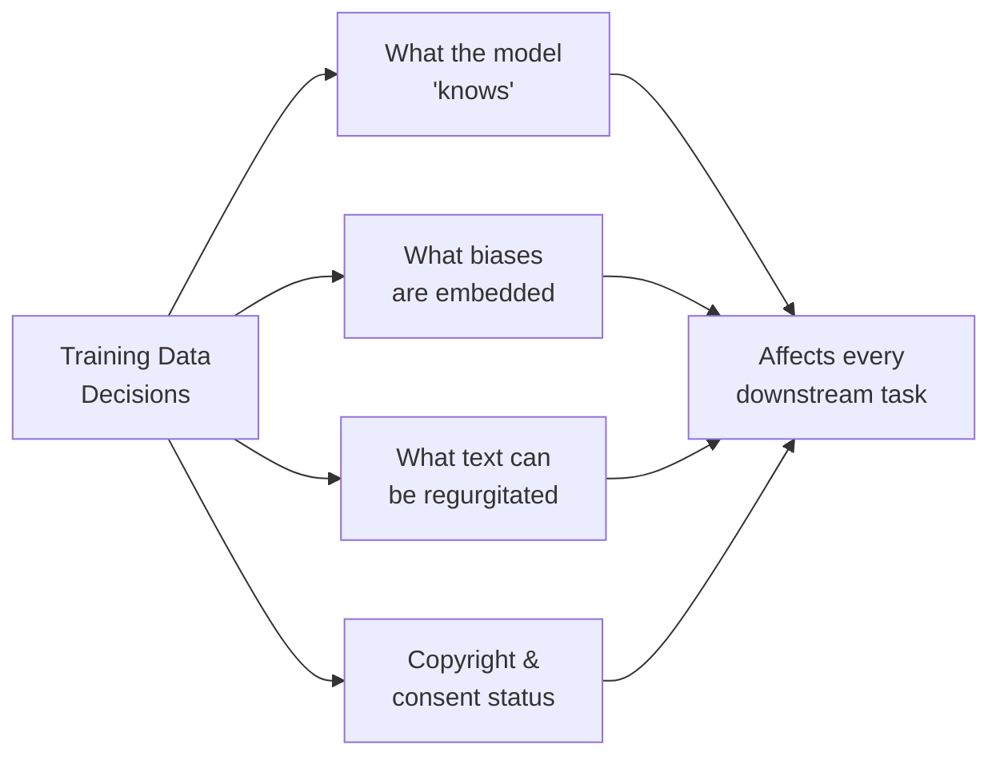

# Pre-Training at Scale

*Last reviewed: April 2026*

Pre-training is the first and most expensive phase of building a large language model. The model processes massive amounts of text — trillions of tokens — learning to predict the next token given all previous tokens. This phase creates the foundation: the model's knowledge of language, facts, reasoning patterns, and code.

## The Pre-Training Objective

For decoder-only models (GPT family, Llama, Mistral, Claude), the objective is simple: **next token prediction** (causal language modelling).

Given a sequence of tokens $[t_1, t_2, \ldots, t_{n-1}]$, predict $t_n$.

The loss function is cross-entropy:

$$\mathcal{L} = -\frac{1}{N}\sum_{i=1}^{N}\log P(t_i | t_1, \ldots, t_{i-1})$$

Every token in the training sequence provides a training signal. A single forward pass through a 4096-token sequence yields 4096 gradient updates (one per position). This is why the objective scales so efficiently — every token is both context and target.

## Training Data

### Scale

| Model | Training Tokens | Approx. Data Size |
|-------|:--------------:|-------------------|
| GPT-2 (2019) | ~10B | ~40 GB |
| GPT-3 (2020) | 300B | ~570 GB |
| Llama 1 (2023) | 1.4T | ~5 TB |
| Llama 2 (2023) | 2T | ~7 TB |
| Llama 3 (2024) | 15T+ | ~50+ TB |

The trend is clear: each generation trains on roughly an order of magnitude more data. Llama 3 trained on over 15 trillion tokens — roughly the equivalent of reading a million books.

### Common Sources

### Data Processing Pipeline

Raw web data is not directly usable. Processing steps typically include:

1. **Deduplication**: Remove near-duplicate documents (MinHash, exact hash). Web crawls contain massive amounts of duplicated content.
2. **Quality filtering**: Remove low-quality pages (spam, boilerplate, gibberish) using classifier-based or heuristic filters.
3. **Toxicity filtering**: Remove documents with high toxicity scores. This pre-training-level filter is the first layer of content safety.
4. **Language identification**: Tag documents by language to control the linguistic distribution.
5. **PII removal**: Redact personally identifiable information (names, addresses, phone numbers, emails). Effectiveness varies significantly.
6. **Domain mixing**: Set proportions of data from each source. The data mix is a critical design choice that affects model capabilities.

## Compute Requirements

### The Scaling "Laws"

Kaplan et al. (2020) and Hoffmann et al. (2022, "Chinchilla") established empirical relationships between model size, training data, and performance:

**Chinchilla scaling**: For compute-optimal training, the number of training tokens should be roughly **20× the number of parameters**.

| Model Size | Chinchilla-Optimal Tokens | Actual Training Tokens |
|------------|:------------------------:|:---------------------:|
| 7B | ~140B | 1-2T (overtrained) |
| 13B | ~260B | 1-2T (overtrained) |
| 70B | ~1.4T | 2T (approximately optimal) |
| 175B | ~3.5T | 300B (undertrained by Chinchilla standards) |

Modern practice **overtrains** smaller models far beyond Chinchilla-optimal — using 10-20× the Chinchilla tokens. This is because inference cost is proportional to model size, so training a smaller model for longer produces a better cost-performance trade-off at deployment time. Llama 3 8B trained on 15T+ tokens — nearly 2000× its parameter count.

### Hardware and Cost

Pre-training large models requires thousands of GPUs running for weeks or months:

| Model | Estimated Compute (FLOPs) | Hardware | Estimated Training Time |
|-------|:------------------------:|----------|:----------------------:|
| GPT-3 175B | ~3.6 × 10²³ | ~10,000 V100 GPUs | ~34 days |
| Llama 2 70B | ~1.7 × 10²⁴ | ~2,000 A100 GPUs | ~29 days |
| Llama 3 405B | ~3.8 × 10²⁵ | ~16,000 H100 GPUs | ~54 days |

At current cloud GPU prices ($2-3/GPU-hour for H100s), a single training run for a frontier model costs **$10M to $100M+** in compute alone. This economic barrier concentrates frontier model development in a small number of organisations.

## Training Dynamics

### Loss Curves

Training loss (cross-entropy) decreases as a **smooth power law** with compute:

$$L \propto C^{-\alpha}$$

Where $C$ is total compute (FLOPs) and $\alpha \approx 0.05$. This means performance improvements follow diminishing returns — each halving of loss requires roughly 100× more compute.

### Training Instabilities

At scale, training can become unstable:

- **Loss spikes**: Sudden increases in loss, often caused by bad data batches or numerical precision issues. Teams typically restart from a checkpoint before the spike.
- **Divergence**: Loss increases without recovery. May require reducing learning rate and restarting.
- **Hardware failures**: Over a multi-week training run on thousands of GPUs, hardware failures are common. Checkpointing and automatic recovery are essential.

### Learning Rate Schedule

Most modern LLMs use a learning rate schedule with:
1. **Warmup**: Gradually increase from near-zero to peak learning rate over the first few thousand steps
2. **Cosine decay**: Decrease learning rate following a cosine curve from peak to a minimum value (typically 10% of peak)

The warmup prevents early instability when model weights are randomly initialized, and cosine decay allows fine-grained optimization in later training.

## Emergent Capabilities

A phenomenon observed at scale: capabilities that are absent in small models **emerge** abruptly at certain model sizes. Examples include:

- **In-context learning**: Models below ~1B parameters show minimal few-shot capability; it appears sharply around 6-10B.
- **Chain-of-thought reasoning**: Negligible benefit for small models; significant for 60B+ models.
- **Multi-step arithmetic**: Near-random performance below a threshold, then rapid improvement.

However, recent work (Schaeffer et al., 2023) argues that some "emergence" is an artifact of the evaluation metrics used — specifically, discontinuous metrics (like exact match accuracy) create the appearance of sharp transitions, while continuous metrics (like log-likelihood) show smooth improvement. The debate is ongoing, but the practical observation remains: larger models can perform tasks that smaller models fundamentally cannot.

## Data Governance Implications

Pre-training data decisions have long-lasting consequences:

Once biases, factual errors, or copyrighted content are encoded in pre-training weights, they persist through fine-tuning and alignment. Mitigation at later stages is possible but imperfect — the foundation determines what the building can support.

> **Governance Relevance**
>
> Pre-training is where the most consequential decisions are made and the hardest to audit:
>
> 1. **Training data provenance**: EU AI Act Article 10 and Article 53(1)(d) require documentation of training data sources. Ask for the data sheet, not just a description.
> 2. **Compute and GPAI classification**: The 10²⁵ FLOPs threshold for GPAI systemic risk (EU AI Act Art. 51) is defined in terms of training compute. Providers should document their training FLOPs.
> 3. **Data mixing ratios**: The proportion of data from different sources affects model behavior. Overrepresentation of certain domains creates capability biases. Ask for the data mix, not just the total volume.
> 4. **Memorization risk**: Models can memorize and reproduce training data verbatim, including PII and copyrighted content. This risk scales with model size and training duration. Ask what deduplication and memorization testing was performed.
