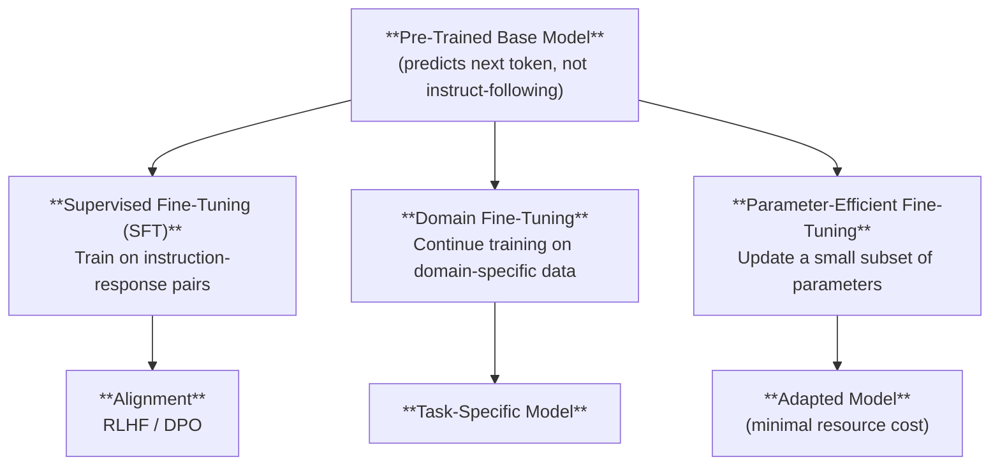
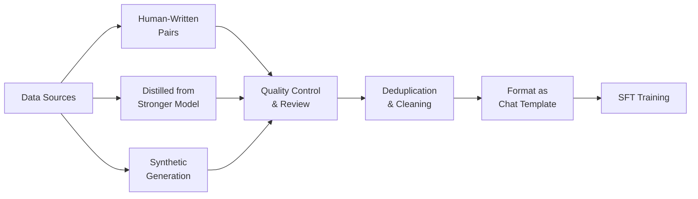
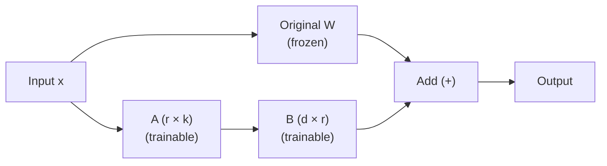

# Fine-Tuning Strategies

*Last reviewed: April 2026*

Pre-training creates a general-purpose language model. **Fine-tuning** specialises it — adapting the model to follow instructions, answer questions in a specific format, work within a particular domain, or exhibit desired behaviors. Fine-tuning is the bridge between a raw language model and a useful product.

## The Fine-Tuning Landscape



## Supervised Fine-Tuning (SFT)

### What It Does

SFT trains the model on curated (instruction, response) pairs. The pre-trained model knows language and facts; SFT teaches it **how to respond to requests**.

Example training pairs:

| Instruction | Response |
|-------------|----------|
| "What is the capital of France?" | "The capital of France is Paris." |
| "Summarise this article in 3 bullet points: [article text]" | "• Point 1\n• Point 2\n• Point 3" |
| "Write a Python function to reverse a string." | "```python\ndef reverse_string(s):\n    return s[::-1]\n```" |

### Key Design Decisions

**Data quality over quantity**: SFT datasets are typically 10K–100K examples — tiny compared to pre-training (trillions of tokens). Quality matters far more than volume. A few thousand high-quality, diverse examples can be more effective than millions of mediocre ones.

**Instruction diversity**: The model needs examples across many task types — Q&A, summarisation, coding, analysis, creative writing, math, etc. Narrow SFT creates narrow capabilities.

**Format conditioning**: SFT teaches the model to use the chat format (system prompt → user message → assistant response). Without SFT, the base model would simply continue generating text rather than responding to instructions.

### The SFT Dataset Pipeline



**Human-written data**: Most expensive, highest quality. Professional annotators write instruction-response pairs following detailed guidelines.

**Distillation**: Use a stronger model (e.g., GPT-4) to generate training data for a smaller model. Cost-effective but creates dependency on the teacher model and potential legal issues if the teacher model's terms of service prohibit this.

**Synthetic generation**: Use the model itself (or a variant) to generate training data, with filtering for quality. Self-training can amplify existing biases.

## Full Fine-Tuning vs. Parameter-Efficient Methods

### Full Fine-Tuning

Update **all** model parameters. Produces the most capable adapted model but:
- Requires the same GPU memory as pre-training (storing full model + optimizer states + gradients)
- Creates a complete copy of the model weights — no weight sharing with the base model
- Risk of **catastrophic forgetting**: the model loses pre-training capabilities while learning new ones

### LoRA: Low-Rank Adaptation

LoRA (Hu et al., 2021) is the dominant parameter-efficient fine-tuning method. Instead of updating the full weight matrices, LoRA adds small **low-rank decomposition** matrices alongside the original weights:

$$W' = W + \Delta W = W + BA$$

Where:
- $W \in \mathbb{R}^{d \times k}$ — original weight matrix (frozen, not updated)
- $B \in \mathbb{R}^{d \times r}$ — low-rank down-projection
- $A \in \mathbb{R}^{r \times k}$ — low-rank up-projection
- $r \ll \min(d, k)$ — the **rank** (typically 8, 16, or 64)



For a weight matrix of size $4096 \times 4096$ (16.7M parameters):
- Full fine-tuning: updates all 16.7M parameters
- LoRA with rank 16: adds only $4096 \times 16 + 16 \times 4096$ = 131K parameters (~0.8% of the original)

**Benefits**:
- **Memory**: Only LoRA parameters + base model in inference memory. Optimizer state only for LoRA parameters.
- **Storage**: LoRA adapters are small files (tens of MB) that can be swapped onto a shared base model.
- **Serving**: Multiple LoRA adapters can share one base model in production, enabling multi-tenant fine-tuning.

### QLoRA

QLoRA (Dettmers et al., 2023) combines LoRA with **4-bit quantisation** of the base model. The base model is loaded in 4-bit precision (dramatically reducing memory), and LoRA parameters are trained in higher precision on top. This enables fine-tuning a 65B parameter model on a single 48GB GPU — making fine-tuning accessible to organisations without large GPU clusters.

### Other PEFT Methods

| Method | Approach | Typical Parameters Trained |
|--------|----------|---------------------------|
| **Prefix Tuning** | Prepend learnable "virtual tokens" to the input at each layer | < 1% |
| **Prompt Tuning** | Learn a soft prompt embedding prepended to the input | < 0.1% |
| **Adapters** | Insert small trainable modules between transformer layers | 1-5% |
| **IA³** | Learn per-layer rescaling vectors for K, V, and FFN activations | < 0.01% |

LoRA has emerged as the clear winner in practice — it offers the best balance of effectiveness, simplicity, and serving flexibility.

## Domain Fine-Tuning

Domain fine-tuning continues the **pre-training objective** (next token prediction) on domain-specific data — medical text, legal documents, financial reports, scientific papers, or code.

### When to Use Domain Fine-Tuning

- The target domain uses specialised vocabulary, writing patterns, or knowledge not well-represented in pre-training
- The model needs to understand domain-specific conventions (legal citation formats, medical terminology, financial reporting standards)
- RAG alone doesn't provide sufficient domain adaptation

### Risks

- **Catastrophic forgetting**: The model may lose general capabilities while gaining domain expertise. Mitigation: mix domain data with general data during fine-tuning.
- **Overfitting**: Domain datasets are often small. Strong regularisation and early stopping are essential.
- **Data quality**: Domain data may contain errors, outdated information, or biases specific to the field.

## Instruction Tuning at Scale

Large-scale instruction tuning (sometimes called "instruction following") uses datasets with thousands of diverse task types to create generally capable assistants:

- **FLAN** (Google, 2022): 1,836 tasks, trained Flan-T5 and Flan-PaLM
- **Self-Instruct** (Wang et al., 2022): Use the model to generate its own instruction data (with filtering)
- **OpenHermes / Ultrachat**: Large synthetic instruction datasets

The key insight: a model fine-tuned on a diverse set of tasks generalises to new tasks it was never explicitly trained on. This is why modern chat models can handle novel requests — they've been trained on a sufficiently diverse set of instruction-response patterns.

> **Governance Relevance**
>
> Fine-tuning is a critical governance checkpoint:
>
> 1. **Data provenance for SFT data**: EU AI Act requirements for data documentation (Art. 10) extend to fine-tuning data, not just pre-training data. Ask about the source, quality control process, and any human annotation guidelines.
> 2. **Distillation legal risk**: If SFT data was generated by another model, verify that the source model's terms of service permit this use. Some providers explicitly prohibit using their outputs to train competing models.
> 3. **LoRA adapter supply chain**: LoRA adapters are small files that can be easily distributed and applied to base models. This creates a new supply chain risk — malicious adapters could modify model behavior. EU AI Act Art. 15(9) on model poisoning applies to adapters.
> 4. **Catastrophic forgetting and safety**: Fine-tuning can degrade safety training from the alignment phase. A model that was safe after RLHF may become unsafe after aggressive domain fine-tuning. Safety evaluation should be repeated after every fine-tuning step.
> 5. **The "substantial modification" question**: Under the EU AI Act, fine-tuning a model may constitute a "substantial modification" (Art. 3(23)) that triggers compliance obligations for the entity performing the fine-tuning. The threshold depends on the scope of behavioral change.
