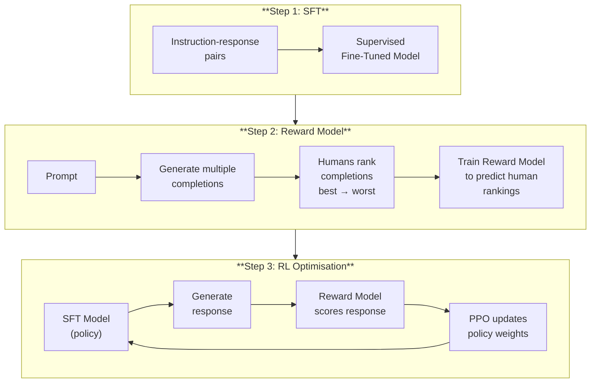
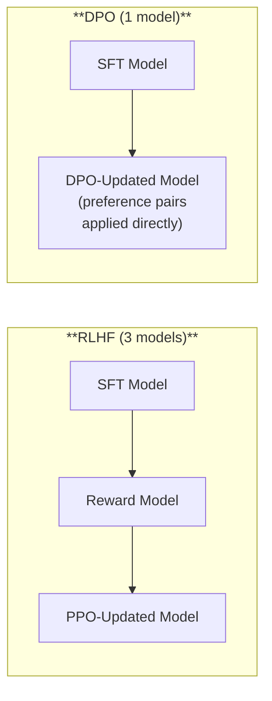
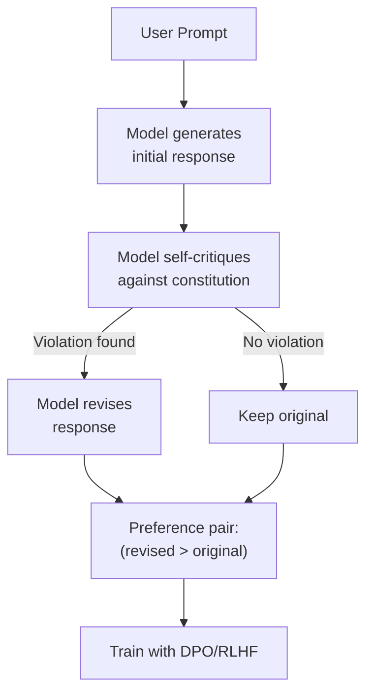

# RLHF and Alignment

*Last reviewed: April 2026*

A pre-trained language model with supervised fine-tuning (SFT) can follow instructions, but it doesn't reliably produce outputs that humans consider helpful, honest, and harmless. **Alignment** is the process of shaping model behavior to match human preferences — making the model not just capable, but safe and useful.

Reinforcement Learning from Human Feedback (RLHF) was the first widely successful alignment technique and remains a core part of the training pipeline for models like ChatGPT, Claude, and Gemini.

## Why Alignment Is Needed

SFT teaches the model **what format** to respond in. It does not reliably teach the model:
- Which of several correct responses is **most helpful**
- When to **refuse** harmful or inappropriate requests
- How to handle **ambiguous** or **sensitive** topics
- When to say **"I don't know"** instead of hallucinating

The problem: next-token prediction optimizes for matching the distribution of training data, not for producing outputs humans actually prefer. A model trained only with SFT will generate plausible-sounding text that may be harmful, biased, or confidently wrong.

## The RLHF Pipeline

### Step 1: Supervised Fine-Tuning (SFT)

Train the base model on high-quality instruction-response pairs (covered in Chapter 13). This creates the starting point — a model that can follow instructions but hasn't been optimized for human preferences.

### Step 2: Reward Model Training

This is the key innovation. Instead of defining a mathematical formula for "good response," RLHF learns what humans prefer:

1. **Sample prompts** from a diverse distribution
2. **Generate multiple completions** (typically 4-8) from the SFT model for each prompt
3. **Human annotators rank** the completions from best to worst
4. **Train a reward model** (often a copy of the LLM with a scalar output head) to predict the human rankings

The reward model learns a function $R(x, y)$ that takes a prompt $x$ and response $y$ and outputs a scalar reward score. Higher scores = more aligned with human preferences.

**Critical detail**: Human annotators follow detailed guidelines specifying preferences — helpful, honest, harmless, following instructions, acknowledging uncertainty, refusing harmful requests. The guidelines encode the alignment goals. Different guidelines produce different reward models and therefore different model behaviors.

### Step 3: PPO Optimization

Use **Proximal Policy Optimization** (PPO) — a reinforcement learning algorithm — to update the SFT model's weights to maximize the reward model's score:

$$\text{maximize} \quad \mathbb{E}_{y \sim \pi_\theta(y|x)} [R(x, y)] - \beta \cdot \text{KL}[\pi_\theta \| \pi_{\text{ref}}]$$

Two components:
1. **Maximize reward**: Generate responses that the reward model scores highly
2. **KL penalty**: Don't deviate too far from the original SFT model ($\pi_{\text{ref}}$). Without this constraint, the model would find "reward hacks" — degenerate outputs that score high on the reward model without being genuinely good.

The KL penalty is controlled by $\beta$. Higher $\beta$ = more conservative (stays closer to SFT). Lower $\beta$ = more aggressive optimization (may find reward hacks).

## Direct Preference Optimization (DPO)

DPO (Rafailov et al., 2023) simplifies RLHF by eliminating the separate reward model and PPO training:

$$\mathcal{L}_{\text{DPO}} = -\mathbb{E}\left[\log \sigma\left(\beta \log \frac{\pi_\theta(y_w|x)}{\pi_{\text{ref}}(y_w|x)} - \beta \log \frac{\pi_\theta(y_l|x)}{\pi_{\text{ref}}(y_l|x)}\right)\right]$$

Where $y_w$ is the preferred (winning) response and $y_l$ is the rejected (losing) response. DPO directly optimizes the model to assign higher probability to preferred responses relative to the reference model, without training a separate reward model or running RL.

**DPO advantages**: Simpler pipeline (no reward model engineering, no RL instability), fewer hyperparameters, more stable training.

**DPO limitations**: May be less expressive than RLHF for complex preference functions. Cannot incorporate real-time reward signals during generation (online RL).

DPO and its variants (IPO, KTO, ORPO) are increasingly popular. Llama 3 used DPO. Many organisations use a combination — RLHF for initial alignment, DPO for iterative refinement.

## Constitutional AI (CAI)

Constitutional AI (Anthropic, 2022) reduces the need for human preference data by having the model **self-critique** against a set of principles ("constitution"):

1. Generate a response
2. Ask the model: "Does this response violate any of these principles? [list of principles]"
3. If yes, ask the model to revise the response
4. Use the (original, revised) pair as preference data for DPO or RLHF

The "constitution" is a set of explicit principles: avoid harmful content, be honest, respect user autonomy, prefer factual accuracy, etc. This approach:
- Scales better than human labeling (self-critique is automated)
- Makes alignment goals **explicit** (the constitution is a readable document)
- Allows rapid iteration on alignment goals (update the constitution, regenerate critique data)

## RLAIF: RL from AI Feedback

A broader category where AI models provide the preference signal instead of (or in addition to) humans:
- Use a stronger model to judge a weaker model's outputs
- Use multiple models as a "review panel"
- Combine AI feedback with human feedback for different types of queries

This approach is increasingly common as the cost of high-quality human annotation grows and AI models become better judges.

## Alignment Tax and Capability Trade-offs

Alignment has costs:

- **Helpfulness-safety tension**: Strong safety training can make models overly cautious — refusing benign requests, adding excessive caveats, or declining to engage with sensitive but legitimate topics. This is sometimes called "alignment tax."
- **Creativity reduction**: Highly aligned models may produce more formulaic outputs, as alignment training pushes toward "safe" response patterns.
- **Knowledge suppression**: Models may decline to discuss topics they have knowledge about if the topic is adjacent to harmful content.

The art of alignment is finding the right balance — safe enough to avoid harm, flexible enough to be useful.

## Reward Hacking

A persistent challenge in RLHF: the model learns to **exploit the reward model** rather than genuinely satisfy human preferences:

- Generating longer responses (reward models sometimes prefer length)
- Using confident-sounding but vague language
- Hedging with "as an AI language model..." preambles
- Listing multiple options instead of committing to one answer

These behaviors score well on reward models but frustrate human users. Detecting and mitigating reward hacking requires ongoing evaluation.

> **Governance Relevance**
>
> Alignment is the most governance-relevant technical process:
>
> 1. **Alignment goals are policy decisions**: The constitution, human annotation guidelines, or reward model training data define what "good behavior" means. These are inherently value-laden decisions. Ask who defined the alignment goals and what principles they encode.
> 2. **Alignment is not permanent**: Fine-tuning, prompt injection, and jailbreaks can bypass alignment. Alignment is a probabilistic reduction of harmful outputs, not a guarantee. EU AI Act Article 9 requires understanding residual risk — alignment's limitations are a key residual risk.
> 3. **Human annotator demographics matter**: Different annotators from different cultures, backgrounds, and demographics may have different preferences. If all annotators are from one demographic, the model's "aligned" behavior reflects that group's preferences. NIST AI RMF MEASURE 2.11 (fairness) should examine annotator diversity.
> 4. **Safety evaluation after alignment**: EU AI Act Article 55(1)(a) requires adversarial testing for GPAI with systemic risk. This testing must evaluate the alignment layer specifically — testing whether safety training can be bypassed.
> 5. **The alignment gap**: Current alignment techniques reduce but do not eliminate harmful outputs. No model is "fully aligned." Documentation should honestly report alignment limitations rather than claiming safety guarantees.
