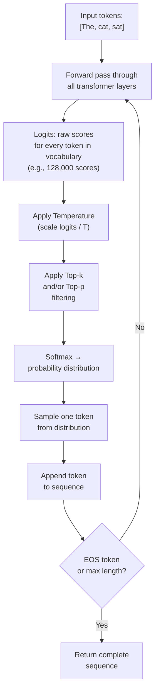
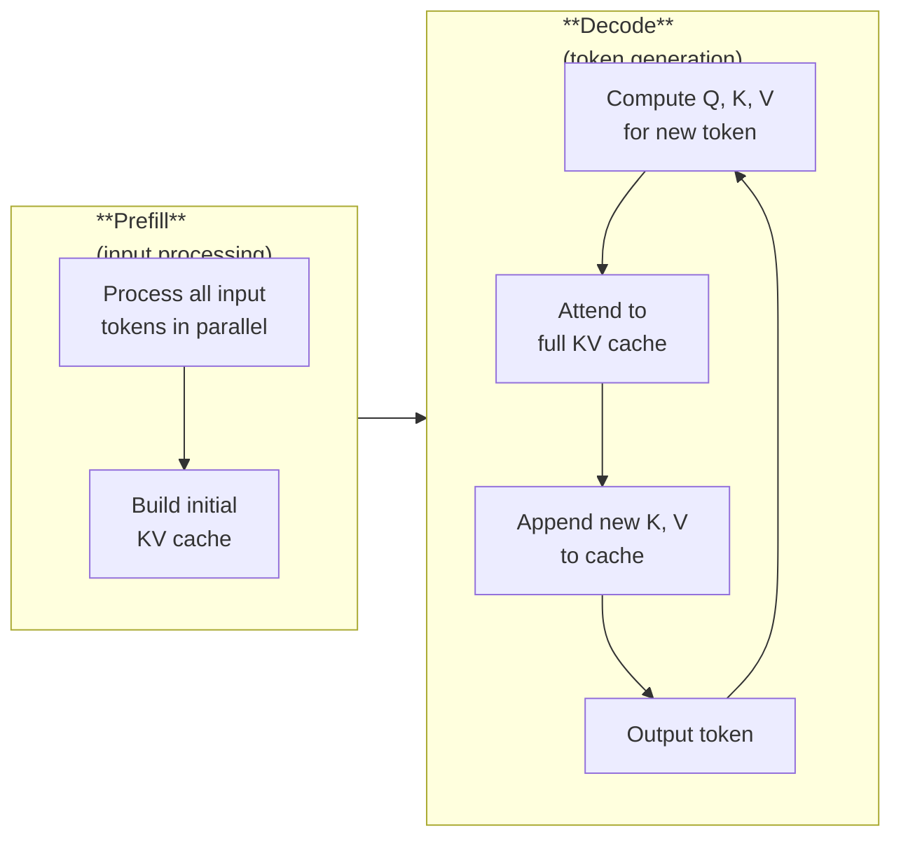

# Inference and Sampling

*Last reviewed: April 2026*

When a language model generates text, it doesn't retrieve pre-written responses. At each step, it computes a probability distribution over its entire vocabulary and **samples** a single token from that distribution. The sampling strategy dramatically affects output quality, creativity, and determinism.

This chapter covers how inference works mechanically and the practical controls that engineers and deployers use to shape model behavior.

## The Inference Loop

Each iteration generates exactly **one token**. For a 200-token response, the model runs 200 forward passes. This is why inference cost scales linearly with output length.

## Logits and Probabilities

The final layer of the model produces **logits** — raw, unnormalized scores for every token in the vocabulary. For a vocabulary of 128,000 tokens, the model outputs 128,000 scores.

Softmax converts logits to probabilities:

$$P(t_i) = \frac{e^{z_i / T}}{\sum_j e^{z_j / T}}$$

Where $z_i$ is the logit for token $i$ and $T$ is the temperature.

## Temperature

Temperature controls the **sharpness** of the probability distribution:

| Temperature | Effect | Use Case |
|:-----------:|--------|----------|
| 0 | Deterministic — always picks the highest-probability token (greedy decoding) | Factual Q&A, code generation, structured output |
| 0.1–0.5 | Low randomness — strongly favours high-probability tokens | Most chat applications |
| 0.7–1.0 | Moderate randomness — balanced between predictable and creative | Creative writing, brainstorming |
| 1.0 | The "native" distribution — logits used as-is | Evaluation / benchmarking |
| > 1.0 | High randomness — flattens distribution, more unlikely tokens selected | Experimental, often produces incoherent text |

At temperature 0, the model is **deterministic** — the same input always produces the same output. At high temperature, outputs become increasingly random and potentially nonsensical.

## Top-k Sampling

Restrict the selection to the **k most probable** tokens, then renormalize and sample:

1. Sort tokens by probability
2. Keep only the top $k$ tokens
3. Set all other probabilities to 0
4. Renormalize the remaining probabilities
5. Sample from the restricted distribution

**Typical values**: $k = 40$ to $k = 100$

**Limitation**: A fixed $k$ applies the same restriction regardless of the distribution shape. When the model is very confident (one token dominates), $k = 50$ includes many unlikely tokens. When the model is uncertain (flat distribution), $k = 50$ may exclude plausible alternatives.

## Top-p (Nucleus) Sampling

Instead of a fixed count, keep the **smallest set of tokens whose cumulative probability exceeds $p$**:

1. Sort tokens by probability (descending)
2. Cumulatively sum probabilities
3. Include tokens until the running sum exceeds $p$
4. Sample from this dynamic set

**Typical values**: $p = 0.9$ to $p = 0.95$

**Advantage over top-k**: The number of included tokens adapts to the distribution. When the model is confident, only 2-3 tokens may be included. When uncertain, dozens may qualify. This naturally adapts the filtering to the model's certainty.

## Repetition Penalty

Without intervention, language models tend to get stuck in **repetition loops** — generating the same phrase repeatedly. Repetition penalty addresses this by reducing the logit of any token that has already appeared in the generated text:

$$z_i' = z_i / \alpha \quad \text{if token } i \text{ has appeared}$$

Where $\alpha > 1$ is the penalty factor (typically 1.1 to 1.3). Higher penalty = stronger suppression of repeated tokens.

More sophisticated variants include:
- **Frequency penalty**: Penalty proportional to how many times a token has appeared
- **Presence penalty**: Binary penalty (appeared or not, regardless of count)

## Beam Search

Instead of sampling one token at a time, **beam search** maintains multiple candidate sequences ("beams") in parallel:

1. At each step, expand each beam with the top $b$ most probable next tokens
2. Score all expanded candidates
3. Keep only the top $b$ candidates overall
4. Repeat until sequences complete

Beam search with $b = 4$ to $b = 10$ beams often produces higher-quality text for structured tasks (translation, summarisation) but tends to generate **bland, repetitive** text for open-ended generation. Modern chat models predominantly use sampling-based methods rather than beam search.

## The KV Cache in Practice

As discussed in Chapter 6, the **KV cache** stores the key and value tensors from all previous tokens, avoiding redundant recomputation. During inference:

- **Prefill phase**: The model processes all input tokens at once (parallel), computing KV pairs for each layer. This is the initial forward pass.
- **Decode phase**: Generate tokens one at a time. Each new token computes Q, K, V for itself, attends to all cached K/V vectors, and appends its K/V to the cache.

**Prefill** is compute-bound (many tokens processed in parallel — efficient matrix multiplication). **Decode** is memory-bandwidth-bound (one token at a time — must read the entire KV cache from memory for each token).

This asymmetry explains why:
- Long prompts are processed relatively quickly (prefill is parallel)
- Generation speed is independent of prompt length but constrained by model size and KV cache access
- **Time-to-first-token** (TTFT) is dominated by prefill; **time-per-output-token** (TPOT) is dominated by decode

## Speculative Decoding

A technique to accelerate generation: use a small, fast "draft" model to generate multiple candidate tokens, then verify them in a single forward pass through the large model:

1. Draft model generates $k$ tokens quickly (e.g., $k = 5$)
2. Large model processes all $k$ tokens in parallel (batch verification)
3. Accept tokens that the large model agrees with (high probability)
4. Reject tokens where the large model disagrees
5. Continue from the last accepted token

When the draft model is good (agrees with the large model most of the time), this achieves 2-3x speedup with **no quality loss** — the output distribution is mathematically identical to sampling from the large model alone.

## Practical Inference Parameters

For a typical deployment, the key controllable parameters:

| Parameter | What It Controls | Typical Default |
|-----------|-----------------|----------------|
| `temperature` | Randomness | 0.7 |
| `top_p` | Probability threshold for nucleus sampling | 0.9 |
| `top_k` | Maximum candidate tokens | 50 (or disabled) |
| `max_tokens` | Maximum output length | 1024–4096 |
| `stop_sequences` | Strings that halt generation | Varies by format |
| `repetition_penalty` | Penalty for repeating tokens | 1.0–1.3 |

These parameters are typically exposed to deployers via API configurations. End users may have limited access (e.g., a "creativity" slider that maps to temperature).

> **Governance Relevance**
>
> Inference parameters affect model behavior at deployment time:
>
> 1. **Determinism for auditing**: Temperature 0 makes outputs deterministic and reproducible — essential for auditing and testing. If results cannot be reproduced, testing is meaningless. Ask deployers what temperature and sampling settings they use.
> 2. **Safety interaction**: Higher temperature increases the probability of generating unsafe content, because safety training operates on token probabilities — tokens that are unlikely (but not impossible) at low temperature become more likely at high temperature. Safety evaluations should be conducted at the deployment temperature.
> 3. **Output quality claims**: A model benchmarked at temperature 0 with greedy decoding may perform differently at temperature 0.7 with top-p sampling. Ensure evaluation conditions match deployment conditions (NIST MEASURE 2.3).
