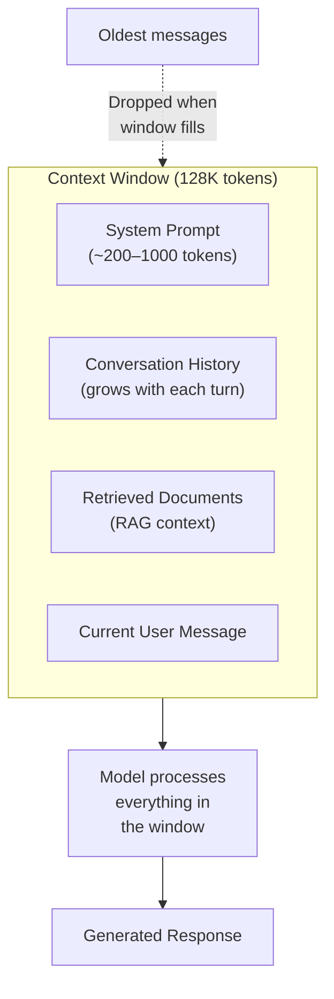
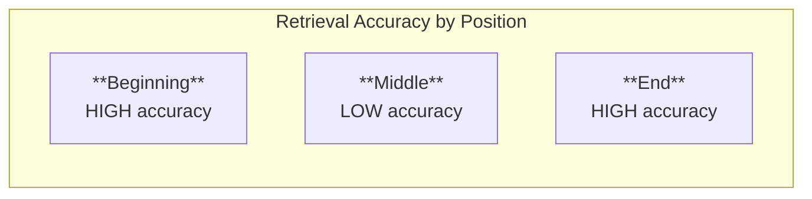
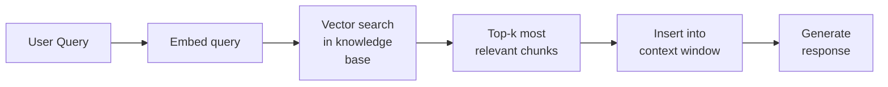

# Context Windows and Memory

*Last reviewed: April 2026*

A language model's **context window** is the maximum number of tokens it can process in a single forward pass. This is the model's working memory — everything it knows about the current conversation must fit within this window. Information outside the context window is invisible to the model.

## Context Window Sizes

| Model | Context Window | Approximate Word Equivalent |
|-------|:-------------:|:---------------------------:|
| GPT-2 (2019) | 1,024 tokens | ~750 words |
| GPT-3 (2020) | 2,048 tokens | ~1,500 words |
| GPT-3.5 Turbo (2023) | 16,384 tokens | ~12,000 words |
| GPT-4 Turbo (2024) | 128,000 tokens | ~96,000 words |
| Claude 3.5 Sonnet (2024) | 200,000 tokens | ~150,000 words |
| Gemini 1.5 Pro (2024) | 1,000,000 tokens | ~750,000 words |

The trend is dramatic — context windows have grown from 1K tokens to 1M tokens in five years, a 1000× increase.

## Why Context Length Matters

The context window determines what the model can "see" during generation:

Everything competes for space in the context window:
- **System prompt**: Instructions, personality, safety guidelines — always present, consuming tokens every turn
- **Conversation history**: Prior messages — grows linearly with conversation length
- **RAG context**: Retrieved documents — can be thousands of tokens per query
- **Current message**: The user's latest input

When the total exceeds the context window, something must be dropped. Most implementations drop the oldest conversation turns — creating a form of "amnesia" for long conversations.

## The "Lost in the Middle" Problem

A critical finding (Liu et al., 2023): models with long context windows don't attend equally to all positions. Information retrieval accuracy varies significantly by position:

When relevant information is placed at the **beginning** or **end** of a long context, models retrieve it reliably. When it's placed in the **middle**, accuracy drops significantly — sometimes by 20-30 percentage points.

This has practical consequences:
- **Document ordering in RAG**: The most relevant documents should be placed at the beginning or end of the context, not buried in the middle
- **Long document analysis**: Models may miss critical information located in the middle of long inputs
- **Context window claims**: A 128K context window does not mean the model uses all 128K tokens equally well

## What Language Models Do NOT Have

### No Persistent Memory

Language models have **no memory between conversations**. Each API call or chat session starts with an empty context window. The model does not remember:
- Previous conversations
- User preferences from past sessions
- Information provided in earlier, unrelated interactions

What appears to be "memory" in chat interfaces is the provider storing conversation history and inserting it back into the context window at the start of each turn.

### No Working Memory Beyond Context

Within a conversation, the model cannot "store" information in a separate memory buffer. Everything it needs must be present in the current context window. There is no equivalent of a human's ability to "keep something in mind" while processing other information — if it's not in the tokens, the model cannot access it.

### No Real-Time Knowledge

The model's knowledge is frozen at the pre-training cutoff date. It does not know about events after training (unless told via the context window or connected to external tools).

## Memory Augmentation Techniques

Several approaches attempt to overcome context window limitations:

### Retrieval-Augmented Generation (RAG)

Instead of fitting everything in the context, store information externally and retrieve relevant pieces on demand:

RAG is the dominant approach for connecting LLMs to private or current information. It doesn't extend the context window — it selects what goes into it.

### Conversation Summarisation

When conversation history grows too long, periodically summarize older turns and replace the full history with the summary. This compresses information but loses exact details.

### Explicit Memory Systems

Some frameworks maintain a structured memory store (key-value pairs, facts, preferences) that is updated during conversation and injected into the system prompt. This simulates persistent memory within a session.

### Sliding Window Attention

An architectural approach (used in Mistral): instead of attending to all tokens, each layer attends only to a local window of recent tokens (e.g., 4096). This reduces memory from $O(n^2)$ to $O(n \times w)$ where $w$ is the window size. Information beyond the window can still propagate through the residual stream across layers, but direct attention is limited.

## Token Budgeting

In practice, deployers must budget the context window across competing needs:

| Component | Typical Allocation |
|-----------|-------------------|
| System prompt | 200–1,000 tokens (fixed) |
| RAG context | 2,000–10,000 tokens (per query) |
| Conversation history | 1,000–50,000 tokens (growing) |
| Current message | 50–2,000 tokens |
| Reserved for response | 1,000–4,000 tokens |

Smart context management — deciding what to include, what to summarize, and what to drop — is a critical engineering decision that directly affects system quality.

## Cost Implications

Most API providers charge per token (input + output). Longer contexts mean higher costs:

- A 128K input + 4K output at $10/M input tokens = $1.32 per request
- A 2K input + 4K output at the same rate = $0.06 per request

This creates a direct cost-quality trade-off: more context generally produces better responses, but at higher cost. Organizations must decide how much context is worth the expense for each use case.

> **Governance Relevance**
>
> Context window limitations create governance-relevant failure modes:
>
> 1. **Information loss**: When context windows overflow and older messages are dropped, the model loses important context. For safety-critical applications, this can cause the model to ignore previously stated constraints. System prompts should never be dropped.
> 2. **Lost in the middle**: If compliance-relevant information is buried in a long context, the model may not attend to it. This is particularly relevant for RAG systems where regulatory requirements are retrieved alongside other documents.
> 3. **False memory claims**: Users may believe the model "remembers" them from previous conversations. Deployers should disclose that the model has no persistent memory — this is a transparency obligation under EU AI Act Article 50.
> 4. **Cost equity**: Token-based pricing combined with the multilingual tokenisation tax (Chapter 10) means non-English users pay more for equivalent context. This should be assessed under fairness considerations.
