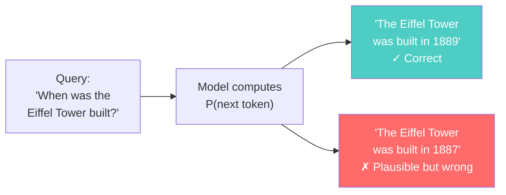
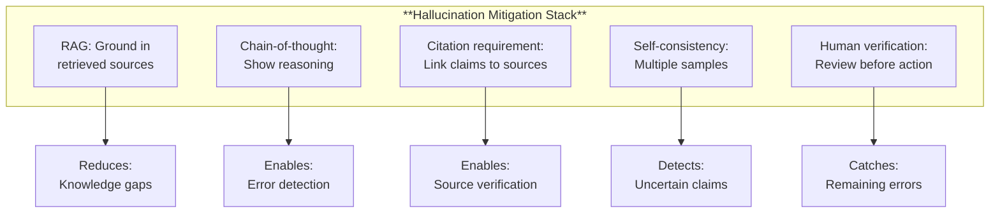

# Hallucination

*Last reviewed: April 2026*

Hallucination is when a language model generates text that is fluent, confident, and **factually wrong** — or entirely fabricated. It is not a bug in specific models; it is a **structural property** of how language models work. Every language model hallucinates. The question is how often and how severely.

## Why Models Hallucinate

### The Fundamental Mechanism

Language models are trained to predict the next **plausible** token, not the next **true** token. The training objective is:

$$\text{maximize } P(\text{next token} | \text{previous tokens})$$

"Plausible" and "true" overlap heavily — most of the time, the most plausible continuation is also factually correct. But when the model encounters a question where:
- The answer isn't well-represented in training data
- Multiple plausible continuations exist (some true, some false)
- The model has partial knowledge (enough to generate confident-sounding text, not enough to be accurate)

...the model will generate the most plausible-sounding text, regardless of whether it's correct.

### No Internal Fact-Checking

The model doesn't verify its output against a knowledge database. It doesn't "know" facts in the way humans do — it has learned statistical patterns about which tokens follow which tokens. When those patterns align with facts, the output is correct. When they don't, the model has no mechanism to detect its own error.

### Confidence Without Calibration

A well-calibrated system would express low confidence when it's uncertain. Language models are poorly calibrated — they express confidence through fluency and assertiveness regardless of accuracy. A hallucinated fact is presented with the same linguistic confidence as a well-known fact.

## Types of Hallucination

### Intrinsic Hallucination
The output contradicts the information provided in the context. Example: given a document stating "revenue was $5M," the model says "revenue was $8M."

### Extrinsic Hallucination
The output contains information that cannot be verified from the input or context. Example: asked about a real person, the model fabricates publications they never wrote.

### Fabricated Citations
A particularly dangerous variant: the model generates plausible-looking citations (author names, journal titles, years) for papers that do not exist. This has caused real-world harm in legal proceedings where lawyers submitted AI-generated briefs containing fabricated case law.

### Confident Refusal to Acknowledge Uncertainty
Instead of saying "I don't know," the model invents an answer. This is perhaps the most harmful form — it looks exactly like a correct, well-informed response.

## When Hallucination Is Most Likely

| Factor | Higher Hallucination Risk |
|--------|--------------------------|
| Rare or obscure topics | Topics with sparse training data are more prone to fabrication |
| Precise numerical claims | Exact dates, statistics, measurements are frequently hallucinated |
| Named entities | Lesser-known people, places, and organizations are confused or fabricated |
| Long-form generation | Hallucination probability increases with output length — more tokens = more chances to drift from accuracy |
| Instruction to be comprehensive | When asked to "list all" or "provide complete coverage," models may fabricate to fill the expected length |
| Multi-step reasoning | Each reasoning step can introduce errors that compound |
| Knowledge cutoff edge | Events near the training data cutoff date have partial, unreliable coverage |

## Mitigation Strategies

### Retrieval-Augmented Generation (RAG)

Ground model responses in retrieved source documents. The model generates based on provided context rather than parametric memory alone. This reduces but does not eliminate hallucination — the model can still misinterpret or ignore retrieved documents.

### Chain-of-Thought Probing

Ask the model to show its reasoning. While this doesn't prevent hallucination, it makes the reasoning visible and auditable. Errors in reasoning steps are easier to identify than errors in a single confident assertion.

### Citation Requirements

Instruct the model to cite specific sources for each claim. Claims without citations are flagged for verification. This doesn't prevent hallucination of the claims themselves, but it makes verification possible.

### Constrained Generation

For structured outputs (JSON, SQL, forms), constrain the model to only generate valid tokens at each position. This prevents syntactically invalid hallucination but not semantically incorrect content.

### Self-Consistency Checking

Generate multiple responses and check for consistency. Claims that appear across multiple independent generations are more likely to be correct. Divergent claims indicate uncertainty.

### Human-in-the-Loop Verification

The most reliable mitigation: have a human verify factual claims before they are acted upon. This is required by EU AI Act Article 14 for high-risk systems.

## Measuring Hallucination

Quantifying hallucination is an active research area:

- **TruthfulQA**: Benchmark testing whether models generate truthful answers to questions designed to elicit common misconceptions. Tests both truthfulness and informativeness.
- **FActScore**: Decomposes model output into individual claims and verifies each against a knowledge source. Reports the percentage of claims that are factually supported.
- **HHEM (Hallucination Evaluation Model)**: Trained models that score whether generated text is faithful to provided context.
- **Human evaluation**: The gold standard — human annotators verify factual claims. Expensive but necessary for high-stakes applications.

No automated metric perfectly captures hallucination — all have false positives and false negatives. Human evaluation remains the most reliable method for critical applications.

> **Governance Relevance**
>
> Hallucination is the single most governance-relevant technical failure mode:
>
> 1. **It cannot be fully eliminated**: Any provider claiming "no hallucination" is either misinformed or misleading. The correct question is: what is the hallucination rate for the specific use case, and what mitigation strategy is in place?
> 2. **EU AI Act Art. 13 (Transparency)**: Deployers must be informed of the system's limitations, including hallucination risk. The instructions for use must describe "known or foreseeable circumstances...that may lead to risks" — hallucination qualifies.
> 3. **EU AI Act Art. 14 (Human oversight)**: For high-risk systems, human oversight must enable detection of hallucinated outputs. The system must be designed so "natural persons...can correctly interpret the system's output."
> 4. **Risk management (Art. 9)**: Hallucination is a foreseeable risk. Testing for hallucination should be part of the risk management system with defined metrics and thresholds.
> 5. **Legal liability**: Real cases have emerged — lawyers submitting fabricated case citations, medical AI generating incorrect drug interactions, financial reports with hallucinated statistics. Providers and deployers share liability depending on where the mitigation failure occurs.
> 6. **Benchmark limitations**: A low hallucination score on TruthfulQA does not guarantee low hallucination in a specific deployment domain. Domain-specific hallucination evaluation is essential.
