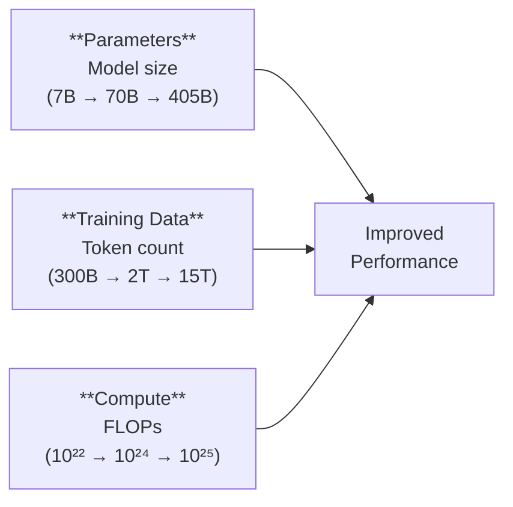
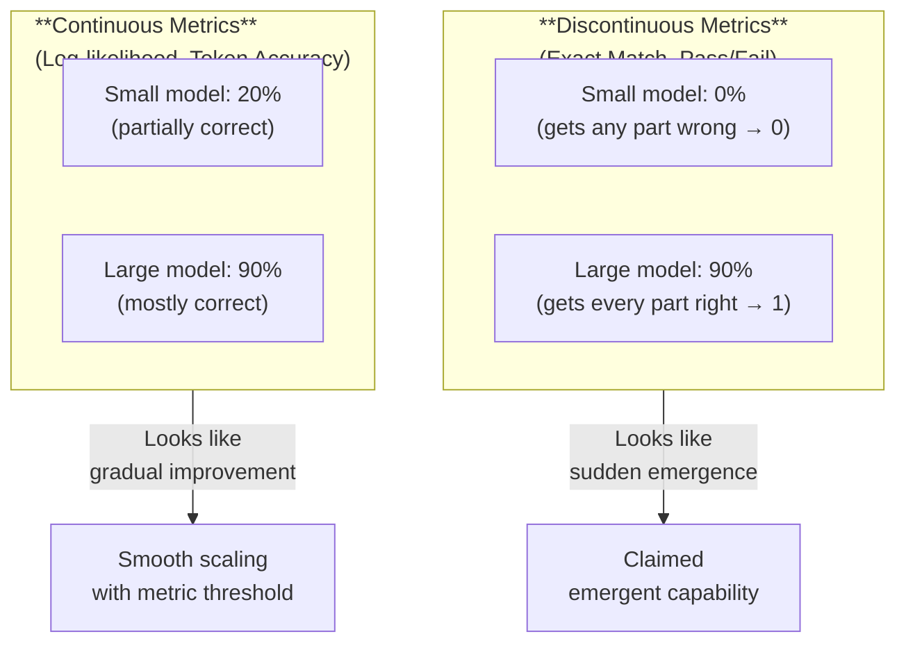

# Emergent Capabilities and Scaling

*Last reviewed: April 2026*

One of the most debated phenomena in AI: certain capabilities appear to **emerge** in language models only at sufficient scale — absent in small models, present in large ones, with a transition that can appear abrupt. Understanding emergence is essential for assessing model capabilities and predicting what risks future models might introduce.

## What Is Emergence?

An emergent capability is one that is:
1. **Not present** in smaller models trained the same way
2. **Present** in larger models, seemingly without explicit training for that capability
3. Often appearing to improve **suddenly** rather than gradually as scale increases

Examples that have been claimed as emergent:

| Capability | Approximate Scale of Emergence |
|-----------|:-----------------------------:|
| In-context learning (few-shot) | ~6B parameters |
| Chain-of-thought reasoning | ~60B parameters |
| Multi-step arithmetic | ~100B parameters |
| Code generation (non-trivial) | ~10B+ parameters |
| Instruction following (zero-shot) | ~30B+ parameters |
| Theory of mind tasks | ~70B+ parameters |
| Multi-lingual transfer (zero-shot) | ~10B+ parameters |

## The Scaling Approach

### Three Axes of Scale

Model performance improves along three dimensions:

These three axes are interrelated — increasing one while holding the others fixed yields diminishing returns. The Chinchilla scaling result showed that **parameters and data should be scaled together** for compute-optimal training.

### Scaling Laws

Empirical power-law relationships govern how loss decreases with scale:

$$L(N) \approx \left(\frac{N_c}{N}\right)^{\alpha_N}$$

$$L(D) \approx \left(\frac{D_c}{D}\right)^{\alpha_D}$$

$$L(C) \approx \left(\frac{C_c}{C}\right)^{\alpha_C}$$

Where $N$ = parameters, $D$ = training tokens, $C$ = compute (FLOPs), and the $\alpha$ values are empirically determined exponents (approximately 0.07 for compute).

The practical implication: performance improves **smoothly and predictably** with scale when measured by training loss. The surprise comes from downstream task performance, which can show non-smooth behavior.

## The Emergence Debate

### The Original Claim

Wei et al. (2022) documented numerous capabilities that appeared to emerge sharply at specific model scales. Below a threshold, performance was near-random; above it, performance jumped significantly.

### The Counterargument

Schaeffer et al. (2023) argued that apparent emergence is largely a **measurement artifact**:

The argument: when you measure with **discontinuous metrics** (exact match: either 100% correct or 0), a gradually improving underlying capability crosses the scoring threshold suddenly. Switch to **continuous metrics** (partial credit, log-likelihood), and the "emergence" becomes smooth improvement.

### The Practical Resolution

Both perspectives contain truth:
- **Underlying capabilities** (as measured by loss, log-likelihood, per-token accuracy) improve smoothly with scale
- **Task performance** (as measured by exact match, pass/fail, benchmark scores) can show sharp transitions when the underlying capability crosses a task-specific threshold
- The threshold is real — a model that gets 60% of arithmetic digits correct fails at arithmetic (wrong answer), while one that gets 99% correct succeeds. The jump from "useless" to "useful" is genuine, even if the underlying improvement is gradual.

For governance, the key takeaway is: **capabilities that are absent in smaller models may appear in larger ones, and predicting exactly when is difficult.**

## Implications for Governance

### Capability Prediction Is Hard

If a model's capabilities cannot be fully predicted from smaller-scale experiments, then:
- **Pre-deployment evaluation is essential**: You must test the actual deployed model, not extrapolate from smaller versions
- **Post-deployment monitoring is essential**: Capabilities may manifest in use that weren't anticipated during evaluation
- **Safety testing must be comprehensive**: Dangerous capabilities (e.g., providing instructions for harmful activities) may emerge at scales that weren't tested

### The "Dual Use" Problem

Scale can produce capabilities that are simultaneously beneficial and dangerous:

| Beneficial Capability | Dangerous Twin |
|----------------------|----------------|
| Understanding chemistry for drug discovery | Understanding chemistry for harmful substances |
| Coding expertise for software development | Coding expertise for malware creation |
| Persuasive writing for education | Persuasive writing for manipulation |
| Multilingual capability for inclusion | Multilingual capability for cross-language disinformation |

Alignment and guardrails attempt to allow beneficial uses while blocking harmful ones, but the underlying capability exists for both.

### Compute Governance

The relationship between compute and capabilities has led to proposals for **compute governance** — regulating or monitoring the compute used for AI training. The EU AI Act's 10²⁵ FLOPs threshold for GPAI systemic risk is the first legal implementation of this concept.

Arguments for compute governance:
- Compute is **measurable** (FLOPs can be calculated)
- Compute is **concentrated** (few entities have enough GPUs for frontier training)
- Compute is a **leading indicator** of capability (more compute → more capability, predictably)

Arguments against:
- Algorithmic efficiency improvements mean the **same compute produces more capability** over time — a fixed threshold becomes outdated
- Compute thresholds are **crude proxies** for actual risk
- They may **disadvantage smaller actors** doing legitimate research

## The Bitter Lesson and Its Limits

Rich Sutton's "Bitter Lesson" (2019) observes that in AI history, approaches that leverage scale (more compute, more data) consistently outperform approaches that leverage human knowledge and engineering. The current scaling paradigm embodies this — training larger models on more data has produced more capable AI than decades of hand-engineering.

But scaling has limits:
- **Physical**: Energy consumption, chip manufacturing capacity, data availability
- **Economic**: Training costs are growing faster than revenue
- **Algorithmic**: Current architectures may hit efficiency ceilings
- **Data**: Some researchers argue we are approaching the limit of available high-quality training data

Whether current scaling trends continue, plateau, or find new efficiency gains is one of the most consequential open questions in AI.

> **Governance Relevance**
>
> Emergence and scaling define the risk frontier:
>
> 1. **EU AI Act compute threshold**: The 10²⁵ FLOPs threshold (Art. 51) is based on the premise that more compute = more capability = more risk. This is approximately correct today but may need updating as algorithmic efficiency improves.
> 2. **Evaluation completeness**: If capabilities emerge unpredictably, no evaluation can guarantee completeness. Risk assessments should explicitly acknowledge the possibility of undiscovered capabilities.
> 3. **Frontier model providers** bear the highest regulatory burden precisely because emergence at scale is unpredictable. EU AI Act Art. 55 (adversarial testing for systemic risk GPAI) and NIST AI RMF MEASURE 3.1 (tracking unanticipated risks) directly address this.
> 4. **The open-weight question**: When large models are released with open weights, emergent capabilities become available to anyone — including those who may strip safety guardrails. This informs the ongoing policy debate about open vs. closed model release.
