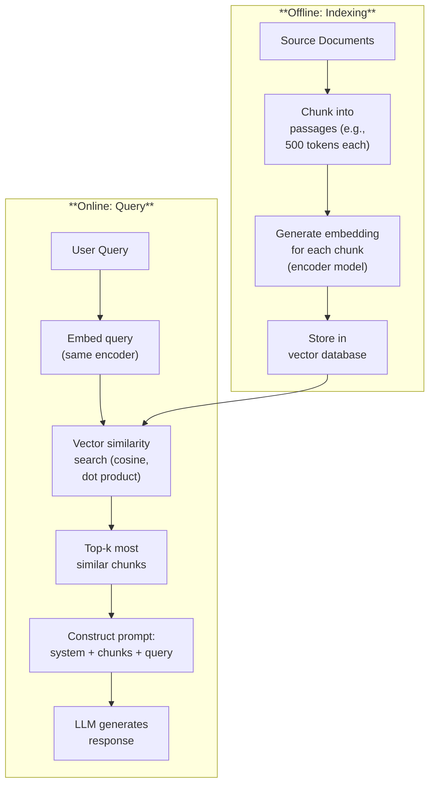
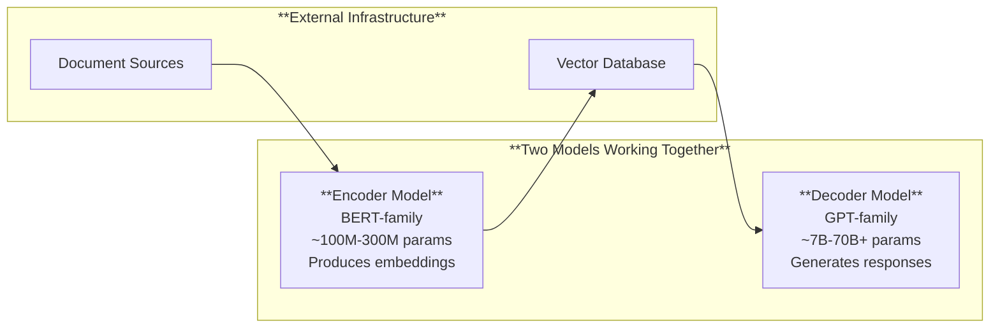
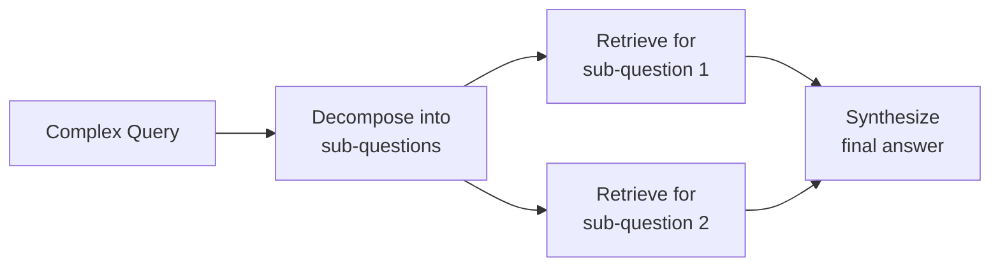

# Retrieval-Augmented Generation (RAG)

*Last reviewed: April 2026*

RAG is the dominant architecture for connecting language models to external knowledge. Instead of relying solely on the model's parametric memory (what it learned during training), RAG retrieves relevant documents from an external knowledge base and includes them in the prompt. This reduces hallucination, enables access to private or current information, and provides verifiable source references.

## How RAG Works

### Step 1: Indexing (Offline)

**Chunking**: Split source documents into passages of manageable size (typically 256–1024 tokens). Chunk size is a critical design choice:
- Too small → chunks lack sufficient context, retrieval finds fragments
- Too large → chunks dilute relevance, waste context window space

**Embedding**: Convert each chunk into a dense vector representation using an embedding model (encoder-only transformer, e.g., E5, BGE, OpenAI text-embedding-3). These vectors capture semantic meaning — similar content produces similar vectors.

**Storage**: Store vectors in a vector database (Pinecone, Weaviate, Qdrant, ChromaDB, pgvector). The database supports efficient nearest-neighbor search over millions or billions of vectors.

### Step 2: Retrieval (Online)

**Query embedding**: The user's query is embedded using the same encoder model.

**Similarity search**: Find the top-$k$ chunks whose embeddings are most similar to the query embedding. Common similarity metrics:
- **Cosine similarity**: Measures angle between vectors (most common)
- **Dot product**: Measures both magnitude and direction
- **Euclidean distance**: Measures straight-line distance

**Re-ranking** (optional): A more sophisticated model re-scores the top-$k$ results based on the full text of query and chunk (not just embeddings). Cross-encoder models are commonly used.

### Step 3: Generation

The retrieved chunks are inserted into the LLM's context alongside the user query and system prompt. The LLM generates a response grounded in the retrieved content.

## Component Architecture

A RAG system involves (at minimum) **two models**: an encoder for embeddings and a decoder for generation. Each model has its own model card, capabilities, and limitations. System documentation must cover both.

## Chunking Strategies

| Strategy | Description | Best For |
|----------|-------------|----------|
| **Fixed-size** | Split every N tokens/characters | Simple, consistent |
| **Sentence-based** | Split on sentence boundaries | Preserving complete thoughts |
| **Paragraph-based** | Split on paragraph boundaries | Structured documents |
| **Semantic** | Split when topic changes (using embedding similarity) | Complex, multi-topic documents |
| **Recursive** | Try larger splits first, recurse to smaller if too large | General purpose |
| **Document-aware** | Respect document structure (headings, sections, tables) | Technical/legal documents |

**Overlap**: Most strategies use overlapping windows (e.g., 50-100 token overlap between consecutive chunks) to avoid splitting important information across chunk boundaries.

## Retrieval Quality

The quality of the entire RAG system depends on retrieval quality — if the wrong documents are retrieved, the LLM generates responses based on irrelevant context.

### Measuring Retrieval Quality

| Metric | Definition |
|--------|-----------|
| **Recall@k** | Fraction of relevant documents that appear in the top-k results |
| **Precision@k** | Fraction of top-k results that are actually relevant |
| **MRR (Mean Reciprocal Rank)** | Average of 1/rank of the first relevant result |
| **NDCG** | Weighted measure accounting for the position of relevant results |

### Common Retrieval Failures

- **Semantic gap**: The query uses different terminology than the source documents. "What are the side effects?" may not match a document titled "Adverse reactions."
- **Cross-lingual**: Query in one language, documents in another. Multilingual embedding models help but aren't perfect.
- **High-level vs. specific**: A broad query retrieves too many marginally relevant chunks, diluting the signal.
- **Temporal**: Outdated documents may be retrieved over current ones if the vector database doesn't weight recency.

## Advanced RAG Patterns

### Hybrid Search

Combine vector (semantic) search with keyword (BM25/TF-IDF) search. Semantic search captures meaning; keyword search captures exact terms. Merging results from both improves recall, especially for queries containing specific technical terms, acronyms, or identifiers.

### Query Transformation

Before searching, transform the user query to improve retrieval:
- **Query expansion**: Generate multiple phrasings of the same question
- **Hypothetical Document Embeddings (HyDE)**: Ask the LLM to generate a hypothetical answer, then use that answer's embedding for retrieval (the hypothetical answer is closer in embedding space to the actual documents than the original question)
- **Step-back prompting**: Generate a more general query to retrieve broader context

### Multi-Step RAG

For complex queries that require information from multiple sources, decompose the query into sub-questions, retrieve for each, and synthesize.

### Agentic RAG

The LLM decides dynamically whether to retrieve, what to retrieve, and when it has enough information. The model generates retrieval queries, evaluates results, and iterates — rather than following a fixed retrieve-then-generate pipeline.

## RAG vs. Fine-Tuning

| Factor | RAG | Fine-Tuning |
|--------|-----|-------------|
| Knowledge update speed | Instant (update the index) | Slow (retrain) |
| Source attribution | Natural (retrieved docs are the source) | Difficult |
| Cost | Retrieval infrastructure + embeddings | GPU compute for training |
| Hallucination | Reduced (grounded in context) | Reduced (memorized) but no source citation |
| Scalability | Scales to billions of documents | Limited by training data size |
| Private data | Stays in the vector database (not in model weights) | Encoded in model weights |
| Context length dependency | Yes — limited by context window | No — knowledge is in weights |

For most enterprise deployments, **RAG is preferred** because:
- Knowledge can be updated without retraining
- Sources can be cited and verified
- Private data doesn't need to be included in model training (data governance advantage)
- Multiple knowledge bases can be connected to one model

## RAG Evaluation

### Answer Quality

| Metric | What It Measures |
|--------|-----------------|
| **Faithfulness** | Does the answer only contain information from the retrieved context? |
| **Relevance** | Does the answer address the user's question? |
| **Completeness** | Does the answer cover all relevant aspects from the retrieved context? |
| **Citation accuracy** | Do citations correctly reference the source passages? |

### End-to-End Metrics

Frameworks like **RAGAS** (Retrieval Augmented Generation Assessment) evaluate the full pipeline:
- Context precision: Are retrieved chunks relevant?
- Context recall: Were all necessary chunks retrieved?
- Answer correctness: Is the final answer correct?
- Faithfulness: Is the answer grounded in context (not hallucinated)?

> **Governance Relevance**
>
> RAG systems have unique governance considerations:
>
> 1. **Two models, two assessments**: The embedding model and the generation model are separate components with separate capabilities and limitations. Each needs documentation. EU AI Act Annex IV requires documentation of system components.
> 2. **Data governance for the knowledge base**: The vector database contents are effectively part of the system's knowledge. Data quality (Art. 10), provenance, access controls, and update procedures all apply.
> 3. **Attribution and transparency**: RAG enables source citation — a significant transparency advantage (Art. 13). But citations must be verified; models can hallucinate citations even in RAG systems.
> 4. **Indirect prompt injection**: Documents in the knowledge base can contain adversarial instructions that the LLM follows. This is the primary security risk for RAG systems (Art. 15). Knowledge base content should be treated as a potential attack surface.
> 5. **Knowledge base currency**: If the knowledge base contains outdated information, the system generates outdated answers. A maintenance and update procedure is essential — stale knowledge is a risk management issue (Art. 9).
