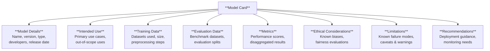
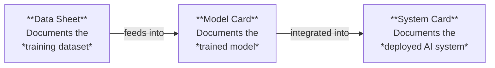

# Model Cards

*Last reviewed: April 2026*

A **model card** is a standardized document that accompanies a machine learning model, describing what it does, how it was built, what it was evaluated on, and what its known limitations are. Think of it as the nutrition label on a food product — except instead of calories and ingredients, it discloses training data, performance metrics, bias evaluations, and intended use cases.

Model cards were introduced in a 2019 research paper by Margaret Mitchell and colleagues at Google. The concept has since become the de facto standard for model documentation and is explicitly referenced or implied by every major AI governance framework.

## Anatomy of a Model Card

A complete model card typically contains these sections:

### Model Details

The identity section: model name, version number, architecture type (e.g., "decoder-only transformer, 70B parameters"), the developing organization, release date, and license. This is where you find out *what* you are looking at.

### Intended Use

What the model was designed to do — and equally important, what it was *not* designed to do. A model intended for "English-language text summarization" should not be deployed for medical diagnosis. The intended use section establishes the boundary between appropriate deployment and misuse.

### Training Data

What data the model was trained on, how much of it, and how it was processed. This section is frequently the weakest in practice — many model cards list dataset names without disclosing composition, consent status, or representation gaps. As a governance professional, this is where you apply the most scrutiny.

### Evaluation Results

Quantitative performance metrics, ideally **disaggregated** across relevant demographic groups or data subsets. A model that scores 92% accuracy overall but 71% on underrepresented groups has a fairness problem that aggregate metrics hide. Look for disaggregation.

### Ethical Considerations and Limitations

Known biases, failure modes, and deployment risks. An honest model card names its weaknesses. A suspicious model card skips this section or fills it with boilerplate.

## The Hugging Face Standard

Hugging Face — the largest public repository of AI models — has operationalized model cards as structured metadata files (`README.md` in YAML frontmatter format) attached to every hosted model. Their format includes:

- **Tags**: task type, language, license, dataset references
- **Metrics**: linked to evaluation results with benchmark names and scores
- **Widget**: interactive demo configuration
- **Carbon footprint**: estimated training emissions (when disclosed)

When you review a model on Hugging Face, the model card is the first thing you see. Its completeness (or lack thereof) is your first indicator of the developer's governance maturity.

## What *Good* Looks Like vs. What *Bad* Looks Like

| Element | Mature Practice | Red Flag |
|---------|----------------|----------|
| Training data | Named datasets with composition stats, consent notes | "Trained on internet data" with no further detail |
| Evaluation | Disaggregated metrics across demographics | Single aggregate accuracy number |
| Limitations | Specific failure modes named | "May produce inaccurate results" (boilerplate) |
| Intended use | Narrow, specific use cases defined | "General purpose" with no boundaries |
| Version history | Changelog with dated updates | No versioning |

## Model Cards vs. System Cards vs. Data Sheets

These three documents serve different purposes and are often confused:

- **Data Sheet** (Gebru et al., 2021): Documents the dataset — motivation, composition, collection process, consent, preprocessing, distribution, maintenance.
- **Model Card**: Documents the model — architecture, training, evaluation, limitations.
- **System Card** (e.g., OpenAI's GPT-4 System Card): Documents the full deployed system — model + safety layers + guardrails + deployment configuration + red-teaming results.

The EU AI Act's technical documentation requirements (Article 11, Annex IV) effectively require all three layers of documentation for high-risk AI systems.

> **Governance Relevance**
>
> Model cards are directly implicated in multiple regulatory requirements:
>
> - **EU AI Act Article 11 / Annex IV**: Requires technical documentation including "a general description of the AI system," training methodologies, data used, evaluation metrics, and known limitations. A model card covers most of Annex IV Section 2.
> - **EU AI Act Article 53 (GPAI)**: Providers of general-purpose AI models must draw up and make publicly available "a sufficiently detailed summary about the content used for training." Model cards are the standard vehicle.
> - **ISO 42001 Clause 6.1.3**: Requires documented AI risk treatment, which should reference model-level documentation.
> - **NIST AI RMF GOVERN-1.5 / MAP-3**: Calls for documentation of model capabilities, limitations, and intended use — exactly what a model card provides.
>
> When assessing a provider's compliance, **request the model card first**. Its completeness tells you more about their governance maturity in five minutes than an hour of interviews.
