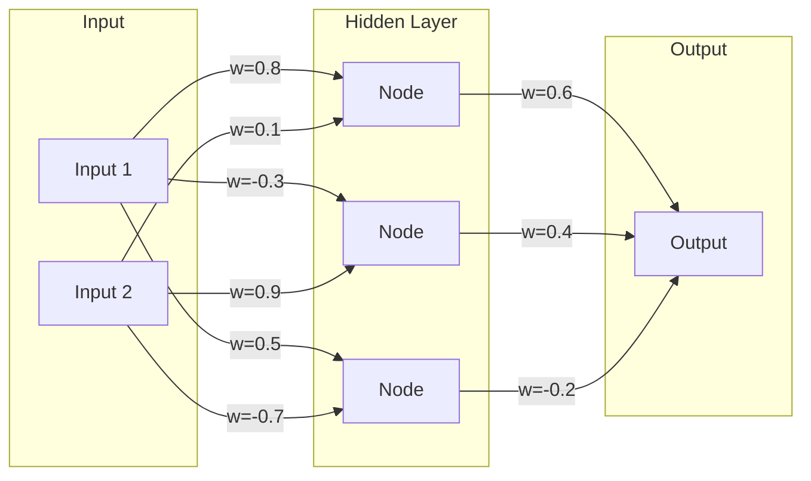

# Weights & Parameters

*Last reviewed: April 2026*

When developers say a model has "70 billion parameters," they are describing the number of individually adjustable numerical values inside the model. These numbers — called **weights** — are what the model learned during training. They are the model's knowledge, encoded as mathematics.

Understanding what weights are, what they represent, and why they matter is essential for governance work because weights sit at the intersection of intellectual property, export controls, open-source licensing, and the fundamental question of what it means to "share" or "deploy" an AI model.

## What Are Weights, Concretely?

A neural network is a graph of connected nodes organized in layers. Each connection between nodes has a numerical value — a **weight** — that determines how strongly one node influences the next. A **bias** is an additional number at each node that shifts the output regardless of input.

In this tiny example, there are 9 weights (the `w=` values on each arrow) plus biases at each node. A real large language model works on the same principle — just with billions of connections instead of nine.

When you hear "GPT-4 has ~1.8 trillion parameters" or "Llama 3 has 70 billion parameters," those numbers refer to the total count of individually learned weight values.

## What Do Weights Encode?

Weights are not human-readable knowledge. You cannot open a weights file and find a paragraph about French grammar or a medical diagnosis procedure. Instead, weights encode **statistical patterns** learned from the training data:

- **Low-level weights** (early layers) learn basic patterns — word boundaries, common character sequences, simple grammatical structures.
- **Mid-level weights** (middle layers) learn compositional patterns — sentence structures, semantic groupings, factual associations.
- **High-level weights** (later layers) learn abstract patterns — reasoning templates, stylistic preferences, task-specific behaviors.

The key insight: **no single weight "knows" anything**. Knowledge is distributed across millions of weights acting together. This is why neural networks are sometimes described as "distributed representations" — the knowledge is in the pattern, not in any individual number.

## Parameters vs. Hyperparameters

These terms are frequently confused:

| Term | What It Is | Who Chooses It | Example |
|------|-----------|---------------|---------|
| **Parameter** (weight) | A value *learned* during training | The training algorithm | Connection weight = 0.0037 |
| **Hyperparameter** | A value *set before* training | The engineer | Learning rate = 0.001, batch size = 32 |

Parameters are the output of training. Hyperparameters are the configuration of training. When a regulation asks about "model parameters," it means the learned weights. When it asks about "training methodology," hyperparameters are part of the answer.

## Why Weights Matter for Governance

### Intellectual Property

Weights represent invested compute. Training a 70B-parameter model can cost $2–10 million in compute alone. Weights are the artifacts that competitors would need to replicate, which is why "open-weight" releases (Meta's Llama, Mistral) are significant business and policy decisions.

"Open-weight" does **not** mean "open-source" in the traditional software sense. A company can release weights under restrictive licenses that prohibit commercial use, fine-tuning for certain purposes, or redistribution above certain user thresholds.

### Export Controls

The U.S. Executive Order on AI (October 2023) and subsequent Commerce Department rules introduced reporting thresholds tied to model scale — specifically, models trained with more than a certain amount of compute (measured in FLOPs). Weights are what results from that compute, making them a controlled artifact in some jurisdictions.

### Model Theft and Security

Stolen weights are stolen capability. If an adversary obtains a copy of a model's weight file, they have the model — they can run it, fine-tune it, and deploy it without the creator's knowledge. This is why weight files in production environments require access controls comparable to source code or trade secrets.

### Weight Formats and File Sizes

Weights are stored as large numerical arrays in specific file formats:

| Format | Extension | Typical Use |
|--------|-----------|-------------|
| PyTorch | `.pt`, `.bin` | Most common during training |
| SafeTensors | `.safetensors` | Security-hardened format (prevents code execution in model files) |
| GGUF | `.gguf` | Quantized models for local inference (llama.cpp) |
| ONNX | `.onnx` | Cross-framework interoperability |

A 70B-parameter model in full precision (FP32) requires ~280 GB of storage. **Quantization** — reducing each weight from 32-bit to 8-bit or 4-bit precision — shrinks this to ~35–70 GB with moderate quality loss. This is how models run on consumer hardware.

> **Governance Relevance**
>
> - **EU AI Act Article 53(1)(b)**: Providers of GPAI models must provide "sufficiently detailed information about the content used for training of the general-purpose AI model, including technical documentation, instructions for use and other information." The weight distribution format and quantization level affect model behavior and should be documented.
> - **EU AI Act Recital 102**: Discusses the distinction between model parameters and the AI system using them — weights alone are not an AI system, but they are the core deliverable in GPAI supply chains.
> - **ISO 42001 Clause A.6.2.6**: Asset management of AI components — weights are AI assets requiring inventory, access control, and lifecycle management.
> - **NIST AI RMF MAP-1.1**: Calls for documentation of model architecture including parameter count and precision — directly about weights.
>
> In governance assessments, ask: *Where are the weight files stored? Who has access? What format? What quantization level and how does it affect performance claims?*
