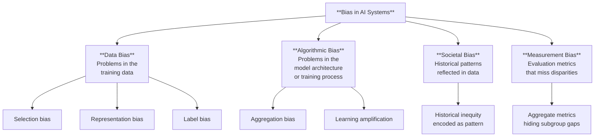
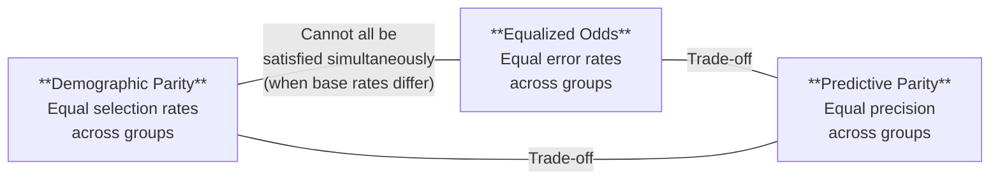

# Bias & Fairness

*Last reviewed: April 2026*

**Bias** in the AI governance context refers to systematic patterns in a model's output that produce unfair, discriminatory, or unrepresentative results for particular groups of people. It is the single most cross-referenced technical concept in AI regulation — appearing in the EU AI Act, ISO 42001, NIST AI RMF, and OECD AI Principles in different but overlapping formulations.

The complexity is that "bias" means different things in different contexts, and some forms of bias are mathematically impossible to eliminate simultaneously. Understanding these distinctions is not optional for governance work.

## Types of Bias

### Data Bias

The training data does not accurately represent the real world:

- **Selection bias**: The data over-represents certain groups and under-represents others. A facial recognition model trained mostly on lighter-skinned faces performs worse on darker-skinned faces — not because the algorithm is inherently discriminatory, but because it had fewer examples to learn from.
- **Representation bias**: The data reflects the world as it is (or was), including historical inequities. A hiring model trained on a company's historical hiring data learns to prefer the same demographic profiles that were historically preferred — perpetuating the bias rather than correcting it.
- **Label bias**: The labels attached to data reflect human annotator biases. If annotators disproportionately label certain speech patterns as "toxic," the model learns those associations.

### Algorithmic Bias

The model's architecture or training amplifies disparities:

- **Aggregation bias**: One model is used for distinct populations that actually have different underlying patterns. A medical model trained on pooled data from all demographics may perform well on average but poorly for underrepresented groups.
- **Learning amplification**: Models don't just reflect correlations in data — they sometimes amplify them. A 60/40 gender split in training data for a profession can become 80/20 in the model's outputs.

### Societal Bias

Historical and structural inequities are encoded in language itself. Word embeddings (vector representations of words) famously encode associations like "doctor → male" and "nurse → female" — because the text data they were trained on reflects these historical patterns. The model didn't create the bias; it learned it from the data; the data came from the society.

## Fairness Metrics (The Impossibility Landscape)

There are multiple mathematically precise definitions of "fairness" — and in most real-world scenarios, **you cannot satisfy all of them simultaneously**. This is known as the impossibility theorem of fairness (Chouldechova, 2017; Kleinberg et al., 2016).

### Key Metrics Explained

**Demographic Parity** (Statistical Parity): The model selects (approves, flags, recommends) individuals from each group at the same rate. If the approval rate for Group A is 40%, the approval rate for Group B should also be approximately 40%.

- *Problem*: If base rates genuinely differ (e.g., default rates on loans across income brackets), enforcing equal selection rates requires accepting more risk for one group or penalizing another.

**Equalized Odds**: The model's error rates are equal across groups. Specifically, the true positive rate and false positive rate are the same for each group.

- *Problem*: Achieving equal error rates often requires different thresholds for different groups, which raises its own fairness concerns.

**Predictive Parity**: When the model predicts a positive outcome, it is equally likely to be correct for each group. If the model approves someone, the probability they actually qualify should be the same regardless of which group they belong to.

- *Problem*: When base rates differ, predictive parity and equalized odds are mathematically incompatible.

### What This Means for Governance

When a developer says their model is "fair," your first question should be: **"Fair according to which definition?"** There is no single correct answer — the choice of fairness metric is a *policy decision*, not a technical one. The governance professional's role is to ensure that:

1. The chosen fairness metric is documented and justified
2. The trade-offs of that choice are understood and accepted by stakeholders
3. The measurement methodology is sound (disaggregated evaluation, appropriate test sets)
4. The results are monitored over time, not just measured once

## Bias Detection Tools

Developers use specific tools to detect and measure bias. Familiarity with these names helps you assess whether bias evaluation actually happened:

| Tool | Developer | What It Does |
|------|-----------|-------------|
| **Fairlearn** | Microsoft | Measures disparities across fairness metrics, provides mitigation algorithms |
| **AI Fairness 360 (AIF360)** | IBM | Comprehensive suite of bias metrics and mitigation methods |
| **What-If Tool** | Google | Interactive visual exploration of model behavior across subgroups |
| **Aequitas** | University of Chicago | Bias audit toolkit focused on public policy applications |
| **HELM** | Stanford | Holistic evaluation including fairness dimensions across benchmarks |

When reviewing a model card or assessment, look for mentions of these tools or equivalent methodologies. If there is no mention of bias evaluation tooling, ask why.

> **Governance Relevance**
>
> Bias and fairness are referenced across every major framework:
>
> - **EU AI Act Article 10(2)(f)**: Training data must be "relevant, sufficiently representative, and to the best extent possible, free of errors and complete in view of the intended purpose." This is a direct anti-bias requirement.
> - **EU AI Act Article 9(7)**: Risk management must address "risks of bias" that could affect health, safety, or fundamental rights — with testing for "possible biases."
> - **EU AI Act Article 27**: The Fundamental Rights Impact Assessment requires assessing risks to groups of people, which is inherently a fairness evaluation.
> - **ISO 42001 Clause A.8.4**: Requires controls for "data for AI systems" including representativeness and bias assessment.
> - **ISO 42001 Clause A.8.5**: Directly addresses AI system bias, requiring identification, assessment, and treatment.
> - **NIST AI RMF MEASURE-2.6**: "AI systems are evaluated for fairness constraints including impacts on different demographic groups."
> - **NIST AI RMF MEASURE-2.11**: "Fairness assessments are conducted, and resulting evidence is documented."
>
> The impossibility theorem is why governance frameworks say "appropriate measures" rather than "eliminate bias" — full elimination across all definitions is mathematically impossible. Your job is to ensure the *choices* are documented, justified, and monitored.
