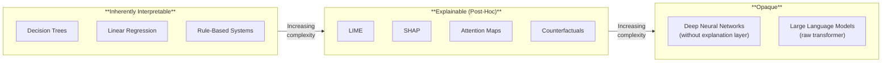
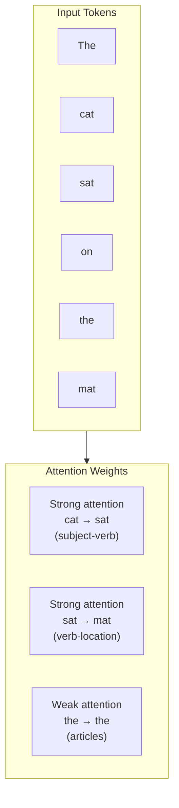
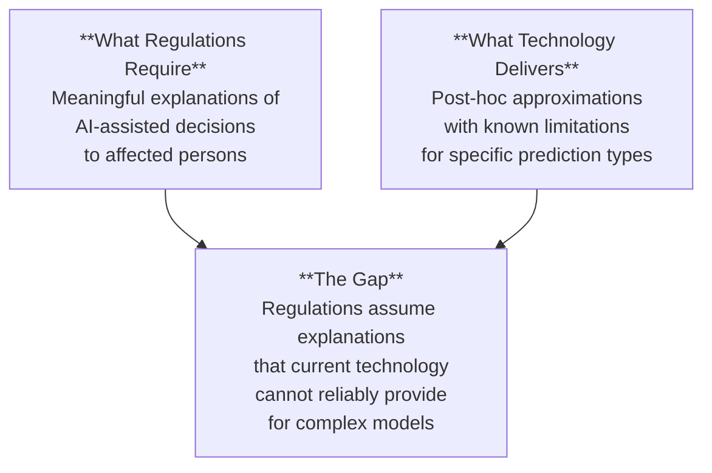

# Explainability & Interpretability

*Last reviewed: April 2026*

**Explainability** and **interpretability** address the same fundamental question: *Why did the model produce this output?* In regulatory terms, this is the "right to explanation" and the requirement for human-understandable decision rationale. In practice, they are two different approaches to answering that question.

- **Interpretability**: The model's internal mechanics are inherently understandable. A decision tree is interpretable — you can trace the exact path from input to output. A 70-billion-parameter neural network is not.
- **Explainability**: Post-hoc techniques that approximate *why* a model produced a given output, even when the model itself is a black box.

Most modern LLMs are not interpretable. They are black boxes. This is not a solvable problem in the near term — it is a structural reality that governance frameworks must accommodate.

## The Explainability Spectrum

## Key Explainability Techniques

### LIME (Local Interpretable Model-Agnostic Explanations)

LIME explains a single prediction by creating a simplified, interpretable model around it. Here is how it works conceptually:

1. Take the specific input you want to explain
2. Create many slightly modified versions of that input (perturbations)
3. Run all perturbations through the original model to get predictions
4. Fit a simple, interpretable model (like a linear model) to the perturbation results
5. The simple model's feature weights tell you which input features mattered most for *this specific prediction*

**Strengths**: Model-agnostic (works with any model), provides local explanations for individual decisions.
**Weaknesses**: Explanations can be unstable (different perturbations can give different explanations), only local (explains one prediction, not the model's overall behavior).

### SHAP (SHapley Additive exPlanations)

SHAP uses a concept from cooperative game theory — Shapley values — to determine each feature's contribution to a prediction. Imagine a group of employees completed a project together, and you need to fairly divide a bonus based on each person's contribution. Shapley values solve exactly this problem.

For a model prediction:
- Each input feature is a "player"
- The prediction is the "payout"
- SHAP calculates how much each feature contributed to pushing the prediction above or below the average

**Strengths**: Mathematically grounded in game theory, provides consistent feature attributions, works globally and locally.
**Weaknesses**: Computationally expensive, exact SHAP for large models requires approximations, can be misleading if features are correlated.

### Attention Maps

In transformer-based models (which includes all modern LLMs), **attention** determines how much the model focuses on each part of the input when producing each part of the output. Attention maps visualize these focus patterns.

**Strengths**: Native to transformer architecture (no extra computation), provides intuitive visualization of "what the model looked at."
**Weaknesses**: Attention ≠ explanation. Research has shown that attention weights do not reliably indicate *why* the model made a decision — they show *where* it focused, which is not the same thing. Do not accept attention maps as sufficient explanation.

### Counterfactual Explanations

Instead of asking "why did the model decide X?", counterfactual explanations ask "what would need to change for the model to decide differently?"

Example: "Your loan application was denied. If your income were $5,000 higher, it would have been approved."

**Strengths**: Highly actionable for affected individuals, intuitive, does not require model internals.
**Weaknesses**: Multiple valid counterfactuals can exist, may reveal gaming strategies, computationally expensive for complex models.

### Mechanistic Interpretability

This is a newer research field (pioneered by Anthropic, among others) that attempts to reverse-engineer neural networks to understand their internal representations. Rather than using post-hoc approximations, mechanistic interpretability looks inside the model to find specific circuits or features responsible for specific behaviors.

This field is promising but **not yet mature enough for regulatory compliance**. It produces fascinating research results (finding specific neurons that detect sarcasm, or circuits that perform arithmetic) but cannot yet reliably explain arbitrary model decisions at production scale.

## The Explanation Gap

This gap is real and unresolved. Regulations (particularly GDPR Article 22 and EU AI Act Article 86) require meaningful explanations for automated decisions affecting individuals. Current explainability techniques provide *partial, approximate* explanations with known limitations. Governance professionals must navigate this honestly — neither claiming XAI solves the problem completely nor dismissing it as impossible.

> **Governance Relevance**
>
> - **EU AI Act Article 13**: High-risk AI systems must be "sufficiently transparent to enable deployers to interpret a system's output and use it appropriately." This directly requires some form of explainability.
> - **EU AI Act Article 86**: Right to explanation of individual decision-making — affected persons have the right to "clear and meaningful explanations" of the role of the AI system in the decision-making procedure.
> - **EU AI Act Recital 72**: Notes that transparency requirements must be proportionate and should not require disclosure of trade secrets.
> - **GDPR Article 22**: Right not to be subject to solely automated decision-making, with right to meaningful information about the logic involved.
> - **ISO 42001 Clause A.8.3**: Calls for "transparency of AI systems" proportionate to risk and context.
> - **NIST AI RMF MEASURE-2.5**: "AI system outputs are parsed and explained for downstream tasks."
>
> In assessments, ask: *What explainability method (LIME, SHAP, counterfactual, other) is used? For which decisions? Has the method's reliability been validated for this specific model and use case? Are explanations provided to affected individuals, and if so, in what form?*
