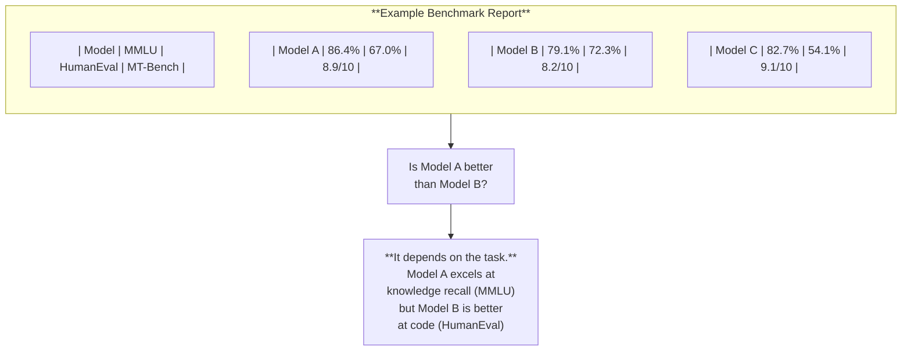

# Evaluation Benchmarks

*Last reviewed: April 2026*

When a model developer claims their model is "state of the art" or "outperforms competitors," they are referencing scores on **benchmarks** — standardized tests designed to measure specific capabilities. Understanding what these benchmarks actually measure (and what they don't) is essential for assessing whether performance claims are meaningful or misleading.

A benchmark is to an AI model what a standardized test is to a student. It measures performance on a defined task under controlled conditions. Like standardized tests, benchmarks are useful but imperfect — they can be gamed, they don't measure everything that matters, and high scores don't guarantee real-world performance.

## The Major Benchmarks

### MMLU (Massive Multitask Language Understanding)

**What it measures**: Knowledge recall and reasoning across 57 academic subjects — from abstract algebra to world religions. Contains ~16,000 multiple-choice questions at varying difficulty levels (elementary through professional).

**What a score means**: MMLU scores are reported as percentage correct. GPT-4 scored ~86%, Claude 3 Opus ~86%, Llama 3 70B ~79%. Human expert performance varies by subject but is roughly 85–95%.

**Limitations**: Multiple-choice format does not test generation quality, practical application, or nuanced reasoning. Models can memorize answers from training data if benchmark questions leak into pretraining corpora (data contamination).

### HumanEval

**What it measures**: Code generation — the model writes code to solve programming problems and the code is executed to check correctness. Contains 164 hand-written programming challenges.

**What a score means**: "Pass@1" means the percentage of problems solved correctly on the first attempt. GPT-4 scored ~67%, Claude 3 Opus ~85%.

**Limitations**: Problems are relatively simple algorithm challenges, not representative of real-world software engineering. Does not test debugging, code review, or system design.

### HELM (Holistic Evaluation of Language Models)

**What it measures**: A comprehensive evaluation framework from Stanford covering accuracy, calibration, robustness, fairness, bias, toxicity, and efficiency across multiple tasks. HELM evaluates models on 42+ scenarios.

**Why it matters for governance**: HELM is the most governance-relevant benchmark because it explicitly includes fairness and bias dimensions alongside capability metrics. A model scoring well on accuracy but poorly on HELM's fairness metrics has a documented disparity problem.

### MT-Bench

**What it measures**: Multi-turn conversational ability — the model's capacity to maintain coherent, helpful dialogue across follow-up questions. Uses GPT-4 as an automated judge to score responses on a 1–10 scale.

**Limitations**: Using one LLM to evaluate another creates circular dependency. The "judge" model has its own biases about what constitutes a good response.

### BigBench

**What it measures**: 200+ tasks specifically chosen to be beyond the capability of current models, designed to track emergent capabilities as models scale. Tasks include novel reasoning, logical inference, and common sense.

### TruthfulQA

**What it measures**: Whether the model generates truthful answers rather than popular misconceptions. Contains 817 questions designed to elicit false but plausible responses.

**Why it matters**: High TruthfulQA scores indicate the model is less likely to confidently generate misinformation — directly relevant to trustworthiness assessments.

## Reading a Benchmark Table

When model developers publish benchmark results, they typically look like this:

### Red Flags in Benchmark Reporting

| Red Flag | Why It's Suspect |
|----------|-----------------|
| Reporting only the benchmarks where the model leads | Cherry-picking — every model has weak areas |
| No version/date on benchmark scores | Models and benchmarks both change over time |
| Aggregate scores without disaggregation | Hides performance disparities across subgroups |
| Scores on internal/unpublished benchmarks | Impossible to independently verify |
| "Near-human performance" claims | Depends entirely on which humans and which task |
| No mention of data contamination checks | Training data may have included benchmark questions |

## The Data Contamination Problem

Benchmarks lose their meaning if the model has seen the answers during training. This is called **data contamination** or **benchmark leakage**. If MMLU test questions appear in the pretraining corpus, a high MMLU score reflects memorization, not reasoning.

Responsible model developers check for contamination and report it. In practice, with training corpora containing trillions of tokens scraped from the internet, perfect decontamination is extremely difficult. Some benchmark scores across the industry may be inflated by unknown contamination.

## Benchmarks vs. Real-World Performance

Benchmarks measure performance in controlled, idealized conditions. Real-world deployment involves:

- Ambiguous, poorly-formed inputs (benchmarks are clean)
- Domain-specific terminology and context (benchmarks are general)
- Adversarial users actively trying to break the system (benchmarks are cooperative)
- Long interactions with context drift (benchmarks are typically short)
- Edge cases not represented in any benchmark

A model that scores 90% on MMLU may perform poorly in your client's specific medical or legal domain. Benchmarks are a necessary but not sufficient indicator of capability. Always ask about **domain-specific evaluation** in addition to standard benchmarks.

> **Governance Relevance**
>
> - **EU AI Act Article 15(1)**: High-risk systems must achieve "appropriate levels of accuracy, robustness and cybersecurity" — benchmarks are the standard evidence for accuracy claims, but must be domain-appropriate.
> - **EU AI Act Article 53(1)**: GPAI model providers must provide "state-of-the-art evaluation results" — this is specifically about benchmark results and their reporting.
> - **EU AI Act Annex XI**: Specifies what evaluation results GPAI providers must disclose, including capability limitations and performance on relevant benchmarks.
> - **ISO 42001 Clause A.7.3**: Performance objectives for AI systems — benchmark results are standard evidence.
> - **NIST AI RMF MEASURE-1**: "Appropriate methods and metrics are identified and applied to measure AI system performance."
> - **NIST AI RMF MEASURE-2.3**: Calls for evaluation across "a range of conditions" — not just benchmark-optimal conditions.
>
> When reviewing benchmark claims: *Which specific benchmarks? What version? Were contamination checks performed? Are disaggregated results available? Has the model been evaluated on domain-specific tasks relevant to the actual deployment use case?*
