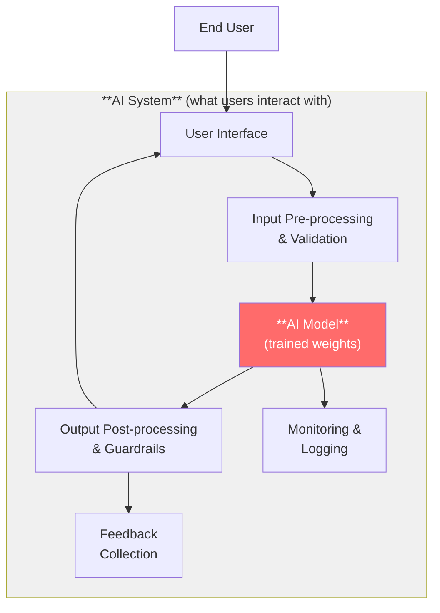
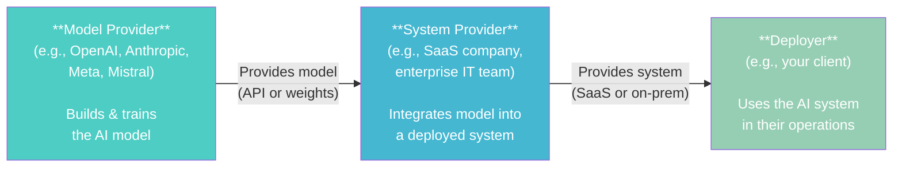

# AI System vs AI Model

*Last reviewed: April 2026*

This distinction may seem academic, but it is the single most consequential definitional boundary in AI regulation. Whether an obligation falls on you, your client, or the upstream model provider depends entirely on whether the regulated artifact is classified as an "AI model" or an "AI system." Getting this wrong means applying the wrong regulatory requirements to the wrong entity.

## The Definitions

### AI Model

An AI model is the trained mathematical artifact — the architecture plus its learned **weights**. It takes input and produces output based on patterns learned from training data. A model, by itself, does nothing useful for end users. It is a component, not a product.

Analogy: an AI model is like an engine. Powerful, essential, but you cannot drive an engine. It needs a vehicle around it.

### AI System

An AI system is a complete, deployed solution that includes one or more AI models *plus* the surrounding infrastructure: data pipelines, pre-processing, post-processing, user interfaces, guardrails, monitoring, and feedback mechanisms. An AI system is what an end user interacts with. It is the vehicle.

### The EU AI Act's Specific Definitions

**AI System** (Article 3(1)): *"A machine-based system that is designed to operate with varying levels of autonomy and that may exhibit adaptiveness after deployment and that, for explicit or implicit objectives, infers, from the input it receives, how to generate outputs such as predictions, content, recommendations, or decisions that can influence physical or virtual environments."*

**General-Purpose AI Model** (Article 3(63)): *"An AI model, including where such an AI model is trained with a large amount of data using self-supervision at scale, that displays significant generality and is capable of competently performing a wide range of distinct tasks."*

The key difference: a model *generates outputs*; a system *generates outputs that influence environments*. The system is the full deployment; the model is a component within it.

## Why This Distinction Matters: The Supply Chain

Modern AI deployments typically involve a supply chain:

The EU AI Act assigns different obligations based on where you sit in this chain:

| Role | Primary Obligations | Key Articles |
|------|-------------------|-------------|
| **GPAI Model Provider** | Technical documentation, training data transparency, copyright compliance, evaluation results | Art. 53, 55 |
| **High-Risk System Provider** | Full conformity assessment, risk management, data governance, transparency, human oversight, accuracy/robustness | Art. 8–15, 16–17 |
| **Deployer** | Use system according to instructions, human oversight, monitor for risks, inform affected persons | Art. 26 |

### Common Supply Chain Scenarios

**Scenario 1: Your client uses the OpenAI API to build a customer service chatbot.**
- OpenAI is the **GPAI model provider** (responsible for Art. 53 obligations on GPT-4)
- Your client is both the **system provider** (they built the chatbot system) and potentially the **deployer**
- If the chatbot is used in a high-risk context (e.g., insurance claim processing), your client bears the high-risk AI system obligations — not OpenAI

**Scenario 2: Your client deploys an off-the-shelf AI recruitment screening tool.**
- The model training organization is the model provider
- The recruitment software vendor is the **system provider** and bears conformity assessment obligations
- Your client is the **deployer** — responsible for using the system according to instructions, maintaining human oversight, and conducting a Fundamental Rights Impact Assessment (FRIA)

**Scenario 3: Your client fine-tunes Llama 3 for internal document classification.**
- Meta is the original model provider
- Your client, by fine-tuning and deploying, becomes the **system provider** for their specific system
- The fine-tuning action shifts significant obligations onto your client

## The "Substantial Modification" Trigger

When a deployer modifies an AI system in a way that constitutes a **substantial modification**, they become a provider and inherit provider-level obligations. This includes:

- Fine-tuning a model for a new task outside its original intended purpose
- Integrating the model into a system that changes its risk classification
- Modifying the system's output processing in ways that alter its behavior profile

This trigger is one of the most practically important provisions in the EU AI Act for governance assessments. Many organizations believe they are "merely deploying" when their customizations have actually made them providers.

> **Governance Relevance**
>
> - **EU AI Act Article 3**: The definitional articles — every obligation depends on correctly applying these definitions.
> - **EU AI Act Article 25**: When a deployer's modification makes them a provider — the "substantial modification" provision.
> - **EU AI Act Article 53 vs Article 8–15**: Different obligation sets for model providers vs system providers. Misclassification means assessing against the wrong requirements.
> - **ISO 42001 Clause 4.3**: Scope determination — the boundary of the AI management system must correctly identify which AI assets are models and which are systems.
> - **NIST AI RMF**: Uses "AI system" throughout — its scope assumes the full deployed system, not models in isolation.
>
> The first question in any governance assessment should be: *Are we looking at a model, a system, or both? Where does this organization sit in the AI supply chain? Are there fine-tuning or customization activities that trigger provider obligations?*
