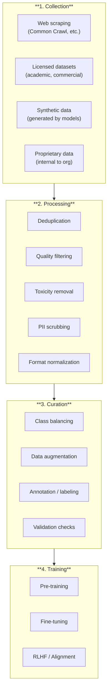
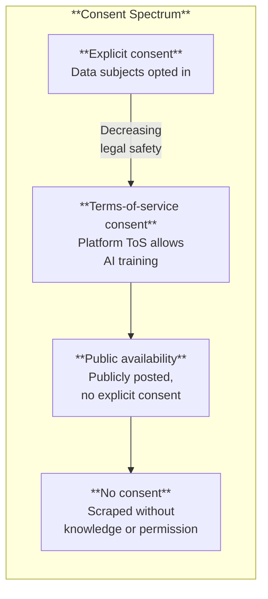

# Training Data, Lineage & Provenance

*Last reviewed: April 2026*

An AI model is only as good — and only as problematic — as the data it was trained on. **Training data** is the raw material from which a model's capabilities and biases emerge. **Data lineage** tracks where data came from. **Data provenance** documents its chain of custody, transformations, and quality characteristics across its lifecycle.

For governance, training data is the highest-risk layer of the AI stack. It is where copyright violations, privacy breaches, consent failures, representation gaps, and bias originate. If you understand one thing deeply, make it this.

## The Training Data Pipeline

### Collection Sources

Modern LLMs are trained on *enormous* datasets — trillions of tokens scraped from the internet, books, code repositories, and other sources. The major public datasets include:

| Dataset | Size | Source | Known Issues |
|---------|------|--------|-------------|
| **Common Crawl** | Petabytes | Web scrape | Contains copyrighted material, toxic content, PII |
| **The Pile** | 800 GB | Curated mix (books, web, code, academic papers) | Copyright disputes (Books3 component) |
| **Wikipedia** | ~20 GB | Encyclopedic text | Editor demographic bias, English-dominant |
| **GitHub Code** | Varies | Public repositories | License compliance, code quality varies |
| **Books3** | ~37 GB | Pirated ebooks | Major copyright litigation target |

The critical insight: **most model developers cannot fully enumerate their training data**. When a model is trained on Common Crawl, which is a snapshot of the public web, the developer often does not know exactly which websites, articles, or personal data are included.

### Processing and Quality Filtering

Raw data is processed before training:

- **Deduplication**: Removes identical or near-identical content (duplicates cause models to memorize specific text rather than learn patterns)
- **Quality filtering**: Removes low-quality content using heuristics (short documents, too many special characters, non-sentences)
- **Toxicity filtering**: Removes content flagged as hateful, violent, or sexually explicit — though this is imperfect and definitions vary
- **PII scrubbing**: Attempts to remove personal information (names, addresses, phone numbers) — also imperfect

Each processing step involves choices that affect the resulting model. Aggressive toxicity filtering can remove content about marginalized groups (because discussion *of* discrimination gets filtered alongside discriminatory content). Language quality filters disproportionately remove content from non-standard dialects.

## Data Documentation Standards

### Datasheets for Datasets

Proposed by Timnit Gebru and colleagues (2021), **datasheets** are standardized documentation for datasets — analogous to model cards for models. A datasheet answers:

- **Motivation**: Why was this dataset created? By whom? For whom?
- **Composition**: What is in the dataset? What data types? What demographic representation?
- **Collection Process**: How was data gathered? Was consent obtained? Were participants compensated?
- **Preprocessing**: What cleaning, filtering, or labeling was applied?
- **Uses**: What has the dataset been used for? What should it not be used for?
- **Distribution**: How is the dataset shared? Under what license?
- **Maintenance**: Who maintains it? How are errors corrected?

### Data Cards (Google)

Google's variation, focused on transparency about dataset characteristics, intended uses, and ethical considerations. More structured metadata format than narrative datasheets.

## Critical Data Risks

### Memorization

Neural networks can **memorize** specific training examples rather than learning general patterns. This means a model may reproduce verbatim text, personal information, or copyrighted content from its training data. Research has demonstrated that prompting models with partial sentences from training data can elicit verbatim continuation.

This is a privacy and copyright risk: if someone's personal email or medical record was in the training data, the model may reproduce it.

### Data Poisoning

An adversary intentionally introduces malicious data into a training dataset to manipulate the resulting model's behavior. For example:

- Inserting trigger phrases that cause the model to produce specific outputs
- Biasing translation models to produce incorrect translations for specific terms
- Causing a code generation model to suggest code with security vulnerabilities

Data poisoning is particularly dangerous because it is difficult to detect after training — the poisoned behavior is encoded in the model's weights, not visible in the deployed code.

### Consent and Licensing

Most web-scraped training data was collected without explicit consent from the content creators. The legal status of this practice is actively being litigated worldwide (e.g., *The New York Times v. Microsoft/OpenAI*). The EU AI Act includes specific copyright transparency requirements for GPAI providers.

> **Governance Relevance**
>
> Training data is the most heavily regulated aspect of AI systems:
>
> - **EU AI Act Article 10**: High-risk systems must use training data that is "relevant, sufficiently representative, and to the best extent possible, free of errors and complete." Data governance practices must address statistical properties, possible biases, and data gaps.
> - **EU AI Act Article 53(1)(c)**: GPAI model providers must put in place a policy to comply with EU copyright law, including identification of content used under text and data mining exceptions.
> - **EU AI Act Article 53(1)(d)**: GPAI providers must publish a "sufficiently detailed summary about the content used for training" — a training data transparency requirement.
> - **EU AI Act Annex XI**: Specifies the information GPAI providers must document about training data methodology, including data sources, scope, and characteristics.
> - **GDPR Articles 5–6**: Personal data in training sets must comply with lawful basis, purpose limitation, data minimization, and accuracy requirements.
> - **ISO 42001 Clause A.8.4**: Establishes controls for data used in AI systems — integrity, quality, representativeness, and bias assessment.
> - **NIST AI RMF MAP-2.3**: "Scientific integrity and TEVV (test, evaluation, verification, and validation) considerations are identified and documented, including those related to data collection and selection."
>
> The highest-impact question in any AI governance assessment: *Where did the training data come from? Is there a data sheet? Were consent and licensing properly handled? Has the data been checked for representativeness, PII, and memorization risks?*
