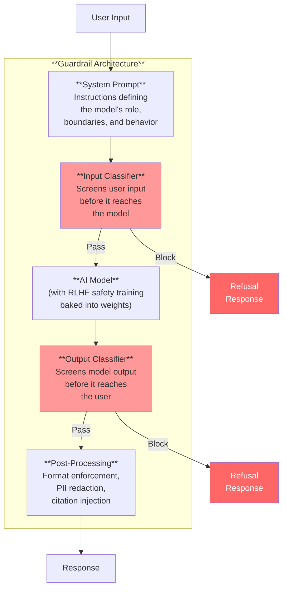
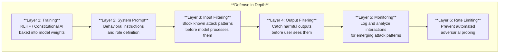

# Guardrails & Content Filtering

*Last reviewed: April 2026*

**Guardrails** are the technical mechanisms that constrain an AI model's behavior to operate within acceptable boundaries. If the AI model is an engine, guardrails are the steering system, brakes, and speed limiter — they don't change what the engine *can* do, but they control what it *does* do in practice.

A model without guardrails is a **base model** — it will complete any text, follow any instruction, and generate any content its training data supports. Every commercially deployed LLM adds safety layers on top of the base model to make it refuse harmful requests, avoid toxic content, and behave helpfully.

## The Guardrail Stack

### System Prompts

A **system prompt** is a set of instructions prepended to every conversation that defines the model's persona, behavioral boundaries, and response policies. When you interact with ChatGPT, Claude, or any commercial LLM, there is a system prompt you don't see that tells the model things like:

- "You are a helpful assistant"
- "You must refuse requests for violence, illegal activity, or harmful content"
- "If you don't know the answer, say so"
- "Do not generate content that discriminates based on protected characteristics"

System prompts are **not** a reliable security boundary — they are instructions to a probabilistic model, not hard constraints. A sufficiently creative jailbreak can override system prompt instructions. This is why system prompts are only one layer in a defense-in-depth approach.

### Input Classifiers

Automated classifiers that analyze user input *before* it reaches the model. These typically flag or block:

- Requests for violence, self-harm, or illegal activity
- Attempts to generate CSAM (child sexual abuse material)
- Known jailbreak patterns
- Personally identifiable information (optionally)

Input classifiers can be rule-based (keyword/pattern matching), learned (a separate ML model trained to detect harmful requests), or hybrid. They reduce the attack surface by filtering obvious threats before the model sees them.

### RLHF Safety Training

**Reinforcement Learning from Human Feedback** (covered in detail in Chapter 16) is the process by which a model's own weights are adjusted to prefer safe, helpful responses over harmful or unhelpful ones. This is the most fundamental guardrail because it changes the model itself — not just what happens around it.

RLHF-trained models develop an internalized tendency to refuse harmful requests. This is more robust than external classifiers because it applies to any input framing, including novel jailbreak attempts the model has never seen. However, RLHF training is imperfect and can be circumvented.

### Output Classifiers

Automated classifiers that analyze model output *before* it reaches the user. Even if a harmful request bypasses the input classifier and the model generates problematic content, the output classifier provides a last line of defense.

Output classifiers typically check for:
- Toxic, hateful, or sexually explicit content
- Personally identifiable information in the response
- Code that contains known security vulnerabilities
- Content that contradicts high-priority safety rules

### Constitutional AI

Developed by Anthropic, **Constitutional AI (CAI)** is an alternative to RLHF that uses a written "constitution" — a set of principles — to guide the model's self-improvement. The model critiques its own outputs against these principles and learns to prefer responses that comply.

The approach:
1. The model generates a response
2. A separate pass asks the model to critique that response against specific principles (e.g., "Is this response harmful?")
3. The model revises the response based on its own critique
4. The revision feedback trains the model's preferences

CAI is notable because it makes the safety criteria explicit and auditable — you can inspect the constitution.

## Defense in Depth

No single guardrail technique is sufficient. Effective deployment uses multiple overlapping layers:

Each layer catches what the previous layers missed. A jailbreak that bypasses RLHF training might still be caught by the output classifier. An adversarial user who evades both might be caught by monitoring patterns. No single layer is perfectly reliable, but the combination raises the bar significantly.

## Known Limitations

Guardrails have fundamental limitations that governance professionals must understand:

1. **Over-refusal**: Models sometimes refuse benign requests that superficially resemble harmful ones. A medical professional asking about drug interactions may get a refusal designed for someone seeking to cause harm. Over-refusal degrades the model's utility.

2. **Bias in safety classifiers**: Content classifiers can exhibit demographic bias — flagging African American Vernacular English as "toxic" at higher rates than Standard American English, for example.

3. **Adversarial arms race**: Every guardrail technique has been circumvented in research or practice. Safety is a continuous process, not a solved state.

4. **Opacity**: Most commercial providers do not disclose the specific guardrails deployed, their configuration, or their effectiveness metrics. This makes independent safety assessment difficult.

5. **Cross-language gaps**: Guardrails trained primarily on English content are often weaker in other languages — a model that reliably refuses harmful requests in English may comply in less-resourced languages.

> **Governance Relevance**
>
> - **EU AI Act Article 15**: High-risk systems must be resilient against "attempts by unauthorised third parties to alter their use, outputs or performance by exploiting system vulnerabilities." Guardrails are the primary technical mechanism for this.
> - **EU AI Act Article 9(2)(b)**: Risk management must address "reasonably foreseeable misuse" — guardrails are how misuse is technically prevented.
> - **EU AI Act Article 55**: GPAI models with systemic risk must implement "adequate measures to mitigate reasonably foreseeable systemic risks" — including guardrails against harmful content generation.
> - **ISO 42001 Clause A.6.2.4**: Calls for AI system "safety" controls — guardrails are the implementation.
> - **ISO 42001 Clause A.9.2**: Security controls for AI systems — input/output filtering is a security measure.
> - **NIST AI RMF MANAGE-2.2**: "Mechanisms are in place and applied to sustain the value of deployed AI systems" — ongoing guardrail effectiveness monitoring.
>
> In assessments, ask: *What guardrail layers are deployed? How was their effectiveness validated? What is the false positive (over-refusal) rate? Is there monitoring for guardrail bypass? How quickly are newly discovered jailbreaks or attack vectors addressed? Are guardrails effective across all supported languages?*
