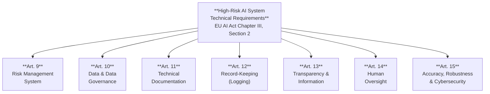
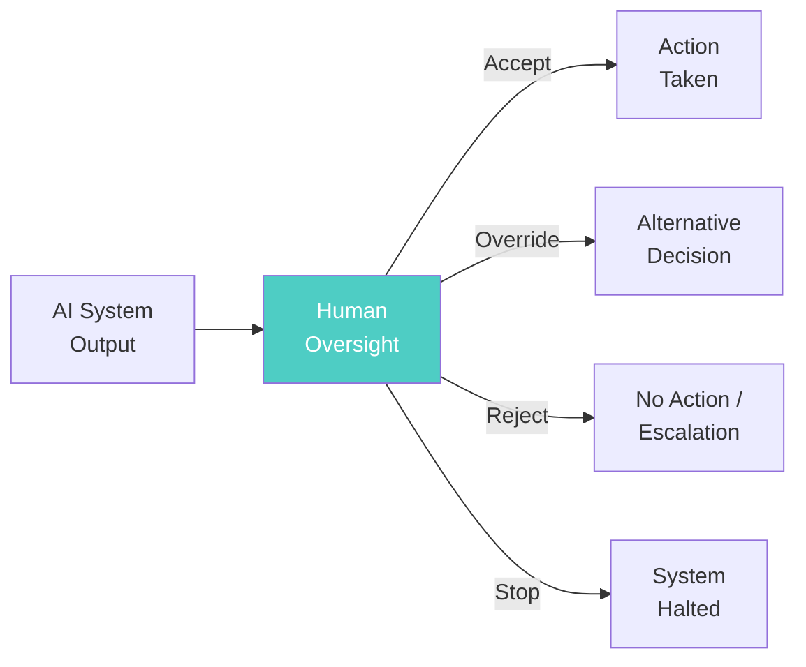

# EU AI Act — High-Risk Technical Requirements

*Last reviewed: April 2026*

Articles 9 through 15 of the EU AI Act (Regulation 2024/1689) define the **technical requirements** that high-risk AI systems must satisfy. These are not vague principles — they are specific engineering obligations with concrete documentation, testing, and monitoring expectations. This chapter maps each article to the technical practices that satisfy it.

## The Requirements at a Glance

## Article 9: Risk Management System

### What the Law Requires

A **continuous, iterative** risk management system must be established across the full lifecycle of the high-risk AI system. This is not a one-time assessment — the regulation explicitly requires "regular systematic review and updating." The required steps are:

1. **Identify and analyse** known and reasonably foreseeable risks to health, safety, or fundamental rights when the system is used as intended
2. **Estimate and evaluate** risks under intended use *and* reasonably foreseeable misuse
3. **Evaluate other risks** based on post-market monitoring data (Article 72)
4. **Adopt risk management measures** to address identified risks

Residual risk — after mitigation — must be "judged to be acceptable." Risk measures must follow a hierarchy:
- **(a)** Eliminate or reduce risks through design and development (first preference)
- **(b)** Implement mitigation and control measures for risks that cannot be eliminated
- **(c)** Provide information and training to deployers

Testing must be performed "against prior defined metrics and probabilistic thresholds that are appropriate to the intended purpose."

### What This Means in Engineering Practice

| Requirement | Technical Evidence |
|-------------|-------------------|
| Continuous risk management | Risk register with dated entries, regular review cadence documented |
| Foreseeable misuse analysis | Adversarial testing results, prompt injection testing, jailbreak resistance evaluation |
| Post-market monitoring integration | Logging pipeline feeding back into risk assessments, incident tracking |
| Residual risk acceptance | Documented risk acceptance criteria, sign-off by accountable persons |
| Testing against defined metrics | Benchmark results with threshold definitions, test logs, dated and signed |

### Assessment Questions

- Is there a risk register that is regularly updated (not just created once at design)?
- Have risks been evaluated for both intended use and foreseeable misuse?
- Are risk management measures prioritized by the hierarchy (eliminate > mitigate > inform)?
- Are testing metrics and thresholds defined *before* testing, not retroactively?

---

## Article 10: Data and Data Governance

### What the Law Requires

Training, validation, and testing datasets must meet specific **quality criteria** and be subject to **data governance practices** addressing:

- **(a)** Relevant design choices
- **(b)** Data collection processes and origin, including original purpose of data collection for personal data
- **(c)** Data preparation: annotation, labelling, cleaning, updating, enrichment, aggregation
- **(d)** Assumptions about what the data measures and represents
- **(e)** Assessment of availability, quantity, and suitability
- **(f)** Examination for possible biases affecting health, safety, fundamental rights, or leading to discrimination
- **(g)** Appropriate measures to detect, prevent, and mitigate identified biases
- **(h)** Identification of data gaps or shortcomings

Datasets must be "relevant, sufficiently representative, and to the best extent possible, free of errors and complete in view of the intended purpose" (Art. 10(3)).

A critical provision: Article 10(5) allows **exceptional processing of special category personal data** (ethnicity, health, etc.) specifically for bias detection — subject to strict safeguards including pseudonymization, access controls, and deletion after bias correction. This is one of the few places where GDPR's strict limits on sensitive data processing are explicitly relaxed for AI fairness purposes.

### What This Means in Engineering Practice

| Requirement | Technical Evidence |
|-------------|-------------------|
| Data governance practices | Data sheets (Gebru et al.), data provenance documentation |
| Origin and collection | Dataset cards specifying sources, consent status, collection methodology |
| Bias examination | Demographic distribution analysis, representation audits across protected groups |
| Bias mitigation | Fairlearn/AIF360 reports, rebalancing documentation, mitigation technique selection rationale |
| Representativeness | Statistical analysis showing coverage of deployment population demographics |
| Data gap identification | Missing data analysis, documented known limitations of training data |

### Assessment Questions

- Is there a data sheet or data card for each training dataset?
- Has demographic representation been analysed and documented?
- Were bias detection methods applied, and are the results available?
- If special category data was processed for bias detection, are the Article 10(5) safeguards in place?

---

## Article 11: Technical Documentation

### What the Law Requires

Technical documentation must be drawn up **before** the system is placed on the market and kept up to date. It must demonstrate compliance with all Section 2 requirements. Annex IV specifies the minimum contents:

**Section A — General Description**: Intended purpose, provider name, version, hardware/software interactions, deployment forms (API, embedded, download).

**Section B — Development Details**: Development methods, design specifications, "key design choices including the rationale and assumptions made, including with regard to persons or groups of persons in respect of whom the system is intended to be used," training data requirements with datasheets, computational resources used.

**Section C — Monitoring and Control**: Performance capabilities and limitations "including the degrees of accuracy for specific persons or groups of persons", foreseeable unintended outcomes, human oversight specifications.

**Section D**: Appropriateness of performance metrics.

**Section E**: Detailed risk management system description.

**Section F**: Relevant changes across lifecycle.

**Section G**: Harmonised standards applied, or alternative solutions to meet requirements.

### What This Means in Engineering Practice

Annex IV effectively requires a model card + system card + risk assessment + performance report + change log, combined into one comprehensive document. Most organizations will need to map their existing documentation to these sections and fill gaps.

### Assessment Questions

- Does a single document (or linked document set) cover all Annex IV sections?
- Are design rationale and assumptions documented, particularly regarding intended user populations?
- Is accuracy reported per demographic group, not just in aggregate?
- Is the documentation dated and versioned?

---

## Article 12: Record-Keeping (Logging)

### What the Law Requires

High-risk systems must **technically allow for automatic recording of events (logs)** over the system's lifetime. Logging must enable:

- Identifying situations that may present risk or constitute substantial modification
- Facilitating post-market monitoring
- Monitoring operation (for deployers subject to Article 26(5))

For biometric identification systems specifically: recording of each use period (start/end), reference database, matched input data, and identification of the humans who verified results.

### What This Means in Engineering Practice

| Requirement | Technical Evidence |
|-------------|-------------------|
| Automatic event logging | System architecture showing logging pipeline, log format specification |
| Lifetime logging | Log retention policy aligned with system lifecycle, storage architecture |
| Risk-relevant events | Definition of logged events per the risk register |
| Post-market monitoring feed | Log aggregation → monitoring dashboard → risk register feedback loop |

---

## Article 13: Transparency and Information to Deployers

### What the Law Requires

The system must be "sufficiently transparent to enable deployers to interpret a system's output and use it appropriately." Instructions for use must include:

- Provider identity and contact details
- Performance characteristics: intended purpose, accuracy metrics (including expected accuracy and known circumstances that may impact it), performance on specific persons or groups, input specifications
- Known circumstances leading to risks under intended use *or* foreseeable misuse
- Human oversight measures and technical measures facilitating output interpretation
- Computational/hardware requirements and expected lifetime
- Log interpretation mechanisms

### What This Means in Engineering Practice

This is effectively a mandatory "instructions for use" document — a deployer-facing manual that must include honest performance disclosures, not just marketing materials. The requirement for disaggregated performance metrics ("specific persons or groups of persons") is explicit.

---

## Article 14: Human Oversight

### What the Law Requires

Natural persons assigned to human oversight must be enabled to:

- **(a)** Properly understand the system's capabilities and limitations, including detecting anomalies and unexpected performance
- **(b)** Remain aware of **automation bias** — the tendency to over-rely on AI system outputs
- **(c)** Correctly interpret the system's output
- **(d)** Decide not to use the system, or disregard/override/reverse its output in any particular situation
- **(e)** Intervene or interrupt the system through a "stop button" or similar mechanism

For biometric identification systems: **no action or decision** based on the AI identification unless verified by **at least two humans** with necessary competence.

### What This Means in Engineering Practice

Key implementation requirements:
- **Override capability**: The deployer must always be able to disregard AI output — no "mandatory follow" designs
- **Stop button**: A clear mechanism to halt the system safely
- **Automation bias awareness**: Deployer training must address the tendency to trust AI outputs without critical evaluation
- **Two-person verification**: For biometric ID — two competent humans must independently verify

---

## Article 15: Accuracy, Robustness, and Cybersecurity

### What the Law Requires

- Achieve **appropriate levels** of accuracy, robustness, and cybersecurity **throughout the lifecycle**
- Accuracy levels and metrics must be **declared in the instructions for use**
- Resilience against errors, faults, and inconsistencies (including from human interaction)
- Systems that continue learning post-deployment must reduce risk of **biased feedback loops**
- Resilience against **unauthorized third-party manipulation** — explicitly naming: data poisoning, model poisoning, adversarial examples/model evasion, confidentiality attacks, and model flaws (Art. 15(9))

### What This Means in Engineering Practice

| Threat (Art. 15(9)) | Technical Countermeasure |
|---------------------|------------------------|
| Data poisoning | Input validation, anomaly detection in training data, data provenance verification |
| Model poisoning | Supply chain security for pre-trained components, integrity verification |
| Adversarial examples | Adversarial training, input perturbation detection, certified robustness bounds |
| Model evasion | Red-teaming, continuous monitoring for evasion patterns |
| Confidentiality attacks | Differential privacy, membership inference defense, model extraction detection |
| Model flaws | Comprehensive testing, formal verification where feasible |

---

## Provider Obligations (Article 16)

Article 16 rolls up the technical requirements into a provider **checklist**:

- Comply with Articles 9–15 (all technical requirements)
- Quality management system (Article 17)
- Maintain documentation (Article 18) and logs (Article 19)
- Conformity assessment (Article 43) before market placement
- EU declaration of conformity (Article 47)
- CE marking (Article 48)
- Registration (Article 49)
- Corrective actions when needed (Article 20)
- Accessibility compliance (Directives 2016/2102 and 2019/882)

> **Governance Relevance**
>
> Articles 9–15 are the backbone of any high-risk AI system assessment. When conducting a compliance assessment:
>
> 1. **Map evidence to articles**: Create a traceability matrix — for each article and sub-requirement, identify what evidence exists and what gaps remain.
> 2. **Check the lifecycle claim**: Every article emphasizes continuous, lifecycle-wide compliance — not just pre-deployment. Ask about post-market monitoring for each requirement.
> 3. **Disaggregation is mandatory**: Articles 10, 13, and 15 all require performance and bias analysis at the subgroup level. Aggregate-only metrics are non-compliant.
> 4. **Foreseeable misuse**: Articles 9 and 13 require analysis of misuse scenarios, not just intended use. If the provider has only tested the happy path, they have a compliance gap.
> 5. **The stop button is not metaphorical**: Article 14(4)(e) requires a concrete intervention mechanism. Ask what it is and how it works.
