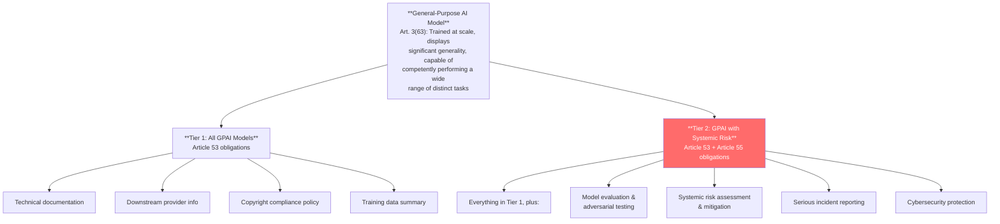
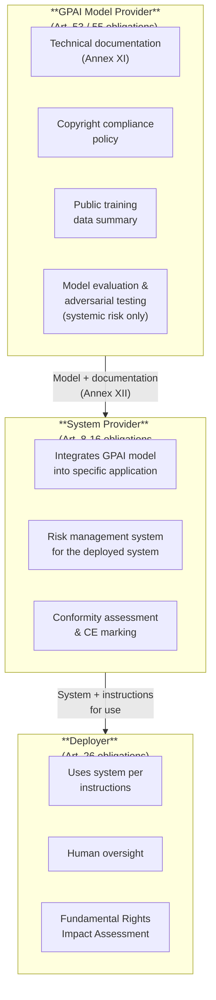

# EU AI Act — GPAI Technical Obligations

*Last reviewed: April 2026*

The EU AI Act creates a separate regulatory track for **General-Purpose AI (GPAI) models** — the foundation models like GPT-4, Claude, Llama, Gemini, and Mistral that are designed for broad capability rather than a single task. Articles 53 and 55 impose obligations on GPAI providers that are distinct from the high-risk AI system requirements covered in the previous chapter.

This distinction matters because GPAI models sit upstream in the supply chain. The model provider's obligations are different from (and generally lighter than) those of the system provider who integrates the model into a specific high-risk application.

## GPAI vs. GPAI with Systemic Risk

The EU AI Act creates two tiers of GPAI obligations:

### What Triggers "Systemic Risk"?

Article 51 establishes the classification. A GPAI model is presumed to have systemic risk when:

- The **cumulative compute** used for training exceeds **10^25 FLOPs** (floating point operations)
- Or it is designated by the Commission based on additional criteria (capabilities, reach, impact)

As of 2026, models suspected of exceeding this threshold include GPT-4, Gemini Ultra, and Claude 3 Opus. The exact training compute for most commercial models is not publicly disclosed, which creates classification uncertainty.

## Article 53: Obligations for All GPAI Providers

### (a) Technical Documentation

Providers must draw up and maintain technical documentation of the model, containing at minimum the information in **Annex XI**:

**Annex XI, Section 1** (required for all GPAI models):

| Category | Required Information |
|----------|---------------------|
| **General description** | Intended tasks, AI system types it can integrate into, acceptable use policies, release date, distribution methods, licence |
| **Architecture** | Architecture type and **number of parameters** |
| **Input/output** | Modality (text, image, etc.) and format |
| **Training process** | Design specifications, training methodologies, key design choices with rationale, optimization targets |
| **Training data** | Type and provenance, curation methodologies (cleaning, filtering), number of data points, scope and characteristics, data selection methods, bias detection measures |
| **Compute** | Computational resources used (e.g., FLOPs), training time |
| **Energy** | Known or estimated energy consumption |

This is where **model cards** become compliance-critical. A well-structured model card maps directly to Annex XI Section 1.

### (b) Downstream Provider Information

GPAI providers must provide sufficient information for downstream system providers to:
- Understand the model's capabilities and limitations
- Comply with their own obligations under the AI Act

This information must include at minimum the elements in **Annex XII**. In practice, this means comprehensive API documentation, integration guides, and honest capability/limitation disclosures — not just marketing materials.

### (c) Copyright Compliance Policy

Providers must put in place a policy to comply with EU copyright law, specifically to **identify and comply with** reservations of rights expressed under Article 4(3) of the Copyright Directive (2019/790). This means:

- Having a technical mechanism to detect and respect "opt-out" signals from rights holders who reserve their works from text and data mining
- Documenting how copyright compliance is achieved "including through state-of-the-art technologies"

This is one of the most operationally challenging obligations. Content creators can opt out of having their works used for AI training, and GPAI providers must have systems to honor those opt-outs.

### (d) Training Data Summary

Providers must "draw up and make **publicly available** a sufficiently detailed summary about the content used for training of the general-purpose AI model."

This is a transparency obligation — the summary must be public, not just available to regulators. The AI Office provides a template. In practice, this requires disclosing dataset names, sources, types of content, and volume — while balancing against trade secret protection.

### Open-Source Exception (Article 53(2))

Models released under **free and open-source licences** where parameters, architecture, and usage information are publicly available are exempt from the documentation obligations in (a) and (b). However, this exception **does not apply** to GPAI models with systemic risk — open-weight models that exceed the compute threshold still bear full obligations.

This means: Meta's Llama (open-weight, potentially systemic risk) would **not** benefit from the open-source exception if it exceeds the compute threshold. The size of the model release does not remove the systemic risk obligation.

## Article 55: Additional Obligations for Systemic Risk GPAI

### (a) Model Evaluation and Adversarial Testing

Providers must "perform model evaluation in accordance with standardised protocols and tools reflecting the state of the art, including conducting and documenting **adversarial testing** of the model with a view to identifying and mitigating systemic risks."

**Annex XI, Section 2** adds specific requirements:
- Detailed evaluation strategies with criteria, metrics, and methodology for identifying limitations
- Detailed description of adversarial testing measures (red teaming), model adaptations including alignment and fine-tuning

This is the **red-teaming mandate**. It requires not just testing but documented methodology, results, and remediation actions. "State of the art" means the provider must demonstrate awareness of and application of current best practices — not just a pro-forma checklist.

### (b) Systemic Risk Assessment and Mitigation

Providers must "assess and mitigate possible systemic risks at Union level, including their sources, that may stem from the development, the placing on the market, or the use of general-purpose AI models with systemic risk."

Systemic risks include:
- Large-scale disinformation or manipulation
- Proliferation of chemical, biological, or nuclear weapons knowledge
- Undermining democratic processes
- Significant disruption to critical infrastructure

### (c) Serious Incident Reporting

Providers must track, document, and report "without undue delay" to the AI Office relevant information about serious incidents and corrective measures. This is analogous to breach notification requirements under GDPR but for AI-specific safety incidents.

### (d) Cybersecurity

Adequate cybersecurity protection for both the model and the **physical infrastructure** of the model. This includes protection against:
- Model theft (weight exfiltration)
- Unauthorized access to training data
- Manipulation of model behavior through infrastructure compromise

## The GPAI Supply Chain in Practice

### Critical Distinctions

**What the GPAI provider is NOT responsible for:**
- How downstream system providers use their model
- Conformity assessment for specific high-risk applications built on their model
- Fundamental Rights Impact Assessments (that falls on the deployer)

**What the GPAI provider IS responsible for:**
- Honest documentation of capabilities and limitations
- Copyright compliance in training data
- Evaluation and adversarial testing (if systemic risk)
- Incident reporting (if systemic risk)

### Codes of Practice (Article 56)

The AI Office is facilitating the development of **codes of practice** that can serve as a path to demonstrating GPAI compliance. Until harmonised standards are published, adherence to an approved code of practice creates a presumption of conformity. Providers who don't follow a code or standard must demonstrate "alternative adequate means of compliance."

> **Governance Relevance**
>
> When assessing a GPAI provider or a client who uses GPAI models:
>
> 1. **Determine the tier first**: Does the model exceed the 10^25 FLOP threshold? If uncertain, the provider should document their compute estimate.
> 2. **Check Annex XI completeness**: Map the provider's model card / technical documentation to each Annex XI section. Gaps are compliance gaps.
> 3. **Training data summary**: Is it publicly available? Is it "sufficiently detailed"? A one-sentence description of "internet text" is not sufficient.
> 4. **Copyright policy**: Ask for the specific policy. How do they detect and honor opt-out signals? What technologies are used?
> 5. **For systemic risk models**: Were adversarial testing results documented? What methodology was used? What risks were identified and how were they mitigated?
> 6. **Open-source is not a shield**: If the model has systemic risk, the open-source exception does not apply. Open-weight systemic risk models bear full Article 53 + 55 obligations.
> 7. **Supply chain traceability**: If your client integrates a GPAI model into a high-risk system, they inherit system-level obligations (Art. 8–16) even though the model provider handles model-level obligations (Art. 53/55). Both layers must be assessed.
