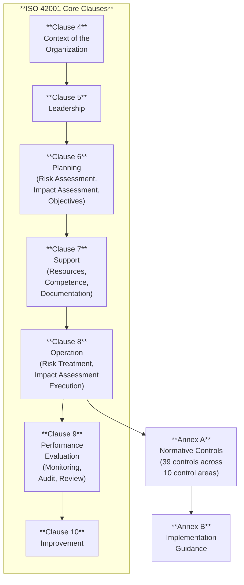
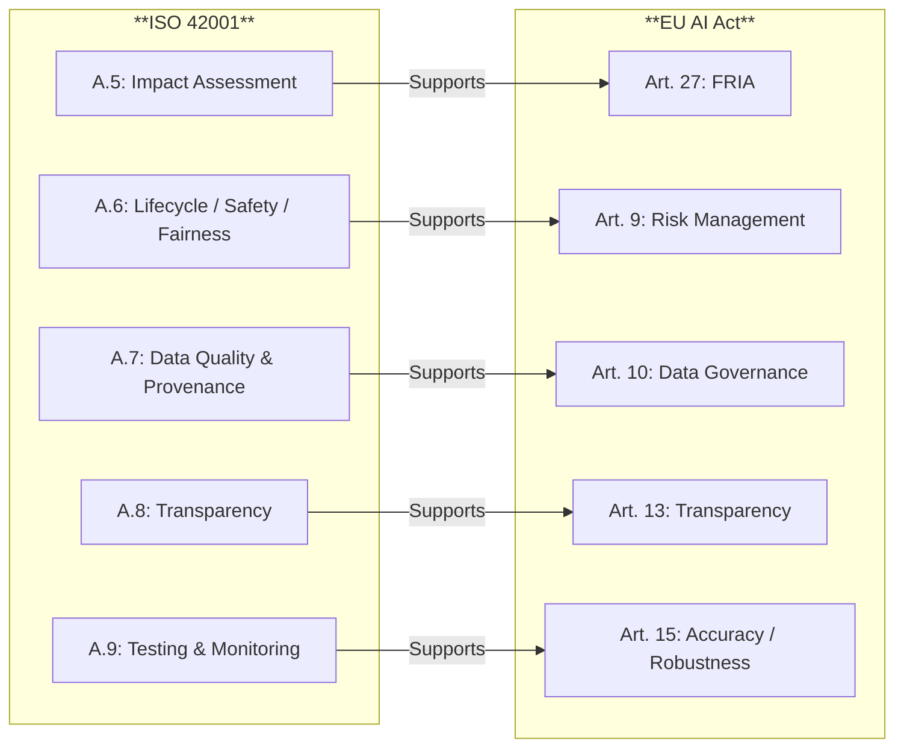

# ISO 42001 — Technical Controls & Evidence

*Last reviewed: April 2026*

ISO/IEC 42001:2023 is an **AI Management System** standard — it defines how an organization should govern the AI systems it develops, provides, or uses. Unlike the EU AI Act (which imposes specific legal obligations), ISO 42001 is a voluntary framework that an organization can be **certified** against, demonstrating to clients, regulators, and partners that it has structured governance over its AI activities.

The standard follows the Harmonized Structure (annex SL) common to management system standards (ISO 27001, ISO 9001, etc.), which means organizations already certified to other ISO management systems will find the structure familiar: Context → Leadership → Planning → Support → Operation → Performance Evaluation → Improvement.

This chapter focuses on the **technical controls and evidence** that an assessment against ISO 42001 requires — the parts that governance professionals need to understand when evaluating an organization's AI governance maturity.

## Structure Overview

## Clause 4: Context — The Starting Point

Before any controls apply, ISO 42001 requires the organization to understand:

- **Its roles** with respect to AI systems: provider, developer, deployer, customer, integrator, data provider
- **External context**: Applicable AI-specific laws (EU AI Act, national regulations), ethical norms, competitive landscape
- **Internal context**: Organizational objectives, governance structures, contractual obligations, intended purposes of AI systems
- **Interested parties**: Who is affected by the organization's AI activities and what are their requirements

The **scope** of the AI management system determines which AI systems, activities, and organizational units are covered. The scope determines which Annex A controls are applicable.

### Role Determination Is Critical

ISO 42001 explicitly recognises that the organization's role determines the applicability of controls. Roles can include:

| Role | Description | Typical Controls Focus |
|------|-------------|----------------------|
| **AI Provider** | Develops and offers AI models or systems | Full lifecycle: design, data, testing, deployment, monitoring |
| **AI Deployer** | Uses AI systems in operations | Use-phase: oversight, monitoring, rights compliance |
| **AI Integrator** | Combines AI models into systems | Integration: compatibility, risk propagation, documentation |
| **Data Provider** | Supplies data for AI training or operation | Data quality, provenance, consent, bias assessment |

An organization may hold multiple roles simultaneously.

## Clause 6: Planning — AI Risk Assessment and Impact Assessment

### AI Risk Assessment (Clause 6.1.2)

The organization must define and apply an AI risk assessment process that:
- Identifies AI-specific risks and their potential consequences
- Analyses the likelihood and severity of identified risks
- Evaluates risks against defined criteria to determine treatment priorities

### AI System Impact Assessment (Clause 6.1.4)

A distinct requirement from risk assessment: the **AI system impact assessment** evaluates impacts on individuals, groups, and societies. This is ISO 42001's equivalent of the EU AI Act's Fundamental Rights Impact Assessment (Article 27) — though broader in scope, covering any societal impact, not just fundamental rights.

The organization must determine:
- Criteria for when impact assessments are needed
- Processes for conducting them
- How results feed into risk treatment

## Annex A: The Control Framework

Annex A defines **39 normative controls** organized into 10 areas. These are the controls that an auditor will assess. The organization must produce a **Statement of Applicability** documenting which controls are selected and justifying any exclusions.

### A.2 — AI Policies

| Control | What It Requires |
|---------|-----------------|
| A.2.2 | AI policy established by top management, communicated, and available as documented information |
| A.2.3 | AI policy reviewed at planned intervals and updated when necessary |

**Evidence expected**: Written AI policy, evidence of communication (email, intranet, training records), review dates and update log.

### A.3 — Internal Organization

| Control | What It Requires |
|---------|-----------------|
| A.3.2 | Roles and responsibilities for AI activities defined and allocated |
| A.3.3 | AI-specific responsibilities assigned within existing roles |
| A.3.4 | AI-specific reporting structures identified |

**Evidence expected**: Organizational chart showing AI governance roles, RACI matrix, job descriptions with AI responsibilities, meeting minutes from governance bodies.

### A.4 — Resources for AI Systems

| Control | What It Requires |
|---------|-----------------|
| A.4.3 | Tools and frameworks for AI development are identified and managed |
| A.4.4 | Systematic processes for AI system life cycle management are established |
| A.4.5 | Processes for ensuring the quality of AI systems throughout their lifecycle |
| A.4.6 | Third-party or commercially available AI components are evaluated and monitored |

**Evidence expected**: Approved technology register, lifecycle process documentation, quality assurance procedures, third-party AI component risk assessments, vendor evaluation records.

### A.5 — Assessing Impacts of AI Systems

| Control | What It Requires |
|---------|-----------------|
| A.5.2 | AI system impact assessment process documented and applied |
| A.5.3 | Impacts on individuals and groups assessed against defined criteria |
| A.5.4 | Documentation of impact assessment results, including decisions and justifications |

**Evidence expected**: Impact assessment template and completed assessments per AI system, assessment criteria definitions, evidence of stakeholder consultation, remediation plans for identified impacts.

### A.6 — AI System Life Cycle

| Control | What It Requires |
|---------|-----------------|
| A.6.2.2 | Intended behaviour and use constraints for AI systems are defined |
| A.6.2.3 | Requirements for AI system development or acquisition are specified |
| A.6.2.4 | Safety requirements for AI systems are addressed |
| A.6.2.5 | Fairness considerations are addressed throughout the AI system lifecycle |
| A.6.2.6 | AI system components are managed as organizational assets |

**Evidence expected for A.6.2.4 (Safety)**: Safety requirements documentation, hazard analysis, testing against safety criteria, residual risk acceptance records.

**Evidence expected for A.6.2.5 (Fairness)**: Fairness metric selection and justification, bias testing results, demographic representation analysis, documentation of fairness/performance trade-off decisions.

**Evidence expected for A.6.2.6 (Asset Management)**: AI asset inventory including model weights, datasets, configurations; access control records; lifecycle tracking (version, status, location).

### A.7 — Data for AI Systems

| Control | What It Requires |
|---------|-----------------|
| A.7.2 | Data requirements for AI are identified |
| A.7.3 | Data quality is measured and managed |
| A.7.4 | Data provenance is recorded and maintained |
| A.7.5 | Data preparation processes are documented |

**Evidence expected**: Data quality metrics and monitoring dashboards, data lineage documentation, data preparation procedures and records, data versioning system.

### A.8 — Information for Interested Parties

| Control | What It Requires |
|---------|-----------------|
| A.8.2 | Information about AI system interactions is provided |
| A.8.3 | Transparency appropriate to the context and risk is ensured |
| A.8.4 | Information about the decision process of the AI system is provided (where applicable) |

**Evidence expected**: User-facing disclosures, transparency statements, explainability outputs (LIME/SHAP reports), notification mechanisms for AI-assisted decisions.

### A.9 — Use of AI Systems

| Control | What It Requires |
|---------|-----------------|
| A.9.2 | Processes for responsible use of AI systems are defined |
| A.9.3 | AI systems are subject to appropriate testing before and during deployment |
| A.9.4 | AI system operations and outputs are monitored |

**Evidence expected**: Acceptable use policies, pre-deployment testing records, production monitoring dashboards and alert configurations, drift detection mechanisms, incident response procedures.

### A.10 — Third-Party and Customer Relationships

| Control | What It Requires |
|---------|-----------------|
| A.10.2 | AI-specific considerations are included in supplier relationships |
| A.10.3 | Supply chain risks for AI components are addressed |
| A.10.4 | Customer requirements for AI transparency and governance are addressed |

**Evidence expected**: AI-specific contract clauses, supplier AI governance assessment records, supply chain risk register entries, customer communication records.

## Cross-Mapping to EU AI Act

An organization certified to ISO 42001 is **not** automatically compliant with the EU AI Act — the Act has specific legal requirements that the standard does not fully cover (conformity assessment, CE marking, registration, specific GPAI obligations). However, ISO 42001 certification provides substantial evidence toward compliance and establishes the organizational governance structure that the Act expects.

> **Governance Relevance**
>
> ISO 42001 is the audit standard you will most frequently use to structure client assessments. Key points:
>
> 1. **Statement of Applicability**: This is the most important single document in an ISO 42001 audit. It lists all Annex A controls, states whether each is applicable, and justifies exclusions. If a client claims ISO 42001 alignment, ask for the SoA first.
> 2. **Evidence is everything**: Each control should have documented evidence — not just a policy document, but records showing the policy was followed. "We have a fairness policy" is not sufficient; "here are the fairness test results for each AI system" is.
> 3. **Role determines scope**: The organization's AI roles (Clause 4.1) determine which controls apply and to what extent. A pure deployer has different obligations than a developer.
> 4. **Integration with existing systems**: Organizations already certified to ISO 27001 (information security) or ISO 9001 (quality) can extend those systems to cover AI. Check for integration rather than standalone implementation.
> 5. **Climate change is not a typo**: Clause 4.1 explicitly requires addressing whether climate change is a relevant issue — reflecting the energy and environmental impact of AI systems.
