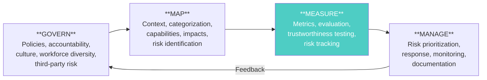
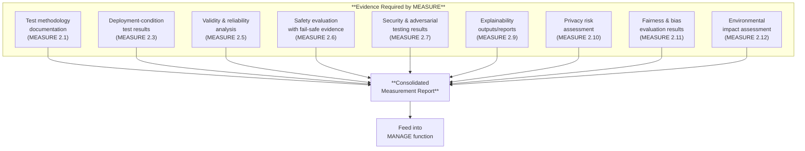

# NIST AI RMF — Measure Function

*Last reviewed: April 2026*

The NIST Artificial Intelligence Risk Management Framework (AI RMF 1.0, January 2023) organises AI risk management into four core functions: **Govern**, **Map**, **Measure**, and **Manage**. This chapter focuses on the **Measure** function — the function most directly concerned with technical evidence and evaluation — while providing context on how it connects to the other three.

Unlike the EU AI Act (which is legally binding) or ISO 42001 (which is certifiable), the NIST AI RMF is a **voluntary framework** designed as guidance for any organisation developing, deploying, or using AI systems. It is widely adopted in the United States and increasingly referenced internationally as a practical risk management methodology.

## The Four Functions

- **GOVERN** is cross-cutting — it establishes the organizational foundation (policies, roles, culture) that enables the other three functions.
- **MAP** identifies and contextualizes risks — establishing what the AI system does, who it affects, and what could go wrong.
- **MEASURE** evaluates those identified risks with specific metrics, tools, and methods.
- **MANAGE** acts on measurement results — prioritizing, mitigating, and monitoring risks over time.

## Trustworthiness Characteristics (Section 3)

Before examining Measure subcategories, it is important to understand the seven trustworthiness characteristics that the AI RMF uses as its evaluation framework. These are what gets measured:

| Characteristic | Definition (AI RMF) | Key Tensions |
|----------------|---------------------|-------------|
| **Valid & Reliable** | Accuracy, robustness, generalizability; consistent correct operation | Accuracy and robustness can be in tension |
| **Safe** | Does not endanger human life, health, property, or environment | Safety may constrain capability |
| **Secure & Resilient** | Maintains confidentiality, integrity, availability; withstands attacks | Security measures can impact performance |
| **Accountable & Transparent** | Decisions are traceable and information is appropriately available | Transparency may conflict with IP protection |
| **Explainable & Interpretable** | Mechanisms are understandable; outputs are meaningful in context | Explainability may be limited for complex models |
| **Privacy-Enhanced** | Safeguards human autonomy, identity, dignity; controls data exposure | Privacy techniques can reduce accuracy |
| **Fair — Harmful Bias Managed** | Equality, equity; harmful bias identified and mitigated | Fairness definitions conflict with each other |

The AI RMF explicitly acknowledges that these characteristics involve trade-offs — optimizing for one may degrade another. The framework does not prescribe which trade-off is correct; it requires that trade-offs be identified, documented, and decided deliberately.

## MEASURE 1: Methods and Metrics

### MEASURE 1.1 — Select Metrics for Identified Risks

"Approaches and metrics for measurement of AI risks enumerated during the MAP function are selected for implementation starting with the most significant AI risks. The risks or trustworthiness characteristics that will not — or cannot — be measured are properly documented."

**What this means in practice:**
- Metrics must be chosen based on the specific risks identified in MAP, not generic benchmarks
- The "most significant" risks get priority — not all risks need equal measurement investment
- If something **cannot be measured** (e.g., long-term societal effects of a recommendation system), that inability must be documented rather than ignored

### MEASURE 1.2 — Assess Metric Effectiveness

Metrics and existing controls are "regularly assessed and updated, including reports of errors and potential impacts on affected communities."

**What this means:** Metrics themselves decay. A benchmark that was relevant two years ago may no longer capture meaningful performance dimensions. Regular reassessment prevents metric staleness.

### MEASURE 1.3 — Independent Assessment

"Internal experts who did not serve as front-line developers for the system and/or independent assessors are involved in regular assessments." Domain experts, users, AI actors external to the team, and affected communities are consulted.

**What this means:** The people who built the system should not be the only ones evaluating it. Independent review — whether internal (a separate team) or external (third-party auditors) — is a core requirement.

## MEASURE 2: Trustworthiness Evaluation

This is the most granular and technically relevant category. Each subcategory maps to a specific trustworthiness evaluation:

### MEASURE 2.1 — Documentation of TEVV

"Test sets, metrics, and details about the tools used during Test, Evaluation, Verification, and Validation (TEVV) are documented."

### MEASURE 2.3 — Deployment-Condition Testing

"AI system performance or assurance criteria are measured qualitatively or quantitatively and demonstrated for conditions similar to deployment setting(s)."

**Why this matters:** Benchmark performance under ideal conditions does not guarantee real-world performance. Testing must simulate actual deployment conditions — noisy data, adversarial users, edge cases, unexpected input patterns.

### MEASURE 2.5 — Validity and Reliability

"The AI system to be deployed is demonstrated to be valid and reliable. Limitations of the generalizability beyond the conditions under which the technology was developed are documented."

### MEASURE 2.6 — Safety Evaluation

"The AI system is evaluated regularly for safety risks. The AI system to be deployed is demonstrated to be safe, its residual negative risk does not exceed the risk tolerance, and it can fail safely, particularly if made to operate beyond its knowledge limits."

**Key phrase: "fail safely"** — the system must have a defined behavior when it encounters inputs outside its training distribution or knowledge limits. Crashing, hallucinating confidently, or producing outputs without confidence indicators are not safe failure modes.

### MEASURE 2.7 — Security and Resilience

"AI system security and resilience — as identified in the MAP function — are evaluated and documented."

Includes adversarial robustness testing, model extraction resistance, data poisoning detection, and infrastructure security.

### MEASURE 2.9 — Explainability

"The AI model is explained, validated, and documented, and AI system output is interpreted within its context — as identified in the MAP function — to inform responsible use and governance."

### MEASURE 2.10 — Privacy

"Privacy risk of the AI system — as identified in the MAP function — is examined and documented."

Includes membership inference risk, training data memorization, and PII exposure analysis.

### MEASURE 2.11 — Fairness and Bias

"Fairness and bias — as identified in the MAP function — are evaluated and results are documented."

This is the NIST equivalent of EU AI Act Article 10(f-g). The key difference: NIST identifies **three categories of bias** (systemic, computational/statistical, and human-cognitive), while the EU AI Act focuses primarily on data and algorithmic bias.

### MEASURE 2.12 — Environmental Impact

"Environmental impact and sustainability of AI model training and management activities — as identified in the MAP function — are assessed and documented."

This is increasingly significant as training compute scales. Energy consumption, carbon footprint, and water usage for cooling are the primary metrics.

## MEASURE 3: Risk Tracking Over Time

### MEASURE 3.1 — Ongoing Risk Identification

"Approaches, personnel, and documentation are in place to regularly identify and track existing, unanticipated, and emergent AI risks based on factors such as intended and actual performance in deployed contexts."

**Key phrase: "unanticipated and emergent"** — risks that were not identified during MAP but surface during deployment must be captured and fed back into the risk management cycle.

### MEASURE 3.2 — Unmeasurable Risks

"Risk tracking approaches are considered for settings where AI risks are difficult to assess using currently available measurement techniques or where metrics are not yet available."

This explicitly acknowledges the measurement gap — some risks cannot yet be quantified. The framework says: track them anyway.

### MEASURE 3.3 — Feedback from End Users and Affected Communities

"Feedback processes for end users and impacted communities to report problems and appeal system outcomes are established and integrated into AI system evaluation metrics."

Not just a complaint box — feedback must be "integrated into AI system evaluation metrics." User-reported issues become inputs to the measurement system.

## MEASURE 4: Measurement Efficacy

### MEASURE 4.1 — Context-Informed Measurement

"Measurement approaches for identifying AI risks are connected to deployment context(s) and informed through consultation with domain experts and other end users."

### MEASURE 4.2 — Validated Measurements

"Measurement results regarding AI system trustworthiness in deployment context(s) and across the AI lifecycle are informed by input from domain experts and relevant AI actors to validate whether the system is performing consistently as intended."

### MEASURE 4.3 — Tracked Improvements or Declines

"Measurable performance improvements or declines based on consultations with relevant AI actors, including affected communities, and field data about context-relevant risks and trustworthiness characteristics are identified and documented."

## Putting It Together: A Measure Function Evidence Map

> **Governance Relevance**
>
> The NIST AI RMF Measure function maps directly to assessment evidence requirements:
>
> 1. **Start with MAP, then Measure**: MEASURE subcategories explicitly reference "as identified in the MAP function." If risks aren't mapped first, measurement is unfocused. Check that MAP outputs exist before evaluating Measure compliance.
> 2. **The "cannot be measured" clause (MEASURE 1.1)** is important: organizations should not ignore this. If a risk cannot be measured, documenting that fact is the compliant response — not pretending the risk doesn't exist.
> 3. **Independent assessment (MEASURE 1.3)** is not optional: the framework is specific — people who did not build the system must be involved in its evaluation. Ask who performed assessments and verify their independence.
> 4. **Three categories of bias**: NIST's distinction between systemic, computational/statistical, and human-cognitive bias is more granular than other frameworks. An organization that only measures computational bias (dataset imbalance) but ignores systemic bias (structural inequities in the deployment context) or human-cognitive bias (how users interpret AI outputs) has an incomplete fairness evaluation.
> 5. **Environmental impact (MEASURE 2.12)** is unique to NIST among the major frameworks. If an organization claims NIST alignment but has no carbon or energy data for model training, they have a gap.
> 6. **Cross-framework mapping**: NIST MEASURE maps cleanly to EU AI Act Article 15 (accuracy/robustness), Article 10 (data/bias), and Article 13 (transparency). Organizations seeking dual compliance can use MEASURE evidence for both.
