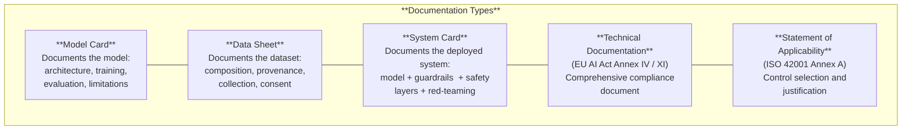
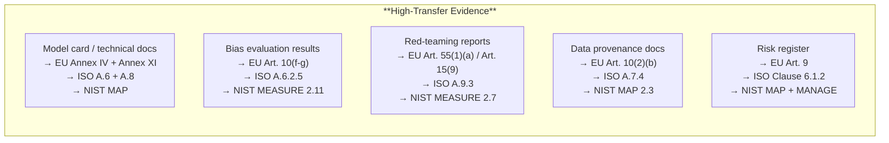

# Cross-Framework Documentation Comparison

*Last reviewed: April 2026*

Every major AI governance framework requires documentation of the AI model and/or system — but they require it in different formats, at different levels of detail, and from different actors. This chapter compares the documentation requirements across frameworks side by side, helping you identify where requirements overlap (work transfers) and where they diverge (separate evidence needed).

## The Documentation Landscape

## Requirement-Level Comparison

### Model Identity and Architecture

| What's Required | EU AI Act (High-Risk) | EU AI Act (GPAI) | ISO 42001 | NIST AI RMF |
|-----------------|:---------------------:|:-----------------:|:---------:|:-----------:|
| Model name and version | Annex IV, A(a) | Annex XI, 1(a)(c) | A.6.2.6 | MAP 1.1 |
| Architecture description | Annex IV, B(b-c) | Annex XI, 1(d) | A.6.2.3 | MAP 2.1 |
| Parameter count | Not explicit | Annex XI, 1(d) | — | MAP 2.1 |
| Input/output specification | Annex IV, C | Annex XI, 1(e) | A.6.2.2 | MAP 2.2 |
| Intended purpose | Annex IV, A(a) | Annex XI, 1(a) | A.6.2.2 | MAP 1.1 |
| Licence/IP terms | — | Annex XI, 1(f) | A.10 | GOVERN 6.1 |

**Key insight**: The EU AI Act GPAI track (Annex XI) is the only framework that explicitly requires parameter count disclosure. The high-risk track (Annex IV) and other frameworks expect architecture documentation but do not mandate a specific parameter count.

### Training Data Documentation

| What's Required | EU AI Act (High-Risk) | EU AI Act (GPAI) | ISO 42001 | NIST AI RMF |
|-----------------|:---------------------:|:-----------------:|:---------:|:-----------:|
| Data sources/provenance | Art. 10(2)(b) | Annex XI, 2(c) | A.7.4 | MAP 2.3 |
| Data composition/statistics | Art. 10(2)(e) | Annex XI, 2(c) | A.7.3 | MAP 2.3 |
| Data preparation methods | Art. 10(2)(c) | Annex XI, 2(c) | A.7.5 | MAP 2.3 |
| Bias examination | Art. 10(2)(f-g) | Annex XI, 2(c) | A.6.2.5 | MEASURE 2.11 |
| Consent/legal basis | Art. 10(2)(b) + GDPR | Art. 53(1)(c) | A.7.4 | — |
| Public training data summary | — | Art. 53(1)(d) | — | — |
| Copyright compliance | — | Art. 53(1)(c) | — | GOVERN 6.1 |

**Key insight**: Only the EU AI Act GPAI track requires a **publicly available** training data summary. The high-risk track requires detailed data documentation but it goes to regulators, not the public. ISO 42001 requires data provenance documentation but does not mandate public disclosure. The copyright compliance obligation is unique to EU AI Act GPAI.

### Performance Evaluation

| What's Required | EU AI Act (High-Risk) | EU AI Act (GPAI) | ISO 42001 | NIST AI RMF |
|-----------------|:---------------------:|:-----------------:|:---------:|:-----------:|
| Accuracy metrics | Art. 15(1,3) | Annex XI, S2(1) | A.9.3 | MEASURE 2.5 |
| Disaggregated results | Art. 13(2)(b)(v) | — | A.6.2.5 | MEASURE 2.11 |
| Robustness testing | Art. 15(4-5) | — | A.9.3 | MEASURE 2.6 |
| Benchmark results | Art. 15(2) | Art. 53(1)(a) | — | MEASURE 1.1 |
| Test methodology | Annex IV, B(g) | Annex XI, S2(1) | A.9.3 | MEASURE 2.1 |
| Deployment-condition testing | Art. 9(8) | — | A.9.3 | MEASURE 2.3 |
| Limitations documented | Annex IV, C | Annex XI, S2(1) | A.8.3 | MAP 2.2 |

**Key insight**: The EU AI Act high-risk track is the only framework that explicitly mandates disaggregated performance metrics — accuracy "for specific persons or groups of persons" (Art. 13(2)(b)(v)). NIST implies this through MEASURE 2.11 (fairness evaluation) but does not mandate it in the same way. ISO 42001's fairness control (A.6.2.5) requires fairness consideration but leaves the metric format to the organisation.

### Risk Management and Safety

| What's Required | EU AI Act (High-Risk) | EU AI Act (GPAI) | ISO 42001 | NIST AI RMF |
|-----------------|:---------------------:|:-----------------:|:---------:|:-----------:|
| Risk management system | Art. 9 | — | Clause 6.1.2 | GOVERN + MAP |
| Impact assessment | Art. 27 (FRIA) | — | Clause 6.1.4 | MAP 5 |
| Adversarial testing | Art. 9(8), 15(9) | Art. 55(1)(a) | A.9.3 | MEASURE 2.7 |
| Incident reporting | Art. 72-73 | Art. 55(1)(c) | A.9.4 | MEASURE 3.1 |
| Post-market monitoring | Art. 72 | — | Clause 9.1 | MEASURE 3.1 |
| Human oversight design | Art. 14 | — | A.9.2 | MAP 3.5 |
| Cybersecurity measures | Art. 15(7-9) | Art. 55(1)(d) | — | MEASURE 2.7 |

**Key insight**: Adversarial testing (red-teaming) is required across all frameworks — EU AI Act Art. 55 (GPAI systemic risk), Art. 15(9) (high-risk), ISO 42001 A.9.3 (testing), and NIST MEASURE 2.7 (security). This is the single most consistently required technical practice across all frameworks.

### Transparency and Explainability

| What's Required | EU AI Act (High-Risk) | EU AI Act (GPAI) | ISO 42001 | NIST AI RMF |
|-----------------|:---------------------:|:-----------------:|:---------:|:-----------:|
| Instructions for deployers | Art. 13(2) | Art. 53(1)(b) | A.8.2 | MAP 2.2 |
| Output interpretability | Art. 13(1) | — | A.8.4 | MEASURE 2.9 |
| Right to explanation | Art. 86 | — | — | — |
| AI use disclosure | Art. 50 | — | A.8.3 | GOVERN 4.2 |
| Environmental impact | — | Annex XI, 2(e) | — | MEASURE 2.12 |

**Key insight**: The right to explanation (Art. 86) is unique to the EU AI Act and has no direct equivalent in ISO 42001 or NIST. Environmental impact disclosure is required by both EU AI Act GPAI (Annex XI) and NIST (MEASURE 2.12) but not by ISO 42001.

## Where Work Transfers Across Frameworks

If your client has already produced evidence for one framework, portions of it can satisfy requirements in others. The transfer matrix:

### Evidence That Does NOT Transfer

Some requirements are framework-specific and require dedicated evidence:

| Framework-Specific Requirement | No Equivalent Elsewhere |
|-------------------------------|------------------------|
| EU AI Act: CE marking and conformity assessment | Unique to EU regulatory compliance |
| EU AI Act: Public training data summary (Art. 53(1)(d)) | Other frameworks don't require public disclosure of training data |
| EU AI Act: Copyright compliance policy (Art. 53(1)(c)) | Unique to EU copyright framework |
| EU AI Act: Right to explanation (Art. 86) | Neither ISO nor NIST create individual rights |
| ISO 42001: Statement of Applicability | Specific to ISO management system certification |
| ISO 42001: Internal audit programme (Clause 9.2) | Specific to management system audit cycle |
| NIST: Environmental impact (MEASURE 2.12) | EU AI Act covers energy for GPAI only; ISO 42001 does not address |
| NIST: Three-category bias model (systemic/computational/human-cognitive) | More granular than other frameworks |

## Practical Assessment Strategy

When conducting a multi-framework assessment:

1. **Start with the EU AI Act** if the system is deployed in the EU — it is the only legally binding framework with enforcement penalties (up to 7% of global annual turnover).

2. **Use ISO 42001 as the organisational backbone** — its management system structure provides the governance infrastructure that supports compliance with all other frameworks.

3. **Apply NIST MEASURE for the technical evaluation** — its trustworthiness characteristics and measurement subcategories are the most granular and practical evaluation methodology.

4. **Map evidence once, cite it multiple times** — create a single evidence repository where each artifact is tagged with every framework requirement it satisfies. This avoids duplicative documentation effort.

> **Governance Relevance**
>
> This chapter is your practical reference when a client says "we need to comply with the EU AI Act AND maintain ISO 42001 certification AND align with NIST AI RMF." Key approach:
>
> 1. **Build the evidence repository first**: Identify the union of all documentation requirements across applicable frameworks. Each piece of evidence satisfies one or more requirements across one or more frameworks.
> 2. **Map gaps, not just overlaps**: Overlaps are easy — the unique requirements per framework are where compliance gaps hide. Use the "does not transfer" table above as a gap-finding checklist.
> 3. **Prioritize by legal consequence**: EU AI Act non-compliance carries financial penalties. ISO 42001 non-compliance risks certification. NIST misalignment has no direct penalty but affects U.S. federal procurement eligibility and demonstrates governance maturity.
> 4. **When in doubt, over-document**: Every framework rewards thorough documentation. No framework penalizes having too much evidence. When a requirement is ambiguous, document your interpretation and the evidence supporting it.
