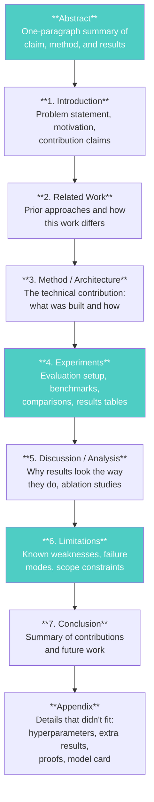
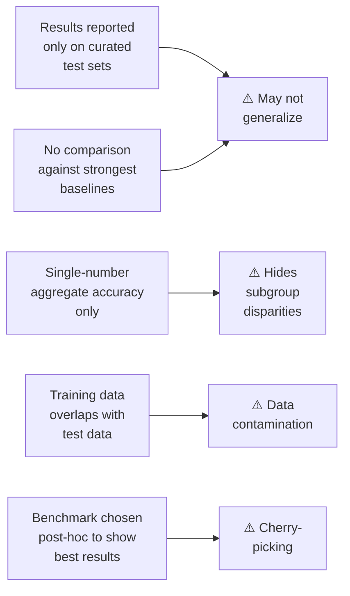

# How to Read an ML Research Paper

*Last reviewed: April 2026*

Machine learning papers are the primary source of truth for understanding model architectures, training techniques, and evaluation claims. As a governance professional, you will encounter paper citations in model cards, technical documentation, and conversations with engineering teams. This chapter provides a structured method for extracting the governance-relevant information from ML research papers without needing a PhD in computer science.

## The Standard Paper Structure

Most ML papers follow the structure established by major conferences (NeurIPS, ICML, ICLR, ACL, CVPR):

## The Three-Pass Reading Method

### Pass 1: Orientation (10 minutes)

Read only:
- **Abstract**: What is the claim?
- **Introduction**: Last paragraph — what are the stated contributions?
- **Section headings and figure captions**: What is the overall structure?
- **Conclusion**: What do the authors believe they demonstrated?

After Pass 1 you should be able to answer: *What problem does this paper address, and what do the authors claim to have achieved?*

### Pass 2: Evidence Extraction (30 minutes)

Read:
- **Experiments section in full**: This is where claims are supported (or not). Focus on the tables and figures — not just the text around them.
- **Limitations section in full**: This is often the most honest part of the paper. Authors are required by major conferences to include this, and it frequently contains critical governance-relevant information.
- **Appendix**: Check for model cards, data sheets, compute budgets, and additional evaluation results that didn't fit in the main paper.

After Pass 2 you should be able to answer: *What evidence supports the claims, and what did the authors identify as limitations?*

### Pass 3: Critical Assessment (as needed)

Read the Method section if you need to understand the technical approach in detail. This pass is optional for governance professionals unless you need to assess whether the claimed approach actually addresses a specific risk (e.g., "does their bias mitigation technique actually address the type of bias relevant to our deployment?").

## What to Look For: The Governance Checklist

### In the Abstract and Introduction

| Look For | Why It Matters |
|----------|---------------|
| **Claimed capabilities** | These become the "intended purpose" in regulatory documentation |
| **Benchmarks mentioned** | Which benchmarks did they choose? What's missing? |
| **Scale claims** (parameter count, data size, compute) | Relevant to GPAI systemic risk classification (10^25 FLOPs threshold) |
| **"State of the art" claims** | SOTA claims should be verified against the specific benchmarks cited |

### In the Experiments Section

| Look For | Why It Matters |
|----------|---------------|
| **Which benchmarks were used** | Are they standard? Comprehensive? Or cherry-picked to show strength? |
| **Which baselines were compared** | Compare against strongest available models, or weaker ones? |
| **Disaggregated results** | Performance by language, demographic group, domain — or only aggregate? |
| **Error analysis** | What types of errors does the model make? On what inputs? |
| **Ablation studies** | What happens when parts of the approach are removed? Shows what actually contributes vs. what is incidental |
| **Confidence intervals / significance tests** | Are results statistically significant or within noise? |

### Red Flags in Evaluation

- **No disaggregated results**: If the paper only reports aggregate accuracy without breaking down by language, demographic, or domain, you cannot assess fairness or differential performance.
- **Curated test sets only**: Real-world inputs are messier than benchmark test sets. Papers that only evaluate on clean benchmarks may overstate practical performance.
- **Missing baselines**: If the paper doesn't compare against the strongest known baselines, ask why. Sometimes it's because the comparison wouldn't be favorable.
- **Data contamination risk**: Some benchmarks are so widely cited that their test data may have leaked into training sets. Papers should address this; if they don't, it's a gap.

### In the Limitations Section

This is the governance gold mine. Common disclosures:

- "We only evaluated on English-language data" — the model may perform poorly on other languages
- "Our training data was collected from [source]" — reveals data provenance and potential bias sources
- "We did not evaluate for [specific risk]" — identifies untested risk areas
- "Performance degrades on [specific input type]" — known failure modes
- "Our approach requires [compute/hardware]" — accessibility and environmental impact
- "We did not conduct human evaluation" — automated metrics only, no human judgment on quality

### In the Appendix

| Look For | Why It Matters |
|----------|---------------|
| **Model card** | If included, this is ready-made governance documentation |
| **Data sheet** | Dataset composition, provenance, consent information |
| **Hyperparameters** | Training configuration — relevant to reproducibility claims |
| **Compute budget** | Total FLOPs, GPU-hours, or cloud cost — relevant to systemic risk classification |
| **Additional evaluation** | Extended results that didn't fit in the main body — often includes failure cases |

## Common Paper Types in AI Governance

### Architecture Papers

Examples: "Attention Is All You Need" (Vaswani et al., 2017), GPT-3 (Brown et al., 2020)

**What to extract**: Architecture innovations, scale (parameters, compute, data), intended capabilities, evaluation benchmarks, known limitations. These papers define the foundation that downstream systems build on.

### Safety Papers

Examples: Constitutional AI (Bai et al., 2022), Red Teaming Language Models (Perez et al., 2022)

**What to extract**: Threat models, attack taxonomies, defense methods, evaluation of defense effectiveness, remaining vulnerabilities. These directly inform risk management and guardrail design.

### Evaluation Papers

Examples: HELM (Liang et al., 2022), MMLU (Hendrycks et al., 2021)

**What to extract**: What the benchmark measures, what it does not measure, how scoring works, known limitations and biases of the benchmark itself. Benchmarks shape what gets optimized — understanding benchmark limitations prevents misplaced confidence.

### Fairness and Bias Papers

Examples: "On the Dangers of Stochastic Parrots" (Bender et al., 2021), "Datasheets for Datasets" (Gebru et al., 2021)

**What to extract**: Bias categories identified, measurement methods, mitigation approaches, trade-off analyses, recommendations for documentation practices.

## Quick Reference: Questions to Ask About Any Paper

1. **What are the claims?** → Abstract and Introduction
2. **What evidence supports the claims?** → Experiments section, Tables, Figures
3. **What are the limitations?** → Limitations section (mandatory at NeurIPS, ICML, ICLR since 2022)
4. **Who funded this research?** → Acknowledgments and Author affiliations — reveals potential conflicts of interest
5. **Has it been peer-reviewed?** → Conference publications (NeurIPS, ICML, ICLR) are peer-reviewed; arXiv preprints are not
6. **Can the results be reproduced?** → Is code released? Are hyperparameters documented? Is training data available?
7. **What's missing?** → What evaluation would you expect to see that isn't there?

> **Governance Relevance**
>
> ML papers are the primary evidence source when engineering teams claim "our model does X" or "we addressed Y risk":
>
> 1. **Verify claims against the paper**: When a team says "we use a state-of-the-art approach to bias mitigation," find the cited paper and check what was actually evaluated and what limitations were disclosed.
> 2. **The Limitations section is your best friend**: Authors are incentivized to undersell limitations, but conference requirements have improved disclosure. What they admit to not testing is as important as what they report testing.
> 3. **Appendix model cards/data sheets**: If the paper includes these, they provide ready-made content for regulatory documentation (EU AI Act Annex IV/XI, ISO 42001 A.6/A.7).
> 4. **Peer review is not a guarantee**: Peer-reviewed papers from top conferences have been vetted, but reviewers are checking methodology and novelty — not governance compliance. A well-reviewed paper can still have significant governance gaps.
> 5. **arXiv preprints deserve extra scrutiny**: Not peer-reviewed. Treat claims from preprints as provisional until independently verified.
